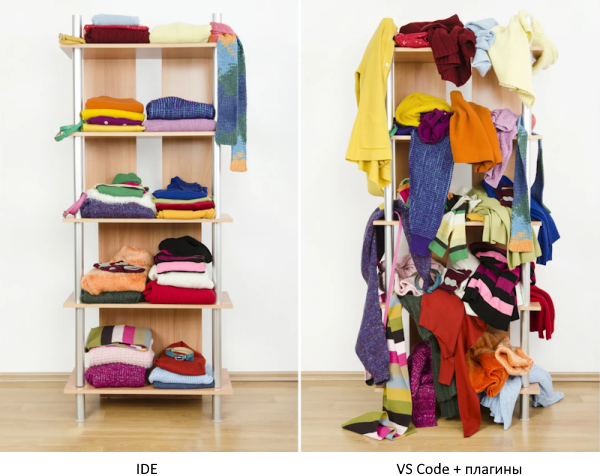
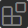
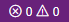
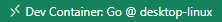
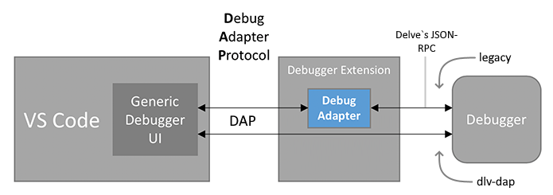
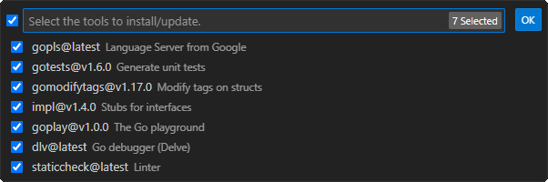

# Практическая работа №1. Настройка рабочего окружения

**Цели:**

- Воспользоваться рабочим окружением для разработки на удалённой машине в контейнере;
- Настроить рабочее окружение для разработки на локальной машине в контейнере;
- Настроить рабочее окружение для разработки непосредственно на локальной машине;

## Visual Studio Code

Для разработки ПО достаточно терминала и любого текстового редактора, но существуют специализированные инструменты, облегчающие этот процесс. Один из таких инструментов - интегрированная среда разработки IDE (integrated development environment).

В этой, и последующих практических работах, в качестве IDE будет использоваться Visual Studio Code от Microsoft. Как указано на [официальном сайте](https://code.visualstudio.com/) VS Code - это не совсем IDE, а легковесный редактор исходного кода, который обладает богатой экосистемой плагинов для разных языков программирования. С одной стороны модель основанная на плагинах позволяет настраивать VS Code полностью по своему вкусу, но с другой, мы получаем свалку из функционала и настроек. Так же нужно учитывать, что за развитие и проверку совместимости плагинов отвечают сторонние разработчики, которые могут забросить это дело в любой момент.



Изучать встроенные возможности и плагины VS Code мы будем по мере необходимости как в этой, так и в последующих работах.

> [!WARNING]
>
> Все дальнейшие инструкции и команды будут исходить из того, что у вас созданы две папки: `"tools"` и `"projects"`. В моём случае это: `"C:\tools"` и `"C:\projects"` для Windows и `"~/tools"` и `"~/projects"` для Linux.
> Вы можете разместить `"tools"` и `"projects"` в удобное для вас место, но учитывайте это внося соответствующие изменения в команды.

> [!WARNING]
>
> Выбирая пути к каталогам `"tools"` и `"projects"` избегайте промежуточных каталогов с русскими (и вообще не латинскими) символами, т.к. некоторые инструменты могут начать вести себя непредсказуемым образом.
> Если название промежуточного каталога будет содержать пробел, то в командах весь путь обязательно нужно заключить в кавычки.

### Установка

VS Code можно установить в двух вариантах: обычная установка и переносимая (portable). Мы будем рассматривать portable установку, т.к. в этом случае, файлы относящиеся к VS Code будут находиться полностью в одной папке, что очень удобно, особенно на этапе изучения среды. Т.к. всё храниться в одном месте, то достаточно легко можно: откатить среду к начальному состоянию, перенести на другую машину, полностью удалить или даже сделать резервную копию. Кроме того, можно иметь на одной машине несколько копий VS Code, разных версий или по разному настроенных.

1. Перейдите на страницу [документации](https://code.visualstudio.com/docs/editor/portable) и следуя инструкции скачайте архив с файлами под свою операционную систему;

2. Распакуйте архив в папку `"tools"`;

3. Чтобы VS Code [понял](https://code.visualstudio.com/docs/editor/portable#_enable-portable-mode), что он должен работать в portable mode создайте каталог `"data"` (для macOS `"code-portable-data"`) в каталоге VS Code. Туда VS Code будет складывать настройки, плагины и прочее. Таким образом, если удалить содержимое каталога `data`, то VS Code сбросится к начальному состоянию.

   Если не создавать каталог `"data"`, то VS Code разместит свои файлы по стандартным путям. Их можно найти в документации, в разделе [Migrate to Portable mode](https://code.visualstudio.com/docs/editor/portable#_migrate-to-portable-mode).

### Переменные среды (окружения) - PATH

Переменные среды - это список пар «ключ - значение», которые передаются **любой** выполняемой программе во время её запуска. Например, их можно посмотреть при помощи [командной оболочки](https://en.wikipedia.org/wiki/Comparison_of_command_shells) (это такая же программа как и все остальные): cmd, PowerShell, bash, zsh и др:

4. Откройте терминал и наберите:
   ```cmd
   set        # для Windows cmd
   gci env:*  # для Windows PowerShell
   env        # для Linux bash
   ```

   В результате вы получите список переменных окружения переданных оболочке и некоторые дополнительные, которые были установлены самой оболочкой.
   
   Любая программа запущенная из терминала является его дочерним процессом. Дочерние процессы получают копию переменных среды **родительского процесса** и могут менять их по своему усмотрению;
   
5. Наберите команду:

   ```cmd
   where ping        # Для Windows cmd
   get-command ping  # для Windows PowerShell
   whereis ping      # Для Linux
   ```

   В результате вы получите путь к исполняемому файлу. Т.е. `ping` - это не просто команда, это отдельная программа, которая лежит где-то на диске. Каким же образом оболочка узнала где искать исполняемый файл? Для этих целей существует специальная переменная среды - `PATH`;

6. Наберите команду:

   ```cmd
   echo %PATH%     # для Windows cmd
   echo $env:PATH  # для Windows PowerShell
   echo $PATH      # для Linux bash
   ```

   > В отличие от Windows, имена переменных среды в macOS и Linux чувствительны к регистру. Например, `Path` и `PATH` одинаковые для Windows и разные для macOS и Linux.

   Как видно, значение переменной - это набор путей. Оболочка (или другая программа) последовательно просматривает содержимое перечисленных каталогов в поисках требуемой программы. Например, тот же `ping` был найден именно благодаря тому, что каталог в котором он лежит находится в списке путей `PATH`.

   К теме переменных среды мы ещё вернёмся, когда будем обсуждать вопрос конфигурирования программ, но сейчас для нас важна только переменная `PATH`. В ходе работы мы установим различные инструменты, и чтобы другие программы могли их найти, необходимо будет добавить пути к ним в `PATH`;

7. Добавьте путь к каталогу VS Code в переменную `PATH`:

   - Windows:
     - Нажмите правой кнопкой мыши на значок "Этот компьютер" или "Мой компьютер" на рабочем столе или в проводнике;
     - Выберите "Свойства";
     - Нажмите на пункт "Дополнительные параметры системы";
     - В открывшемся окне нажмите на кнопку "Переменные среды";
     - Как альтернатива, пунктам описанным выше, можно набрать в поиске слово *переменные* и выбрать пункт "Изменение системных переменных среды";
     - В разделе "Переменные среды пользователя ..." найдите переменную с именем `Path` и выберите её.
     - Нажмите кнопку "Изменить";
     - В открывшемся окне нажмите "Создать" и введите путь к папке, где установлен VS Code. В моём случае это `"C:\tools\VSCode-win32-x64-1.93.0"`;
     - Закройте все окна, нажав "ОК", чтобы сохранить изменения.
   
   - Для Linux и macOS:
     - VS Code открыть палитру команд (<kbd>Shift</kbd>+<kbd>Command</kbd>+<kbd>P</kbd> на Mac, <kbd>Shift</kbd>+<kbd>Ctrl</kbd>+<kbd>P</kbd> на Linux);
     - В палитре команд найдите и выберите опцию *Shell Command:  Install 'code' command in PATH*.
   
   > Если у вас уже установлен VS Code, то переименуйте новый исполняемый файл `"code.exe"` например в `"code2.exe"`, чтобы вы могли запускать и старый и новый экземпляр VS Code из терминала по команде `code` и `code2` соответственно.

Обратите внимание, что чтение переменных среды происходит в момент **запуска** программы и если вы обновили значение переменных среды, то и программу которая хочет их использовать тоже нужно перезапустить. Если программа запускается из терминала, то нужно перезапустить и сам терминал.

### Установка плагина русификации

Если вы плохо владеете английским, то на начальном этапе будет полезно иметь возможность переключить язык интерфейса на русский. Перевод интерфейса на разные языки доступен в виде плагинов.

8. Запустите VS Code через терминал:
   - Откройте любую командную оболочку;
   - Введите: `code` и нажмите Enter;

9. Установите плагин для русификации интерфейса:
   - С левой стороны окна расположена Панель действий (*Activity Bar*) на которой есть иконка в виде квадрата собранного из квадратов поменьше  - это менеджер плагинов (*extensions*). Нажмите на эту иконку и в поле поиска плагинов введите "Russian Language Pack for Visual Studio Code" (иконка с глобусом от Microsoft);

   - Установите плагин и затем подтвердите изменение языка и перезапуск VS Code;

10. Переключите язык интерфейса обратно на английский:

    - Откройте палитру команд (command palette): <kbd>Ctrl</kbd>+<kbd>Shift</kbd>+<kbd>P</kbd>;

    - Начините вводить display пока не появится пункт "Настройка языка интерфейса" (Configure Dispaly Language);

    - Выберите этот пункт и затем английский язык. 


## Разработка на удалённом сервере

Контейнер — это **изолированная среда** для запуска приложений, которая включает всё необходимое для их работы (код, библиотеки, зависимости). Он обеспечивает **одинаковую работу** приложения на разных системах и упрощает процесс разработки и развертывания.

В настоящее время всё чаще процесс разработки ПО переносят с локальной машины на внешний сервер, на котором запускается полностью готовый к работе контейнер. Использование контейнеров обеспечивает:

- **Быстрая настройка окружения**: Создание и настройка контейнера для разработки занимает значительно меньше времени по сравнению с традиционными методами, что позволяет разработчикам сразу приступить к работе практически с любого устройства.
- **Единообразие среды**: Разработка и тестирование в контейнерах обеспечивают одинаковую среду выполнения, что исключает проблемы, связанные с различиями в конфигурациях на разных машинах.

- **Легкость в управлении зависимостями**: Приложение и все его зависимости могут быть упакованы в отдельный контейнер, что позволяет избежать конфликтов и упрощает управление версиями библиотек.

- **Удобство в тестировании**: Контейнеры облегчают процесс тестирования, так как можно быстро создавать и удалять экземпляры приложения, а также тестировать его в разных конфигурациях.
- **Снижение затрат на оборудование**: Все ресурсоёмкие вычислительные операции выполняются на сервере, что позволяет избежать необходимости предоставления каждому разработчику собственного высокопроизводительного компьютера.

VS Code предлагает множество настроек, плагинов и возможностей для персонализации интерфейса, что позволяет настроить редактор под свои предпочтения и задачи. Но с течением времени количество настроек, значков и пунктов меню будет увеличиваться. Механизм **[профилей](https://code.visualstudio.com/docs/editor/profiles)** позволяет разделить сценарии использования VS Code и, при необходимости, переключаться в требуемый режим. Например, у вас может быть профиль для разработки веб-приложений, для анализа данных, для обучения и т.д.

11. Создайте профиль `"Remote"`:
    - Нажмите на значок шестерёнки  и выберете *Profiles* (или *File* > *Preferences* > *Profiles*);
    - Нажмите кнопку *NewProfile* и назовите профиль `"Remote"`;
    - Выберете примечательную иконку (она будет отображаться вместо шестерёнки, когда профиль будет активен);
    - Нажмите Create, чтобы завершить создание профиля.
12. Переключитесь на профиль `"Remote"`:
    - В списке профилей, наведите мышь на `"Remote"` и нажмите на кнопку с изображением галочки.  
      Теперь рядом с ним должно быть указано: *In use*. При этом значок шестерёнки должен измениться на вашу иконку.
13. Установите набор расширений "Remote Development";
14. Подключитесь к серверу:
    - Нажмите на значок в левом нижнем углу ; 
    - В появившемся списке выберите *Connect to Host...*; 
    - Затем *+ New SSH Host...*;
    - Введите строку подключения в формате: `ssh логин@ip-адрес`. В моём случае: `ssh boss@192.168.1.35`.
      Конкретные данные для подключения смотрите в [moodle](https://moodle.cfuv.ru/mod/assign/view.php?id=690960);
    - Затем выберите файл в котором будет сохранены данные. В моём случае: `"C:\Users\Professional\.ssh\config"`;
    - Cнова дойдите до *Connect to Host...*;
    - Теперь в списке будет ip-адрес сервера. Выберите его;
    - Откроется новое окно VS Code и начнётся подключение. Если VS Code сможет определить ОС на сервере, то вверху сразу появится запрос пароля. Если не сможет, то сначала спросит тип ОС (*Windows*, *Linux*, *macOS*). В этом случае выберите *Linux*;
    - Введите пароль и нажмите Enter.
      Если не вводить пароль некоторое время, то подключение завершится ошибкой;
    - В результате, значок в левом углу заменится на  и строка состояния тоже поменяет цвет.
15. Откройте список установленных плагинов.  
    Теперь секция *Installed* разделена на две: *Local - Installed* и *SSH:192.168.1.35 - Installed*. Как видно, на сервере пока нет установленных плагинов.

### C++

16. Откройте окно терминала в VS Code:
    - Нажмите на значок крестик и треугольник на строке состояния и выберите вкладку *Terminal*. Или пункт главного меню *Terminal* > *New Terminal* (пункт меню *Terminal* может быть скрыт за троеточием, если окно маленькое);
    
17. Сейчас вы находитесь в домашнем каталоге пользователя. Создайте тут каталог `"projects"` и внутри каталог `"cpp"`, затем перейдите в него:
    ```bash
    mkdir projects
    cd projects
    mkdir cpp
    cd cpp
    ```
    
18. Откройте каталог `"cpp"` в VS Code как рабочее пространство (workspace):
    - Пункт меню *File* > *Open Folder...*;
    - Затем, в появившееся списке выберите (или допишите) `"projects"` и `"cpp"` и нажмите *ОК*; 
    - Введите пароль для подтверждения действия;
    - Как альтернативный вариант описанным выше действиям можно просто набрать в терминале `code .`. В этом случае откроется новое окно сразу в текущем каталоге;
    - Открыв каталог, VS Code может спросить [доверяем](https://code.visualstudio.com/docs/editor/workspace-trust) ли мы файлам в этом каталоге. Выберите: *Yes, I trust the authors*. Если бы мы выбрали *No*, то VS Code работал бы в режиме безопасности и не позволял запускать код и некоторые плагины.
    
19. Создайте файл `"main.cpp"` содержащий:
    ```cpp
    #include <iostream>
    
    int main(){
        std::cout << "Hello, World!" << std::endl;
    }
    ```
    
    VS Code определит, что это язык С++ и предложит установить соответствующие расширения. Игнорируйте или закройте окно;
    
20. Добавьте конфигурацию Dev Container:
    - Нажмите на значок и в выпадающем списке выберите *Add Dev Container Configuration Files...*.
      VS Code покажет существующие шаблоны контейнеров на основании файлов в текущем каталоге. Чтобы посмотреть все доступные нужно выбрать *Show All Templates...*;
    
    - В поле поиска шаблона введите *C++* и выберите одноимённый шаблон;
    - Шаблон *С++* доступен на основе нескольких ОС. Выберите контейнер на основе *ubuntu-24.04*;
    - Затем будет несколько вопросов касающихся установки в контейнер дополнительного софта. Нажмите: *none*, *ОК* и *ОК*;
    
    В папке проекта появится каталог `".devcontainer"` с файлом `"devcontainer.json"` и некоторыми другими. Сейчас не будем с ними разбираться. Главное то, что этот каталог содержит настройки нашего будущего контейнера и при необходимости их можно дополнить вручную.
    
21. Откройте каталог с проектом в контейнере:
    - Обычно среда автоматически распознаёт наличие в каталоге проекта файла `"devcontainer.json"` и сама предлагает открыть проект в контейнере. Если этого не произошло нажмите на значок и в выпадающем выберите *Reopen in Container*;
    
    - Подтвердите действие паролем.
      При успешном подключении значок в левом углу изменится на ;
    
      > Во время первого запуска выполняется не только создание контейнера, но и скачивание базового образа для него, поэтому процесс может затянуться. Наблюдать за тем, что происходит можно нажав на *Connecting to Dev Container (show log)*.
    
22. Нажмите на кнопку менеджера расширений и изучите список.
    Как видно, теперь вместо *SSH - Installed* у нас раздел *Dev Container - Installed*. При этом в разделе *Dev Container - Installed* уже есть несколько расширения для С++. На самом деле в контейнере есть ещё много чего, в том числе компилятор, дебагер и т.д;

23. Переключитесь в раздел *Exprorer*  и выберите `"main.cpp"`.
    Среда может предложить установить дополнительные расширения. Можно их тоже установить. Они попадут в список расширений контейнера и в дальнейшем будут доступны для текущего проекта. Новые проекты будут открываться в отдельных контейнерах и там этих расширений не будет;

24. Нажмите <kbd>F5</kbd> или *Run* > *Start Debugging* или значок треугольника (play) вверху, справой стороны.
    Вам будет предложено выбрать один из найденных компиляторов. Можно выбрать любой, т.к. это один и тот же компилятор, просто доступный под разными именами.
    В результате запустится сборка проекта и на вкладке *Terminal* можно посмотреть вывод программы;
    
25. Переключитесь обратно в раздел *Exproler* и изучите список файлов.
    Теперь тут появился новый файл с именем `"main"`. Это исполняемый файл, который был собран из исходного кода;

26. Перейдите в терминал и проверьте работоспособность программы командой:
    ```bash
    ./main
    ```
    `./` показывает, что мы хотим запустить именно файл из текущего каталога, иначе будет попытка найти команду или файл `main` который доступен по путям перечисленным в `PATH`;
    
27. Отключитесь от контейнера:
    - Нажмите на значок  и в выпадающем списке выберите *Reopen Folder in SSH*;
    - Подтвердите действие паролем.
    
    В результате вы выйдите из контейнера обратно на сервер.
    
28. Как видно исполняемый файл `"main"` никуда не исчез. Убедитесь в его работоспособности запустив в терминале как и ранее;

29. Проверьте список расширений сервера.  
    Он по прежнему пуст, т.к. все расширения и другие инструменты сборки С++ проектов были установлены только в контейнере, при этом сам сервер остался в чистом состоянии;

30. Отключитесь от сервера:
    - Нажмите на значок  выберите *Close Remote Connection*. Или можно просто закрыть окно.

### Go

31. Снова подключитесь к серверу. Теперь он уже есть в списке (не забывайте вводить пароль);

32. Откройте окно терминала;

33. Вы снова находитесь в домашнем каталоге пользователя. Каталог `"projects"` мы создали в прошлый раз (можно проверить его наличие командой `ls`), поэтому просто перейдите в него и создайте каталог `"go"` и перейдите в него:
    ```bash
    cd projects
    mkdir go
    cd go
    ```

34. Откройте каталог `"go"` в VS Code как рабочее пространство;

35. Добавьте конфигурацию Dev Container:

    - Нажмите на значок  и выберите *Add Dev Container Configuration Files...*;
    - В поле поиска шаблона введите *Go* и выберите одноимённый шаблон;
    - Шаблон контейнера для *Go* доступен с разными версиями компилятора и на основе нескольких версий дистрибутива Debian (версия задана не номером, а кодовым именем). Выберите версию отмеченную как *default*;
    - Затем будет несколько вопросов касающихся установки в контейнер дополнительного софта. Нажмите: *ОК* и *ОК*;

    В папке проекта появится каталог `".devcontainer"` с файлом `"devcontainer.json"`.

36. Откройте каталог с проектом в контейнере:

    - Обычно среда автоматически распознаёт наличие в каталоге проекта файла `"devcontainer.json"` и сама предлагает открыть проект в контейнере. Если этого не произошло нажмите на значок и в выпадающем выберите *Reopen in Container*;
    - Подтвердите действие паролем.
      При успешном подключении значок в левом углу изменится на ;

37. Нажмите на кнопку менеджера расширений и изучите список.  
    Как видно, теперь в разделе *Dev Container - Installed* установлены только плагины для *Go*.

38. Откройте терминал и наберите:
    ```bash
    go mod init hello
    ```
    В текущем каталоге появится файл `"go.mod"`. Это говорит о том, что компилятор *Go* тоже присутствует к контейнере;

39. Создайте файл `"main.go"` содержащий:
    ```go
    package main
    
    import "fmt"
    
    func main(){
        fmt.Println("Hello, World!")
    }
    ```

40. Нажмите <kbd>F5</kbd> или *Run* > *Start Debugging*.  
    В результате запустится сборка проекта и отобразится вывод программы;

41. В терминале наберите команду:
    ```bash
    go build .
    ```

    Это команда соберёт и сохранит в текущем каталоге исполняемый файл без запуска;

42. Переключитесь обратно в раздел *Exproler* и изучите список файлов.  
    Теперь тут появился новый файл с именем `"hello"`;

43. Перейдите в терминал и проверьте работоспособность программы командой:
    ```bash
    ./hello
    ```

44. Отключитесь от контейнера:

    - Нажмите на значок  и в выпадающем списке выберите *Reopen Folder in SSH*;
    - Подтвердите действие паролем.

    В результате вы выйдите из контейнера обратно на сервер.

45. Как видно исполняемый файл `"hello"` никуда не исчез. Убедитесь в его работоспособности запустив в терминале как и ранее;

46. Проверьте список расширений сервера.  
    Он по прежнему пуст, т.к. все расширения и другие инструменты сборки Go проектов были установлены только в контейнере, при этом сам сервер остался в чистом состоянии;

47. Отключитесь от сервера:

    - Нажмите на значок  выберите *Close Remote Connection*. Или можно просто закрыть окно.

48. Проверьте список локальных расширений. Как видно тут присутствуют только расширения из набора "Remote Development", расширений для C++ и Go нет.

Таким образом можно вести разработку с абсолютно любого устройства, без какой либо предварительной подготовки и настройки рабочего окружения и при этом получать одинаковый пользовательский опыт не зависимо от операционной системы. При этом устройство разработчика останется "чистым" и ему не требуется быть очень мощным или обладать большими объёмами дискового пространства. Дополнительно, вся кодовая база и артефакты сборки остаются на сервере (который может быть внутри защищённого контура компании) и не сохраняются на локальной машине разработчика.

## Разработка в локальном контейнере

И всё же, когда вы работаете в одиночку, в стартапе или маленькой компании, держать отдельный производительный сервер для разработки может быть слишком затратно, но отказываться от удобств, которые дают контейнеры не хочется, тогда можно установить средства контейнеризации на локальную машину.

### Docker Desktop

49. Установите Docker Desktop:
    - Перейдите на сайт https://www.docker.com/products/docker-desktop/;
    - Скачайте дистрибутив под свою операционную систему;
    - Установите Docker Desktop следуя инструкции соответствующей ваше операционной системе: https://docs.docker.com/desktop/;
    - Для работы программы не требуется заводить учётную запись. В процессе установки просто выбирайте *skip* в тех местах, где предлагают войти.

50. Запустите Docker Desktop и убедитесь, что он запустился нормально и внизу окна есть зелёная панель с текстом *Engine running* .  
    Пока здесь больше нет ничего интересного. Сверните или закройте окно.

### C++

51. Откройте/создайте каталог `"projects"` на **локальной** машине и создайте в нём каталог `"cpp"`;

52. В каталоге `"cpp"` запустите окно терминала и наберите команду:
    ```bash
    code .
    ```
    Откроется окно VS Code и спросит [доверяем](https://code.visualstudio.com/docs/editor/workspace-trust) ли мы файлам в этом каталоге. Выберите: *Yes, I trust the authors*;

53. Активируйте профиль "Remote", если активен другой;

54. Создайте файл `"main.cpp"` содержащий:
    ```cpp
    #include <iostream>
    
    int main(){
        std::cout << "Hello, World!" << std::endl;
    }
    ```
    
    VS Code определит, что это язык С++ и предложит установить соответствующие расширения. Игнорируйте или закройте окно;
    
55. Добавьте конфигурацию Dev Container:

    - Нажмите на значок в левом нижнем углу  и выберите *Add Dev Container Configuration Files...*;
    - На вопрос, где сохранить конфигурацию контейнера выберите *Add configuration to workspace*.
      В этом случае, конфигурация контейнера будет храниться в папке проекта. Альтернативный вариант создаст конфигурацию в другом месте, но она тоже будет действовать только на этот проект. Разница в том, хотите ли вы, чтобы конфигурация контейнера могла отслеживаться системой контроля версий или нет;
    - В поле поиска шаблона введите *C++* и выберите одноимённый шаблон;
    - Шаблон *С++* доступен на основе нескольких ОС. Выберите контейнер на основе *ubuntu-24.04*;
    - Затем будет несколько вопросов касающихся установки в контейнер дополнительного софта. Нажмите: *none*, *ОК* и *ОК*;

    В папке проекта появится каталог `".devcontainer"` с файлом `"devcontainer.json"` и другими.

56. Откройте каталог с проектом в контейнере:

    - Обычно среда автоматически распознаёт наличие в каталоге проекта файла `"devcontainer.json"` и сама предлагает открыть проект в контейнере. Если этого не произошло нажмите на значок и в выпадающем выберите *Reopen in Container*;

    - Среда автоматически определит присутствие Docker Desktop на машине и начнёт процесс создания контейнера;

      > Во время первого запуска выполняется не только создание контейнера, но и скачивание базового образа для него (~2.9 GB) , поэтому процесс может затянуться. Наблюдать за тем, что происходит можно нажав на *Connecting to Dev Container (show log)*.

    - При успешном подключении значок в левом углу изменится на ;

57. Откройте окно Docker Desktop и проверьте разделы *Images (Образы)* и *Containers (Контейнеры)*.  
    В списке контейнеров должен присутствовать один со статусом *Running*;

58. Вернитесь в VS Code и нажмите на кнопку менеджера расширений и изучите список.  
    Как и ранее раздел *Installed* разделён на два: *Local - Installed* и *Dev Container - Installed* и во втором уже есть расширения для С++;

59. Переключитесь в раздел *Exproler* и выберите `"main.cpp"`.  
    Установите расширения, которые рекомендует среда;

60. Нажмите <kbd>F5</kbd> или *Run* > *Start Debugging* или значок треугольника (play) вверху, справой стороны.  
    Вам будет предложено выбрать один из найденных компиляторов. Можно выбрать любой, т.к. это один и тот же компилятор, просто доступный под разными именами.  
    В результате запустится сборка проекта и на вкладке *Terminal* можно посмотреть вывод программы;

61. Переключитесь обратно в раздел *Exproler* и изучите список файлов.  
    Теперь тут появился новый файл с именем `"main"`. Это исполняемый файл, который был собран из исходного кода;

62. Перейдите в терминал и проверьте работоспособность программы командой:

    ```bash
    ./main
    ```

63. Отключитесь от контейнера:

    - Нажмите на значок  и в выпадающем списке выберите *Close Remote Connection* или просто закройте окно;

64. Откройте локальный каталог `"cpp"`. Как видно, все изменения произошедшие в контейнере также присутствуют и в локальном каталоге.  
    Работоспособность файла `"main"` будет завесить от вашей операционной системы. Он был собран в контейнере с Linux, поэтому будет работать только под Linux.

65. Откройте окно Docker Desktop и проверьте раздел *Containers (Контейнеры)*.  
    В норме, у контейнера теперь должен быть статус *Exited*. Это значит, что на данный момент, контейнер не работает и не потребляет никаких ресурсов, кроме места на жёстком диске. Т.к. мы ещё планируем работать над этим проектом, то контейнер удалять не нужно.

#### Отладка программы на C++

Ни одна программа не обходится без ошибок. Хотелось бы иметь возможность заглянуть внутрь работающей программы и по шагам посмотреть как она исполняется. Такую возможность даёт специальная программа - дебагер (отладчик). Основной дебагер для *С++* - [gdb](https://ru.wikipedia.org/wiki/GNU_Debugger), но есть и другие (например отладчик от Microsoft).

Для полноценной работы дебагера в программу должна быть добавлена дополнительная отладочная информация, отключена оптимизация кода и т.д. (для этого есть специальные ключи компилятора). Это всё негативно сказывается на скорости работы программы, поэтому, как правило программу можно собрать как в режиме дебагинга (Debug mode), таки и в режиме выпуска (Release mode). Нужно понимать, что нет каких-то *специальных* режимов, просто компилятору передаётся разный набор ключей.

66. Запустите VS Code в каталоге `"cpp"` и откройте проект в контейнере;

67. Модифицируйте `"main.cpp"` следующим образом:

    ```cpp
    #include <iostream>
    
    int main(){
        double a = 0.1, b = 0.2;
        double c = a + b;
        if (c == 0.3) std::cout << "+++\n";
        else std::cout << "---\n";
    }
    ```

68. Запустите, код и убедитесь, что в терминале отображаются минусы (хотя кто-то мог ожидать плюсы), что означает: `0.1 + 0.2` не равно `0.3`.

69. Поставьте курсор на сроку №4 (`double a = 0.1, b = 0.2;`) и нажмите <kbd>F9</kbd>. Повторите для следующих двух строк.  
    В результате на полях перед цифрами появятся красные кружки - точки останова (*breakpoints*). Так же их можно добавлять или удалять щелчком мыши;

70. Нажмите <kbd>F5</kbd>, чтобы начать отладку.  
    В результате программа запустится и остановится на 4й строке;

71. Наведите курсор на переменные `a`, `b`, `c` и посмотрите их текущие значения. Эти же значения можно увидеть слева в окне *Variables (Переменные)* в разделе *Locals (Локальные)*.  
    Сейчас переменных хранят мусорные значения, т.к. программа остановилась **до** первой точки останова, т.е. код в строке №4 ещё не был выполнен;

72. Снова нажмите <kbd>F5</kbd>, чтобы продолжить выполнение программы, затем изучите значения переменных.  
    В результате программа продолжит выполнение, пока не дойдёт до следующей точки останова (у нас - это строка №5);

73. Нажмите <kbd>F5</kbd> ещё раз и посмотрите, чему на самом деле равно `0.1 + 0.2` (значение переменной `c`).  
    Эта ситуация встречается во многих языках, и ей даже посвящён отдельный [сайт](https://0.30000000000000004.com/);

74. Остановите отладку и измените код `"main.cpp"` на следующий:

    ```cpp
    #include <iostream>
    
    int main(){
        for (int i=0; i<10; i++){
            for (int j=0; j<10; j++){
                std::cerr << "x ";
            }
            std::cerr << std::endl;
        }
    }
    ```

    > Здесь мы используем `cerr` (поток ошибок) для вывода текста. В целом он идентичен `cout`, за исключением того, что он НЕ содержит внутреннего буфера и сразу выводит текст на экран. Поток вывода `cout` сначала накапливает символы во внутреннем массиве и передаёт его содержимое на экран только при необходимости (заполнение буфера, переход в режим ввода, конец программы и т.п.). В среднем `cout` работает быстрее `cerr` за счёт буферизации, но в случае падения программы часть текста может застрять в буфере `cout` и не попасть на экран.
    >
    > Кроме того, `cin`, `cerr` и `cin` связаны с соответствующими системными [стандартными потоками](https://ru.wikipedia.org/wiki/Стандартные_потоки).

75. Поставьте точку останова только на строку №6. Щёлкните по ней правой кнопкой мыши и выберите *Edit Breakpoint...* и в выпадающем списке *Expression*.  
    Это условная точка останова. Она будет останавливать программу каждый раз, когда условие будет истинным;

76. В поле ввода напишите `i + j == 9` и нажмите <kbd>Enter</kbd>.  
    В результате программа будет останавливаться только на элементах обратной диагонали отображаемой матрицы;

77. Запустите отладку и убедитесь, что остановки происходят там где нужно;

78. Кроме break-поинтов можно установить log-поинты. Они удобны когда нет возможности остановить работу программы и добавлять отладочные принты руками не хочется.  
    Щелкните правой кнопкой мыши про точке останова на строке №6 и выберите *Edit Breakpoint...* и в выпадающем списке выберите *Log Message...*, затем введите текст в поле ввода: "Индексы: i={i} j={j}" и нажмите <kbd>Enter</kbd>;

79. Запустите отладку.  
    Как видно, в этот раз программа завершилась без остановок. Переключитесь с вкладки терминала на вкладку *Debug console* и вы увидите сообщения выводимые отладчиком;

80. Модифицируйте код `"main.cpp"`:

    ```cpp
    #include <iostream>
    
    void swap(int& a, int& b){
        int t = a;
        a = b;
        b = t;
    }
    
    int middle(int x, int y, int z){
        if (x < y) swap(x, y);
        if (x < z) swap(x, z);
        if (y < z) swap(y, z);
        return y;
    }
    
    int main(){
        int a = 10;
        int b = 20;
        int c = 5;
        std::cout << middle(a, b, c) << std::endl;
    }
    ```

81. Уберите все точки останова и поставьте новую на 17 строку. Запустите отладку;

82. Нажимайте клавишу <kbd>F10</kbd> (*step ower*) до тех пор, пока на экране не появится число.  
    Как видно, программа останавливается на каждой строке даже без точек останова.

83. Перезапустите отладку, но теперь нажимайте <kbd>F11</kbd> (*step into*) пока не окажитесь в функции `swap`.  
    Как видно, дойдя до 20й строки мы перепрыгнули в функцию `middle`, а затем в функцию `swap` автоматически заходя во все функции по ходу исполнения программы;

84. С левой стороны изучите раздел *Call stack* (стек вызовов).  
    На данный момент там должны присутствовать функции `main`, `middle` и `swap`. Они сложены в стопку, в том порядке, в котором мы в них попадали. Рядом указано имя файла в котором находится функция и номер строки на которой функция была приостановлена. Таким образом можно понять не только где мы сейчас находимся, но и проследить (*trace*) как мы туда попали. Локальные переменные всех перечисленных функций тоже доступны для изучения;

85. Нажмите сочетание клавиш <kbd>Shift</kbd> + <kbd>F11</kbd> (*step out*) два раза.  
    Как видно, мы сразу вышли из функции `swap` обратно в `middle`, а затем и в `main`;

86. Модифицируйте код `"main.cpp"` следующим образом:

    ```cpp
    #include <iostream>
    
    int main(){
        int a, b;
        do{
            a = rand();
            b = rand();
        }while(a + b != 1137);
        std::cout << "Happy End" << std::endl;
    }
    ```

    И установите точку останова на строку №6;

87. Запустите процесс отладки и, когда он остановится на 6й строке, в разделе *Watch* (слева) при помощи кнопки `+` добавьте выражения:

    ```cpp
    a
    b
    a + b
    a + b == 1137
    ```

88. Нажмите несколько раз <kbd>F5</kbd>, чтобы продолжить отладку и наблюдайте за изменениями значений в окне *Watch*.  
    Как видно, при каждом изменении отслеживаемых переменных их значение изменяется и в окне *Watch*;

89. Поставьте точку останова на строку №8 и нажмите <kbd>F5</kbd>, чтобы переключиться на неё. Затем добавьте в *Watch* следующие выражения:

    ```cpp
    a = 1000
    b = 137
    ```

    и нажмите <kbd>F5</kbd> ещё раз.
    Как видно, программа завершилась. Т.е. при помощи *Watch* мы можем не только получать значения переменных, но и устанавливать их.

Кроме рассмотренных сценариев работы отладчика есть ещё и другие, некоторые из них не доступны из графического интерфейса VS Code, но ими можно воспользоваться непосредственно отдавая команды отладчику в консоле отладки.

90. Отключитесь от контейнера через *Close Remote Connection*;
91. Откройте окно Docker Desktop и нажмите на иконку жука (верху). Затем нажмите на *Reset to factory defaults*.  
    Таким образом мы полностью удалим всё, что насоздавал Docker Desktop за время работы. Периодически полезно сбрасывать всё к начальным настройкам, т.к. ручное удаление контейнеров, образов и т.д. может не приводить к освобождению дискового пространства (есть такой баг).

### Go

92. Откройте каталог `"projects"` на локальной машине и создайте в нём каталог `"go"`;

93. В каталоге `"go"` запустите окно терминала и наберите команду:

    ```bash
    code .
    ```

94. Активируйте профиль "Remote", если активен другой;

95. Создайте файл `"main.go"` содержащий:

    ```go
    package main
    
    import "fmt"
    
    func main(){
        fmt.Println("Hello, World!")
    }
    ```

    VS Code определит, что это язык Go и предложит установить соответствующие расширения. Игнорируйте или закройте окно;

96. Добавьте конфигурацию Dev Container:

    - Нажмите на значок в левом нижнем углу  и выберите *Add Dev Container Configuration Files...*;
    - На вопрос, где сохранить конфигурацию контейнера выберите *Add configuration to workspace*.
    - В поле поиска шаблона введите *Go* и выберите одноимённый шаблон;
    - Выберите шаблон контейнера отмеченный как *default*;
    - Затем будет несколько вопросов касающихся установки в контейнер дополнительного софта. Нажмите: *ОК* и *ОК*;

    В папке проекта появится каталог `".devcontainer"` с файлом `"devcontainer.json"` и другими.

97. Откройте каталог с проектом в контейнере:

    - Обычно среда автоматически распознаёт наличие в каталоге проекта файла `"devcontainer.json"` и сама предлагает открыть проект в контейнере. Если этого не произошло нажмите на значок и в выпадающем выберите *Reopen in Container*;

    - Среда автоматически определит присутствие Docker Desktop на машине и начнёт процесс создания контейнера.  
      Процесс первого запуска снова будет долгий, т.к. мы удалили всё, что Docker Desktop скачивал. Но даже если бы мы ничего не удаляли, процесс был бы не быстрее, т.к. ранее Docker Desktop качал образ для разработки под С++, а теперь ему нужен образ для Go (~1.6 GB);
      
    - При успешном подключении значок в левом углу изменится на ;

98. Откройте окно Docker Desktop и проверьте разделы *Images (Образы)* и *Containers (Контейнеры)*.  
    В списке контейнеров должен присутствовать один со статусом *Running*;

99. Вернитесь в VS Code и нажмите на кнопку менеджера расширений и изучите список.  
    Как и ранее раздел *Installed* разделён на два: *Local - Installed* и *Dev Container - Installed* и во втором уже есть расширения для Go;

100. Откройте терминал и наберите:

     ```bash
     go mod init hello
     ```

     В текущем каталоге появится файл `"go.mod"`. Это говорит о том, что компилятор *Go* тоже присутствует к контейнере;

101. Переключитесь в раздел *Exproler* и выберите `"main.go"`;

102. Нажмите <kbd>F5</kbd> или *Run* > *Start Debugging*.  
     В результате запустится сборка проекта и отобразится вывод программы;

103. В терминале наберите команду:

     ```bash
     go build .
     ```

     Это команда соберёт и сохранит в текущем каталоге исполняемый файл без запуска;

104. Переключитесь обратно в раздел *Exproler* и изучите список файлов.  
     Теперь тут появился новый файл с именем `"hello"`;

105. Перейдите в терминал и проверьте работоспособность программы командой:

     ```bash
     ./hello
     ```

106. Отключитесь от контейнера:

     - Нажмите на значок  и в выпадающем списке выберите *Close Remote Connection* или просто закройте окно;

107. Откройте локальный каталог `"go"`. Как видно, все изменения произошедшие в контейнере также присутствуют и в локальном каталоге.  
     Работоспособность файла `"hello"` будет завесить от вашей операционной системы. Он был собран в контейнере с Linux, поэтому будет работать только под Linux.  
     На самом деле *Go* из коробки поддерживает возможность кросскомпиляции, т.е. мы можем собрать исполняемый файл для *Windows* или *macOS* даже работая в контейнере *Linux*; 

108. Откройте окно Docker Desktop и проверьте раздел *Containers (Контейнеры)*. В норме, у контейнера теперь должен быть статус *Exited*.  
     Можете снова сбросить Docker Desktop до чистого состояния, т.к. ближайшее время контейнеры и образы нам не понадобятся.

#### Отладка программы на Go

Основной отладчик для *Go* - [delve](https://github.com/go-delve/delve). С точки зрения пользователя VS Code, процесс отладки *Go* и *C++* проектов ничем не отличается, т.к. соответствующий плагин обеспечивает преобразование действий пользователя в графическом интерфейсе в команды понятные дебагеру и обратно.



В связи с выше сказанным, не будем отдельно рассматривать отладку для *Go*, т.к. то, что мы делали ранее для *С++* кода будет работать для *Go* кода точно также. Единственное отличие, которое было замечено - это невозможность изменять значение переменных в процессе отладки. Хотя *delve* умеет это делать, но через VS Code значение переменной не изменяется (возможно функция не реализована в расширении).

## Разработка в локальном окружении

В качестве последнего этапа рассмотрим процесс подготовки полностью локального окружения для разработки.

### C++

109. Запустите VS Code и создайте профиль `"C++"`:

     - Нажмите на значок шестерёнки  и выберете *Profiles* (или *File* > *Preferences* > *Profiles*);
     - Нажмите кнопку *NewProfile* и назовите профиль `"C++"`;
     - Выберете примечательную иконку;
     - Нажмите Create, чтобы завершить создание профиля.
110. Переключитесь на профиль `"C++"`:

     - В списке профилей, наведите мышь на `"C++"` и нажмите на кнопку с изображением галочки.  
       Теперь рядом с ним должно быть указано: *In use*. При этом значок шестерёнки должен измениться на вашу иконку.
111. Установите набор расширений *С++* для Visual Studio Code:
     - Откройте менеджер расширений и введите в строку поиска: *C/C++ Extension Pack*;
     - Установите набор расширений;

Набор инструментов (*toolchain*) для *C++* проектов сильно зависит от платформы на которой ведётся разработка и целевой платформы. В зависимости от вашей операционной системы выполните соответствующий блок:

#### Windows

Для разработки приложении под Windows чаще всего применяют компилятор от Microsoft, поэтому установим его.

112. Установите компилятор от Microsoft следуя [инструкции](https://code.visualstudio.com/docs/cpp/config-msvc#_prerequisites) (начиная с пункта 3);
113. Откройте *Developer Command Prompt for Visual Studio* как указано [здесь](https://code.visualstudio.com/docs/cpp/config-msvc#_check-your-microsoft-visual-c-installation) и запустите VS Code из этой оболочки при помощи команды: `code`;
     Если запустить VS Code по другому, то он не сможет найти инструменты разработки.
114. Проверьте, что всё установлено правильно:

     - Откройте каталог `"projects/cpp"` в VS Code;
     - Убедитесь, что профиль по прежнему `"C++"` и, при необходимости, переключитесь на него;
     - Выберите файл `"main.cpp"`;
     - Запустите процесс сборки клавишей <kbd>F5</kbd>;
     - Вам будет предложено выбрать инструменты сборки.  
       Выберите *C++ (Windows)* и затем конфигурацию *C/C++: cl.exe build and debug active file*. Здесь cl.exe - это компилятор от Microsoft.  
       В результате, в текущем каталоге появится новый каталог `.vscode` с файлом `tasks.json`. В этом файле описана задача сборки проекта в соответствии с теми настройками которые мы выбрали. Про `tasks.json` мы будем подробнее говорить в следующих работах;
     - Проверьте, что сборка прошла успешно и в окне терминала присутствует сообщение: "Hello, World!".

Теперь установим другой компилятор (*g++*), который как правило используется на Linux системах. Часто бывают случаи, что популярные библиотеки могут быть собраны из исходников только этим компиляторам, т.к. скрипты сборки используют специфические для Linux инструменты, а переписывать скрипты сборки под Windows не очень хочется или не представляется возможным.

115. Установите компилятор g++ следуя [инструкции](https://code.visualstudio.com/docs/cpp/config-mingw#_installing-the-mingww64-toolchain);

116. Проверьте, что компилятор и дебагер установлены и доступны из терминала как указано [здесь](https://code.visualstudio.com/docs/cpp/config-mingw#_check-your-mingw-installation);

117. Проверьте, что всё установлено правильно:

     - Создайте в каталоге `"projects"` новый каталог `"cpp2"` и откройте его в VS Code;
     - Убедитесь, что профиль по прежнему `"C++"` и, при необходимости, переключитесь на него;
     - Создайте файл `"main.cpp"` содержащий:
     
       ```cpp
       #include <iostream>
       
       int main(){
           std::cout << "Hello, World!" << std::endl;
       }
       ```
     
     - Запустите процесс сборки клавишей <kbd>F5</kbd>;
     - Вам будет предложено выбрать инструменты сборки.  
       Выберите *C++ (GDB/LLDB)* и затем конфигурацию *C/C++: g++.exe build and debug active file*. Здесь g++.exe - это компилятор из коллекции *gcc*.  
       В результате, в текущем каталоге тоже появится новый каталог `.vscode` с файлом `tasks.json`;
     
     - Проверьте, что сборка прошла успешно и в окне терминала присутствует сообщение: "Hello, World!".

#### Linux

118. Установите компилятор *g++* следуя [инструкции](https://code.visualstudio.com/docs/cpp/config-linux#_ensure-gcc-is-installed);
119. Проверьте, что всё установлено правильно:

     - Откройте каталог `"projects/cpp"` в VS Code;
     - Выберите файл `"main.cpp"`;
     - Запустите процесс сборки клавишей <kbd>F5</kbd>;
     - Вам будет предложено выбрать инструменты сборки.  
       Выберите конфигурацию *C/C++: g++ build and debug active file*. Здесь g++ - это компилятор из коллекции *gcc*.  
       В результате, в текущем каталоге появится новый каталог `.vscode` с файлом `tasks.json`. В этом файле описана задача сборки проекта в соответствии с теми настройками которые мы выбрали. Про `tasks.json` мы будем подробнее говорить в следующих работах;
     - Проверьте, что сборка прошла успешно и в окне терминала присутствует сообщение: "Hello, World!".

#### macOS

120. Установите компилятор *Clang* следуя [инструкции](https://code.visualstudio.com/docs/cpp/config-clang-mac#_ensure-clang-is-installed);
121. Проверьте, что всё установлено правильно:

     - Откройте каталог `"projects/cpp"` в VS Code;
     - Выберите файл `"main.cpp"`;
     - Запустите процесс сборки клавишей <kbd>F5</kbd>;
     - Вам будет предложено выбрать инструменты сборки. Выберите конфигурацию *C/C++: clang++ build and debug active file*.  
       В результате, в текущем каталоге появится новый каталог `.vscode` с файлом `tasks.json`. В этом файле описана задача сборки проекта в соответствии с теми настройками которые мы выбрали. Про `tasks.json` мы будем подробнее говорить в следующих работах;
     - Проверьте, что сборка прошла успешно и в окне терминала присутствует сообщение: "Hello, World!".

### Go

В случае с *Go* процесс установки тулчейна одинаков для всех основных платформ.

122. Установите *Go* с официальной страницы. В результате будут остановлены: компилятор, стандартная библиотек и средства для выполнения различных распространенных задач во время разработки на *Go*:
     - Перейдите на оф. сайт [go.dev/doc/install](https://go.dev/doc/install);
     - Следуйте инструкциям для своей платформы установите компилятор *Go* (возможно понадобится VPN, если вы получаете ошибку 404);
     - Откройте терминал и выполните команду `go version` , чтобы подтвердить правильность установки *Go*.

123. Запустите VS Code и создайте профиль `"Go"`:

     - Нажмите на значок шестерёнки  и выберете *Profiles* (или *File* > *Preferences* > *Profiles*);
     - Нажмите кнопку *NewProfile* и назовите профиль `"Go"`;
     - Выберете примечательную иконку;
     - Нажмите Create, чтобы завершить создание профиля.

124. Переключитесь на профиль `"Go"`:

     - В списке профилей, наведите мышь на `"Go"` и нажмите на кнопку с изображением галочки.  
       Теперь рядом с ним должно быть указано: *In use*. При этом значок шестерёнки должен измениться на вашу иконку.

125. Установите расширение *Go* для Visual Studio Code:
     - Откройте менеджер расширений и введите в строку поиска: *Go*;
     - Установите расширение;

126. Установите дополнительные инструменты для Go:

     - VS Code открыть палитру команд <kbd>Shift</kbd>+<kbd>Ctrl</kbd>+<kbd>P</kbd>;
     - Наберите `Go: Install/Update tool`;
     - В выпадающем писке выберите все инструменты:

       

     - Дождитесь завершения установки инструментов *Go*.  
       Процесс может быть довольно долгим и потребовать VPN (для *staticcheck*).

127. Проверьте, что всё установлено правильно:

     - Откройте каталог `"projects/go"` в VS Code;
     - Выберите файл `"main.go"`;
     - Запустите процесс сборки клавишей <kbd>F5</kbd>;
     - Проверьте, что сборка прошла успешно и на вкладке *Debug console*: "Hello, World!".

## Источники

- Visual Studio Code documentatio: https://code.visualstudio.com/docs;
- Overview of Docker Desktop: https://docs.docker.com/desktop/;
- Go Documentation: https://go.dev/doc/.

