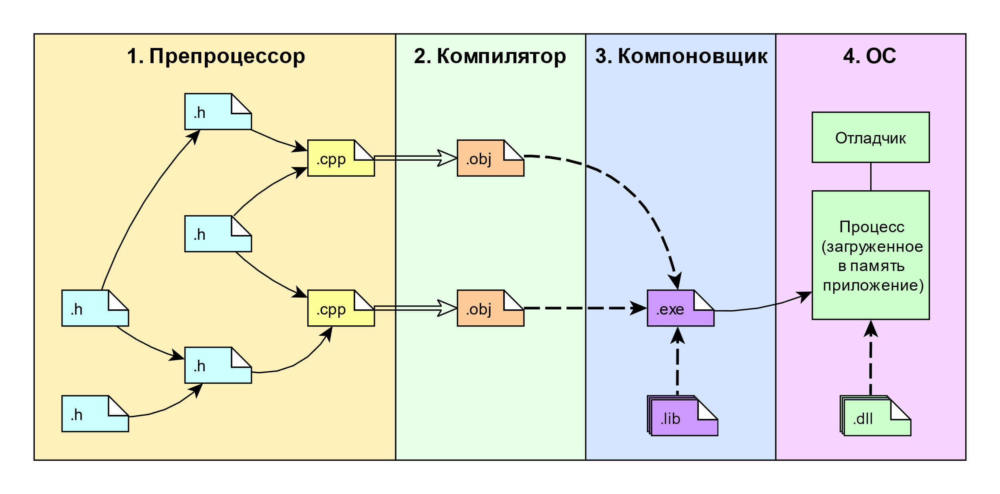

# Практическая работа №2. Сборка многофайловых программ

**Цели:**

- Изучить процесс сборки многофайловых программ на С++ и Go;

- Познакомиться с основными инструментами сборки;

## Подготовка

Перед началом работы выполните следующие действия:

- В каталоге `projects` создайте каталог `lab2` и перейдите в него;

- Откройте терминал в каталоге `lab2` (текущий каталог должен быть `projects/lab2`);

- Наберите команду: `code .`;

- Активируйте профиль *Remote* и добавьте конфигурацию *Dev Container* для разработки под С++ в текущий каталог. В качестве ОС контейнера выберите *Ubuntu 24.04*;
- Запустите *Docker Desktop*. Если *Docker Desktop* не будет запущен, то на следующем шаге получите ошибку;

- Откройте текущий каталог в контейнере.

Все дальнейшие действия нужно выполнять в этом контейнере.

## Процесс сборки C++

Стандарт насчитывает 9 [этапов трансляции](https://en.cppreference.com/w/cpp/language/translation_phases), которые упрощённом виде можно объединить в следующие четыре:



> [!Note]
>
> Расширения файлов показаны для *Windows*. Для *Linux*: `.obj` соответствует `.o`; `.lib` соответствует `.a`; `.dll` соответствует `.so`; для `.exe` соответствия нет, т.к. на *Linux* исполняемые файлы обычно без расширения.

Процесс сборки начинается с того, что у нас есть набор `.cpp` и `.h` файлов. Каждый `.cpp` файл будет проходить все стадии сборки вплоть до линковки (компоновки) **независимо** от остальных, поэтому их называют - единицей трансляции (*translation unit*). Файлы с расширением `.h` встраиваются в `.cpp` - файлы на этапе препроцессирования и непосредственно в компиляции не учувствуют.

Из каждого `.cpp` файла генерируется соответствующий объектный файл (`.o` или `.obj`), который на этапе линковки объединяется с другими объектными файлами и со статическими библиотеками (`.lib` или `.a`) в один исполняемый файл (`.exe` или без расширения).

Готовый исполняемый файл можно запустить. В процессе запуска исполняемый файл может попросить ОС загрузить необходимые ему динамические библиотеки (`.dll` или `.so`).

Большинство компиляторов позволяют остановить процесс сборки после указанного этапа и вывести промежуточное состояние файлов, после препроцессирования, после компиляции и т.д. Сборка программы под разные ОС в целом следует одному сценарию, но всё-таки присутствуют мелкие отличия. Чтобы не "утонуть" в мелочах, далее мы будем работать с компиляторам *g++* под *Linux*. g++ - это компилятор языка программирования *C++*, который является частью *GNU Compiler Collection (GCC)*.

Компилятор *g++* не делает всю работу самостоятельно, а последовательно вызывает другие команды: сначала *cc1plus*, потом *as*, в конце *collect2*, который вызывает *ld*. Сценарий сборки со всеми параметрами можно посмотреть командой:

```bash
echo | g++ -v -x c++ -
```

### Фаза препроцессинга

Подробности работы препроцессора *g+* можно посмотреть в [документации](https://gcc.gnu.org/onlinedocs/cpp/). 

Перед началом работы препроцессор выполняет ряд текстовых преобразований над переданными ему файлами. Например: удаляет комментарии и лишние пробельные символы, объединяет строки перенесённые при помощи символа `\` и т.д. Эти преобразования примерно соответствуют первым трём «этапам трансляции», описанным в стандарте C++.

Препроцессор можно воспринимать, как интерпретатор некоторого простого языка, предназначенного для работы с текстом. Этот язык имеет набор команд, которые называются директивами препроцессора.

Директивы препроцессора занимает одну полную строку и имеют следующий формат:

- Символ `#`;
- Название стандартной директивы или название нестандартной директивы или ничего (тогда директива ничего не делает). Нестандартные директивы (например `#pragma`) могут работать на одних компиляторах и игнорироваться другими;
- Перевод строки.

Препроцессор принимает на вход **текст**, исполняет директивы и на выход тоже выдаёт **текст**, в котором уже нет директив. Компилятор `g++` с опцией `-E` позволяет остановить сборку после этапа препроцессирования и вывести результат на экран, а если добавить опцию `-o имя_файла`, то сохранить его в файл (прошедшему через стадию препроцессинга C коду, обычно, дают расширение `.i`. В случае С++, расширение `.ii`).

1. Создайте каталог `"preprocessor"` и внутри него создайте файл `"main.cpp"` содержащий:

   ```cpp
   The answer is ANSWER
   ```

2. Откройте встроенный в VS Code терминал и перейдите в каталог `"preprocessor"`.

3. Выполните команду:

   ```bash
   g++ -E -o main.ii main.cpp
   ```

   В результате в текущем каталоге должен появится файл `"main.ii"`. Посмотрите его содержимое. Если среда не показывает файл, нажмите символ `↻` (*Refresh Explorer*).

   Как видно, препроцессор никак не изменил исходный текст, а только добавил сверху "шапку" (может отличаться в зависимости от компилятора). Несмотря на то, что строки в "шапке" тоже начинаются с решётки - эта директива предназначена не для препроцессора, а для компилятора и инструментов, работающих с кодом. Как мы увидим далее, препроцессор всё-таки модифицирует исходный текст: выполняет вставку одних файлов в другие, включает/отключает блоки текста и т.д. Т.к. компилятор получает на вход уже модифицированные файлы ему необходима эта метаинформация, например, чтобы в сообщения об ошибках были названия файлов и нумерация строк соответствующая исходным файлам, а не модифицированным. Кроме того эта информация нужна и дебагеру.

   В нашем примере в исходном файле текст *"The answer is ANSWER"* находится на первой строке, а в препроцессированном на пятой. Чтобы компенсировать такое смещение, препроцессором было добавлено `# 1 "main.cpp"`, чтобы компилятор понимал, что следующая за директивой строка должна восприниматься как первая и она изначально находилась в файле `"main.cpp"`.

4. Выполните команду:

   ```bash
   g++ -P -E -o main.ii main.cpp
   ```

   Опция `-P` уберёт пустые строки и предотвратит генерацию директив с номерами строк. В результате код станет чище и понятнее для изучения.

5. Измените текст файла `"main.cpp"` на следующий:

   ```cpp
   #define ANSWER 42
   The answer is ANSWER
   ```

   Запустите препроцессирование и затем откройте файл `"main.ii"`. Чтобы в терминале повторить прошлую команду нажмите на клавиатуре стрелку вверх. 

   В данном примере директива `#define` объявляет "константу" препроцессора с именем `ANSWER` и значением 42. Такое определение ещё называют макроопределением или макросом. В общем случае значение макроса может отсутствовать или зависеть от параметров. В процессе анализа текста препроцессор найдёт и заменит все вхождения `ANSWER` на его значение. Говорят, что макрос `ANSWER` раскроется в 42.

   Директива противоположная `#define` - `#undef`. Она удаляет указанное имя из списка объявленных и далее по тексту препроцессор больше не будет реагировать на него.

6. Измените текст файла `"main.cpp"` на следующий:

   ```cpp
   #define MONEY is GOOD
   The money is MONEY
       
   #define GOOD is MONEY
   The money is MONEY
       
   #undef GOOD
   The money is MONEY
   ```

   Запустите препроцессирование и затем откройте файл `"main.ii"`.

   Как видно, в теле макроса можно использовать другие макросы (или даже себя), причём они могут быть объявлены как выше так и ниже текущего. Препроцессор не выполняет раскрытие макросов в директивах, только в обычном тексте.

   В этом примере препроцессор найдёт в первой строке слово *MONEY*, заменит на *is GOOD* и пойдёт дальше. Во второй строке, *MONEY* сначала раскроется в *is GOOD*, а затем препроцессор раскроет *is GOOD* в *is is MONEY* Т.к., для этого фрагмента, больше нет **неиспользованных** макросов, то оно считается полностью раскрытым и препроцессор выполнит замену исходного текста *MONEY* на *is is MONEY*. В третьей строке, препроцессор снова заменит *MONEY* на *is GOOD* и т.к. макрос *GOOD* удалён, то на этом он и остановится.

   За счёт того, что в процессе раскрытия один макрос не может быть использован дважды, угрозы попасть в петлю рекурсивных замен нет.

7. Измените текст файла `"main.cpp"` на следующий:

   ```cpp
   #define print(x) std::cout << x << std::endl;
   print("Hello, world")
   ```

   Запустите препроцессирование и затем откройте файл `"main.ii"`.

   Здесь мы объявили макрос `print` с параметром `x`. В результате раскрытия, аргумент переданный макросу будет подставлен в его тело вместо `х`.

   Хотя такое выражение и похоже на функцию, работает оно по другому. Препроцессор никак не анализирует результат раскрытия макроса на корректность с точки зрения синтаксиса С++, т.к. он работает на уровне текса и понятия не имеет, что этот текст означает.

8. Измените текст файла `"main.cpp"` на следующий:

   ```cpp
   #define sum(a, b) a + b
   int x = sum(2, 2);     // Ожидаем 4
   int y = 3 * sum(2, 2); // Ожидаем 12
   ```

   Запустите препроцессирование и затем откройте файл `"main.ii"`.

   Как видно, макрос раскрылся правильно, но совершенно не так, как мог бы ожидать человек читающий код, особенно, если объявление макроса не находится в поле зрения. Такого рода сюрпризы могут заставить усомниться в собственной адекватности и подарить многие часы увлекательного дебагинга. Это одна из причин, почему макросы принято называть заглавными буквами. Чтобы они сразу бросались в глаза.

   Чтобы уменьшить количество неожиданных ситуаций с макросами, принято заворачивать само тело и каждый параметр макроса в круглые скобки:

   ```cpp
   #define sum(a, b) ((a) + (b))
   ```

   Общая рекомендация для С++ - не использовать макросы вообще. Большая часть функционала, ради которого используют макросы, покрывается обычными переменными и функциями объявленными с добавлением ключевого слова `constexpr`:

   ```cpp
   constexpr int sum(int a, int b) {
       return a + b;
   }
   ```

9. Измените текст файла `"main.cpp"` на следующий:

   ```cpp
   #define PRINT( x ) std::cout << "Error: " x " not correct" << std::endl;
   #define ASSERT( n ) if ( not (n) ) PRINT(#n)
   
   ASSERT(sizeof(int) == 4)
   ```

   Запустите препроцессирование и затем откройте файл `"main.ii"`.

   Здесь, в теле макроса `ASSERT`, перед именем параметра `n` указан спец. символ `#`. Этот спец. символ завернёт весь текст который будет передан в качестве `n` в двойные кавычки, т.е. превратит его в текстовый литерал.

   После препроцессирования появятся конструкции вида:

   ```cpp
   "Error: " "some_text" " not correct"
   ```

   Это абсолютно корректная запись, которая после склеивания строк превратится в:

   ```cpp
   "Error: some_text not correct"
   ```

10. Измените текст файла `"main.cpp"` на следующий:

    ```cpp
    #define PRINT_WARNING( x ) std::cout << "Warning: " x " not correct" << std::endl;
    #define PRINT_ERROR( x ) std::cout << "Error: " x " not correct" << std::endl;
    #define ASSERT( n, type ) if ( not (n) ) PRINT_##type(#n)
      
    ASSERT(sizeof(int) == 4, ERROR)
    ASSERT(sizeof(int) == 4, WARNING)
    ```

    Запустите препроцессирование и затем откройте файл `"main.ii"`.
    
    Здесь, в теле макроса `ASSERT`, используется другой спец. символ: `##`. Он позволяет склеить то, что находится слева от него с тем, что находится справа уже после подстановки параметров. Если убрать решётки, то `PRINT_type` останется без изменения, т.к. `type` НЕ будет воспринято как имя параметра макроса.

11. Введите по очереди команды:

    ```bash
    echo | g++ -dM -E -x c++ -
    echo "#include <iostream>" | g++ -dM -E -x c++ -
    g++ -dM -E -x c++ main.cpp
    ```

    Кроме макросов определённых нами, существует набор преопределённых макросов (зависит от системы, компилятора и т.д.). Первый вариант покажет только их. Второй, покажет список макросов, но с учётом кода в кавычках. Третий вариант, добавит к стандартным, макросы из `"main.cpp"`.

12. Измените текст файла `"main.cpp"` на следующий:

    ```cpp
    Running on SYSTEM
    ```

    и запустите препроцессирование командой:

    ```bash
    g++ -E -P -D SYSTEM=Linux -o main.ii main.cpp
    ```

    Опция `-D` позволяет определить макрос и передать его в качестве параметра компилятору. Если нужно больше одного макроса, то повторите `-D` нужное число раз. Тело макроса можно заключить в кавычки, например, если в нём будут пробелы. Короткие опции с параметром, позволяют опускать пробел, поэтому часто можно встретить запись вида: `-DSYSTEM=Linux`.

На С++ часто пишут код, который должен собираться на разных платформах (кроссплатформенный код). В зависимости от платформы, может поменяться очень многое, начиная от способа взаимодействия со стандартным вводом/выводом, заканчивая размером базовых типов. Поэтому, может потребоваться реализовать отдельные фрагменты программы по разному, чтобы учесть особенности платформы на которой он будет компилироваться. Благодаря препроцессору и семейству директив **условной компиляции** мы можем это делать.

13. Измените текст файла `"main.cpp"` на следующий:

    ```cpp
    #define LINUX
    
    #ifdef LINUX
    Linux specific code
    #endif
    
    Common code
    ```

    Запустите препроцессирование и затем откройте файл `"main.ii"`.

    Директива `#ifdef` проверяет объявлен ли макрос с указанным именем и если это так, препроцессор оставить блок текста, иначе удалит. При этом сам макрос может иметь любое тело и даже быть с параметрами, на результат влияет только факт его объявления. Блок обязательно закрывается директивой `#endif` .

    Кроме того, существует директива с противоположным поведением `#ifndef`, которая срабатывает, в случае, если макрос не объявлен.

14. Измените текст файла `"main.cpp"` на следующий:

    ```cpp
    #define LINUX 24
    
    #ifdef LINUX
        #if (LINUX >= 20 ) && (LINUX % 2 == 0 ) 
        Linux super specific code
        #else
        Linux specific default code
        #endif
    #else
        Windows specific code
    #endif
    
    Common code
            
    #ifdef LINUX
        Linux specific default code
    #endif
    ```

    Запустите препроцессирование и затем откройте файл `"main.ii"`.

    Директивы условной компиляции можно вкладывать друг в друга. Здесь отступы добавлены исключительно с целью наглядности, они не обязательны.
    
    Если есть необходимость выбора между основной веткой и побочной, то можно воспользоваться директивой `#else` , либо `#elif`, если побочные ветки требуют проверки доп. условий.
    
    Так же есть директива `#if`, которая в целом работает аналогично обычному if-у, но только с целочисленными выражениями. Т.е. сравнить два вещественных числа или строки нельзя.  В выражении можно использовать арифметические, логические и операторы сравнения.

Для С++ характерным является разделение кода на два типа файлов `.cpp` (*source code*) и `.h` (*header*). При этом `.h` встраиваются в `.cpp` на этапе препроцессирования и до компиляции не доходят.

15. Измените текст файла `"main.cpp"` на следующий:

    ```cpp
    First line
    #include "header.txt"
    #include "header.txt"
    #include "header.txt"
    Second line
    ```

    затем, рядом с `"main.cpp"` создайте файл `"header.txt"` :

    ```cpp
    From header
    ```

    Запустите препроцессирование (так же как и до этого) и затем откройте файл `"main.ii"`.

    Директива `#include` говорит компилятору вставить содержимое указанного файла в текущий, начиная с этой строки. Расширение файла при этом значения не имеет, его вообще может не быть (например как у файла стандартной библиотеки "iostream"`). Перед вставкой, файл пройдёт процедуру препроцессирования.

    Имя файла можно указать как полностью, начиная от корня диска, так и в относительном формате  с использованием символов `./` (текущий каталог) и `../` (родительский каталог). Если внутри вставляемого файла (`a.h`) тоже встретится `#include "b.h"`, то путь к файлу `"b.h"` будет определятся относительно `a.h`.

16. Измените текст `"main.cpp"` на следующий и снова запустите препроцессирование:

    ```cpp
    First line
    #include <header.txt>
    Second line
    ```

    В результате, препроцессор должен сообщить о том, что `"header.txt"` не найден.

    Директива `#include` позволяет указать путь к файлу в двух форматах:

    ```C++
    #include "header.txt"
    #include <header.txt>
    ```

    Первый вариант, сначала ищет файл в текущем каталоге (поведение по умолчанию), и если не находит переходит к такому же поведению, как и второй вариант. Второй вариант, ищет файл по стандартным путям, которые зависят от компилятора и платформы. Это короткая версия процесса поиска файла. Для компилятора *g++* подробности можно посмотреть [здесь](https://man7.org/linux/man-pages/man1/g++.1.html) в разделе *Options for Directory Search*.

    Ещё можно посмотреть порядок поиска файла непосредственно в настройках компилятора, в выводе команды (в разделах *#include "..." search starts here* и *#include <...> search starts here*):

    ```bash
    echo | g++ -v -E -x c++ -
    ```

17. Измените текст файла `"main.cpp"` на следующий:

    ```cpp
    First line
    #if __has_include(<header.txt>)
        #include <header.txt>
    #else
        Ooops!
    #endif
    Second line
    ```

    Запустите препроцессирование и затем откройте файл `"main.ii"`.

    Макрос `__has_include` (доступен с С++17), возвращает единицу, если искомый файл существует и ноль в противоположном случае. Он также доступен в нескольких формах:

    ```cpp 
    __has_include("file_name")
    __has_include(<file_name>)
    ```

18. Выполните команду:

    ```bash
    g++ -E -P -I . -o main.ii main.cpp
    ```

    Как видно, процесс завершился без ошибок и заголовочный файл был успешно вставлен.

    Опция `-I` позволяет добавить указанный путь **в начало** списка путей поиска. Здесь мы указываем точку, что означает - текущий каталог. При необходимости, можно добавить и больше путей, при помощи дополнительных опций `-I`. Порядок поиска определяется слева направо. Как только по одному из путей будет найден искомый файл, поиск остановится.

    Кроме директивы `-I` есть и другие. В основном они отличаются только местом добавления пути в общий список путей, т.е. приоритетом.

Не трудно понять, что у препроцессора имеется как минимум 2 проблемные ситуации:

- Циклическая вставка:

  ```mermaid
  flowchart LR
      subgraph B[" "]
      direction LR
      a1[C: #include ''A'']-->a2[A: #include ''B'']
      a2-->a3[B: #include ''C'']
      a3-->a1
      end
      subgraph A[" "]
      direction LR
      b1[B: #include ''A'']-->b2[A: #include ''B'']
      b2-->b1
      end
  ```
  
  Процесс зацикливается и падает с ошибкой на этапе препроцессинга;

- Ромбовидная (*diamond*) вставка:

  ```mermaid
  flowchart
      subgraph B[" "]
      direction BT
      a[A: #include ''B'' \n #include ''С'']-->b[B: #include ''D']
      a-->c[C: #include ''D']
      b-->d[D]
      c-->d
      end
  ```

  На этапе препроцессинга проблем нет, но на этапе компиляции может возникнуть ситуация нарушения *ODR* (*One Definition Rule*). Например, если файл `D` содержит **определение** переменной или функции, то файл `A`  получит это определение дважды: один раз их `B`, второй из `C`.

19. Измените текст файла `"main.cpp"` на следующий:

    ```cpp
    From main
    #include "B.txt"
    #include "C.txt"
    ```

    Создайте в текущем каталоге файл `"B.txt"`:

    ```cpp
    From B
    #include "header.txt"
    ```

    и файл `"C.txt"`:

    ```cpp
    From C
    #include "header.txt"
    ```

    Запустите препроцессирование и изучите содержимое файла `"main.ii"`. Как видно, содержимое `"header.txt"` присутствует дважды.

20. Измените текст файла `"header.txt"` на следующий:

    ```cpp
    #ifndef HEADER_TXT
    #define HEADER_TXT
    From header
    #endif
    ```

    Запустите препроцессирование и изучите содержимое файла `"main.ii"`.

    Как видно, текст из `"header.txt"` теперь присутствует в единственном экземпляре. Такая конструкция носит название *header guards* и является стандартной для заголовочных файлов.

    В качестве альтернативы *header guards* используют **нестандартную** директиву `#pragma once`. В общем случае, поддержка директив из семейства `#pragma` не гарантируется, но `#pragma once` настолько популярна, что большинство компиляторов работают с ней нормально. Если разместить её в начале файла, то эффект будет такой же как и от *header guards*. Некоторые замеры показываю, что использование `#pragma once` ускоряет сборку проекта по сравнению с *header guards*.

    В нашем же случае порядок работы препроцессора такой:

     - Строка *"From main"* остаётся без изменения;
     - Нужно вставить в `"main.cpp"` файл `"B.txt"`. Запускаем обработку  `"B.txt"`:
       - Строка *"From B"* остаётся без изменения;
       - Нужно вставить в `"B.txt"` файл `"header.txt"`. Запускаем обработку  `"header.txt"`:
         - Макрос `HEADER_TXT` не объявлен, значит заходим в тело if и выполняем код;
         - Объявляем макрос `HEADER_TXT`;
         - Строка *"From header"* остаётся без изменения.
         - Файл `"header.txt"` обработан.
       - Вставляем обработанное содержимое `"header.txt"`;
       - Файл `"B.txt"` обработан.
     - Вставляем обработанное содержимое `"B.txt"`;
     - Нужно вставить в `"main.cpp"` файл `"C.txt"`. Запускаем обработку  `"C.txt"`:
       - Строка *"From C"* остаётся без изменения;
       - Нужно вставить в `"C.txt"` файл `"header.txt"`. Запускаем обработку  `"header.txt"`:
         - Макрос `HEADER_TXT` объявлен, значит пропускаем всё до `#endif`;
         - Файл `"header.txt"` обработан (пусто).
       - Вставляем обработанное содержимое `"header.txt"`;
       - Файл `"С.txt"` обработан.
     - Вставляем обработанное содержимое `"B.txt"`;
     - Файл `"main.cpp"` обработан.

21. Измените текст файла `"main.cpp"` на следующий:

    ```cpp
    #include <iostream>
    
    int main(){
        std::cout << "Hello, World!" << std::endl;
    }
    ```

    и пропроцессируйте командой:

    ```bash
    g++ -E -H main.cpp -o main.ii
    ```

    Посмотрите, какое количество строк кода получилось в файле `"main.ii"` и найдите в нём функцию `main` (в самом низу).

    Здесь, опция `-H` заставит компилятор вывести на экран все файлы, которые были подключены при помощи `#include`. Количество точек показывает уровень вложенности.

Кроме рассмотренных здесь, если несколько других директив препроцессора, но они используются значительно реже и не несут для нас практической пользы. 

### Фаза компиляции

> [!NOTE]
>
> Значение слова компиляция, согласно википедии - это процесс преобразования исходного кода программы, написанного на языке программирования, в машинный код или другой язык, понятный компьютеру.

На фазе компиляции каждая единица трансляции преобразуется в бинарный объектный файл, организованный определённым образом. У разных платформ свои [форматы объектных файлов](https://en.wikipedia.org/wiki/Comparison_of_executable_file_formats). Вот несколько самых распространённых из них:

- *[COFF](https://docs.microsoft.com/en-us/archive/msdn-magazine/2002/february/inside-windows-win32-portable-executable-file-format-in-detail)* – изначально использовался на *UNIX* системах (`.o`, `.obj`) и не поддерживал 64-битные архитектуры (потому что их в тот момент просто не было). Позже был заменён на формат ELF. С его развитием появился *Portable Executable (PE)*, который до сих пор используется в *Windows* (`.exe`, `.dll`).

  *[Mach-o](http://www.cilinder.be/docs/next/NeXTStep/3.3/nd/DevTools/14_MachO/MachO.htmld/index.html)* – формат объектных файлов на *macOS*. Отличается от *COFF* структурой, но выполняет те же функции. Формат поддерживает хранение кода для разных архитектур. Например, в одном исполняемом файле можно хранить код как для *ARM*, так и для *x86* процессоров.

  *[ELF](http://www.skyfree.org/linux/references/ELF_Format.pdf)* – формат объектных файлов на *Unix* системах. Так же используется как формат исполняемых файлов и динамических библиотек.

Наиболее распространённой конструкцией традиционного статического компилятора является трёхфазная. Её основные компоненты: фронтенд, оптимизатор и бэкенд.


Фронтенд анализирует исходный код, проверяя его на наличие ошибок, и создаёт абстрактное синтаксическое дерево *(AST)* для представления входного кода. *AST* при необходимости преобразуется в новое промежуточное представление для оптимизации (например *clang* использует *LLVM IR* (*Intermediate Representation*), а *g++* -  [GIMPLE](https://gcc.gnu.org/onlinedocs/gccint/GIMPLE.html)). Оптимизатор отвечает за выполнение широкого спектра преобразований, направленных на улучшение времени выполнения кода, за устранение избыточных вычислений, и обычно более или менее независим от языка и целевой платформы. Затем бэкенд (также известный как генератор кода) создаёт машинный код в соответствии с набором команд и особенностей конкретной целевой платформы.

Такое разделение позволяет упростить разработку компиляторов для новых языков, т.к. достаточно написать только часть отвечающую за преобразование нового языка в промежуточное представление, а вторая, самая сложная часть, которая сгенерирует машинные коды под заданную архитектуру процессора уже написана.


Компилятор *g++* на выходе создаёт ассемблерный код под целевую платформу, а он в свою очередь преобразуется в бинарный при помощи отдельной программы. Эта добавочная фаза называется - ассемблирование (преобразование ассемблера в машинные коды). *Clang* же умеет генерировать как ассемблерное представление (по запросу), так и машинные коды напрямую из промежуточного представления (*LLVM IR*).

22. В корневой папке `"lab2"` создайте каталог `"compilation"` и перейдите в него в терминале;

23. Создайте файл `"main.cpp"` содержащий:

    ```cpp
    int main(){
        int a = 2, b = 2;
        int c = a + b;
    }
    ```

    и запустите команду:

    ```bash
    g++ -S -masm=intel -O0 main.cpp
    ```

    Опция `-S` говорит компилятору сгенерировать ассемблерный код, сохранить его в файл и остановиться (препроцессирование тоже произойдёт). Сам файл будет сохранён в этот же каталог под именем `main.s` (как и ранее опция `-o` позволяет указать другое имя).

    Опция `-masm=intel` говорит компилятору использовать синтаксис ассемблера Intel, а не AT&T. Синтаксис AT&T менее популярный и менее читаемый, по сравнению с Intel-овским.

    Опция `-O0` говорит компилятору применить минимальный уровень оптимизаций (значение по умолчанию). Этот уровень обычно выставляется во время **отладки** программы, т.к. скомпилированная программа практически идентична написанной программистом. Ещё есть: `-O1`, `-O2`, `-O3`, `-Os`, `-Ofast`, `-Og` ([подробнее](https://gcc.gnu.org/onlinedocs/gcc-11.5.0/gcc/Optimize-Options.html)).

24. Изучите файл `"main.s"`. В выводе содержится довольно много вспомогательной информации, которая нам сейчас не нужна. Чтобы посмотреть очищенный вариант ассемблерного кода перейдите на сайт [godbolt.org](https://godbolt.org/z/TnaE6cb5d).

    Как видно, в первой строке присутствует метка `main:`. Метки - это не ассемблерные команды, они используются для удобства в командах перехода (типо `goto` в С++). В исполняемом файле метки в будут заменены на конкретные адреса.

25. В окне godbolt измените уровень оптимизации на `-O2`. Как правило **релизные** версии программ собираются с этим уровнем оптимизации.

    Как видно, компилятор понял, что переменные, `a`, `b` и `c` никак не используются и просто удалил их. То что осталось делает всего две вещи:

    - `xor  eax, eax` - после этого в регистре процессора `eax` будет 0 (это код завершения программы);
    - `ret` - вернуться в точку вызова (конец функции main).

26. Создайте файл `"foo.cpp"` содержащий:

    ```cpp
    int second();
    
    int first(){
        return second();
    }
    
    int foo(){
        return first();
    }
    ```

    и запустите команду:

    ```bash
    g++ -S -masm=intel -O0 foo.cpp
    ```

    Изучите получившийся файл, затем посмотрите на очищенную версию [здесь](https://godbolt.org/z/cff4Yvz6Y).

    Обратите внимание, что функции называются не так как в коде, а: `_Z3foov`, `_Z5firstv`, `_Z6secondv`. Это называется манглирование (искажение) имён (*name mangling*). Манглирование необходимо, для реализации махизма перегрузки (в go нет, в с нет), чтобы можно было использовать одно и тоже имя для функций с разными типами параметров, например:

    ```c++
    int foo(int);         // _Z3fooi
    double foo(int);      // _Z3fooi
    int foo(int, int);    // _Z3fooii
    int foo(int, double); // _Z3fooid
    ```

    Чтобы получить исходное имя по мангилрованному можно воспользоваться https://demangler.com/.

27. Запустите команду:

    ```bash
    g++ -S -masm=intel -O0 -x c foo.cpp
    ```

    Здесь, при помощи опции `-x` со значением `c` мы говорим компилятору, что код в файле написан на языке программирования С, не смотря на расширение `*.cpp` (обычно компилятор выбирает язык ориентируясь именно на расширение). Добавьте эту же опцию на странице godbolt.

    Как видно, теперь имена функций не манглируются. Так происходит, потому что, в С нет поддержки перегрузки и в манглировании нет необходимости.

    Такое различие в именах может вызвать проблемы, например в случае использования С и С++ в одной кодовой базе. Такое может быть, если вы подключаете к проекту на C++ скомпилированную C-шную библиотеку, а не собираете её из исходников.

28. Измените содержимое файла `"foo.cpp"` на:

    ```cpp
    extern "C" int second();
    
    extern "C" int first(){
        return second();
    }
    
    int foo(){
        return first();
    }
    ```

    и скомпилируйте без опции `-x`, т.е. по правилам С++. Аналогично сделайте на godbolt.

    Как видно, добавление `extern "C"` привело к тому, что имена перестали манглироваться. Про `extern` будет далее. Для функций отмеченных `extern "C"` мы всё ещё можем использовать перегрузку (т.е. создавать функции с таким же именем но другим списком параметров), но только одна из них может быть помечена как `extern "C"` по понятным причинам.

29. Изучите ассемблерный вывод и найдите инструкции `call`. Данная инструкция отвечает за вызов функции и по сути сводится к двум действиям: записать адрес следующей за `call` инструкции на стек и перепрыгнуть на указанную метку/адрес. Как только будет встречена инструкция `ret`, будет выполнен обратный прыжок по тому адресу, который сейчас указан на вершине стека.

    Обратите внимание, что несмотря на то, что функция `second` только объявлена и не имеет определения, процесс компиляции завершился успешно. При этом в ассемблерном выводе нет блока отмеченного меткой `second`.

    При помощи объявления мы пообещали компилятору, что функция есть либо далее по тексту либо в других `.cpp` файлах. Теперь понятно, почему компилятору *С++* обязательно нужно такое объявление, т.к. без него он не сможет правильно манглировать имя. В языке *C* наличие объявлений не обязательно, т.к. имя функции всегда будет совпадать с именем метки.

30. Запустите команду:

    ```bash
    g++ -S -g -masm=intel main.cpp
    ```

    Опция `-g` позволяет добавить в ассемблер отладочную информацию, которая будет использоваться дебагером для синхронизации с исходным кодом в процессе отладки. Опция имеет рад уровней от 0 до 3 и позволяет генерировать информацию в разных форматах. Как правило, просто `-g` достаточно для большинства случаев.

    Изучите содержимое `"main.s"` (godbolt больше не понадобится). Как видно, ассемблер существенно разбух и теперь тут можно найти: путь и название файла с исходным кодом, инструкции вида `.loc 1 2 9`, которые говорят, в каком файле, на какой строке и на каком символе должен находится курсор во время исполнения текущей ассемблерной инструкции. Кроме того, можно найти даже имена локальных переменных.

    Именно благодаря наличию этой информации мы можем устанавливать точки останова на определённых строках, отслеживать значения переменных по их имени и при этом наблюдать процесс работы кода интерактивно в среде. Если собрать программу добавив ещё ключи оптимизации, то можно наблюдать всякого рода "глюки", которые будут связаны с тем, что часть кода была удалена или переделана компилятором. В принце можно отлаживать программу собранную и без ключа `-g`, но в этом случае у нас не будет возможности пройти построчно по коду, посмотреть значения локальных переменных и т.д. Можно будет смотреть только на стек вызовов и устанавливать точки останова по именам функций, т.к. дебагер понятия не имеет как связать исполняемые инструкции и исходный код. Кстати, где находится нужный файл с кодом он тоже знать не будет.

31. Выполните команду:

    ```bash
    g++ -c foo.cpp
    ```

    Опция `-c` говорит компилятору остановиться после этапа ассемблирования и сохранить полученный объектный файл. Сам файл будет сохранён в этот же каталог под именем `foo.o` (как и ранее опция `-o` позволяет указать другое имя).

    Это бинарный файл, поэтому посмотреть его содержимое в текстовом редакторе будет проблематично. На самом деле отличие текстовых и бинарных файлов не большое и то и то - это просто последовательность байт. Разница заключается в том, как текстовые редакторы интерпретируют эти байты. Например, символ с кодом `0` (нулевой байт) может быть воспринят как конец файла, другая часть байт в принципе не имеет [глифа](https://ru.wikipedia.org/wiki/Глиф) для отображения. Ещё есть разница как воспринимается символ конца строки на *linux*, *macOS* и *windows* ([подробнее](https://habr.com/ru/articles/358154/)).

32. Выполните команду:

    ```bash
    hexdump -C foo.cpp
    ```

    Опция `-C` настраивает вывод утилиты [`hexdump`](https://man7.org/linux/man-pages/man1/hexdump.1.html) в виде трёхколоночного: номер первого байта в строке (цифры шестнадцатеричные), 16 байт из файла (тоже в шестнадцатеричной системе счисления) и попытка интерпретировать байты как коды ASCII-символов. Если символ не имеет графического представления, то отображается точка.

    Т.к. `"foo.cpp"` это текстовый файл, то почти все символы имеют графическое представление (кроме символа перевод строки).

33. Выполните команду:

    ```bash
    hexdump -C foo.o
    ```

    Т.к. `"foo.o"` это бинарный файл, то большая часть символов уже не является печатными.

34. Утилита `hexdump` и подобные ей, позволяют только просматривать содержимое файлов, но иногда требуется в них что-то поправить. Есть множество программ hex-редакторов с кучей дополнительного функционала (например дизассемблирование), но раз уж мы работаем в vs code, то воспользуемся одним из его плагинов:

    - Перейдите в раздел плагинов, найдите и установите расширение *Hex Editor*;
    - Вернитесь в раздел *Explorer* выберите файл `"foo.cpp"`;
    - Нажмите сочетание клавиш <kbd>Ctrl</kbd>+<kbd>Shift</kbd>+<kbd>P</kbd> и начните набирать *hex* пока не появится пункт: *Hex Editor: Open Active File in Hex Editor*;
    - Изучите возможности плагина по просмотру и редактированию файла.

35. Выполните команду:

    ```bash
    objdump -D -M intel foo.o
    ```

    Опция `-D` или длинный вариант (`--disassemble-all`) выполняет обратное преобразование объектного файла в ассебмлерное представление, а опция `-M` со значением `intel` указывает, что нужно использовать синтаксис от *Intel*.

    Как видно, здесь довольно много информации, которая разбита на секции.

36. Выполните команду:

    ```bash
    objdump -d -M intel foo.o
    ```

    Опция `-d` дизассемблирует только секцию `.text`. В этой секции расположен исходный код программы.

    Макет представления тоже разделён на три колонки: в начале, смещение в байтах от начала секции, затем один или несколько байт из файла, в зависимости от того какая распознана инструкция, и справа соответствующие этим байтам ассемблерные мнемоники. Например: байт `с3` соответствует мнемонике `ret` для архитектуры x86 процессора ([справочник](https://blic.fandom.com/ru/wiki/Таблица_с_кодами_операций)), а байт `e8` - мнемонике `call`.

    Обратите внимание, что вызов функции записан как:

    ```
    e8 00 00 00 00          call   d <first+0xd>
    ```

    Здесь, после кода инструкции должны быть 4 байта указывающие адрес на который нужно выполнить переход (адрес функции), но сейчас тут нули. Это заглушка, которую оставил компилятор, т.к. ему НЕ известно точное расположение функций в полном исходном коде программы, ведь он видит только её кусочек - один объектный файл из многих. На следующем этапе программа будет собрана в единый исполняемый файл и эти заглушки будет заменены на реальные адреса функций.

### Фаза линковки (компоновки)

После фазы компиляции мы получаем набор отдельных объектных файлов. Как мы видели, объектные файлы содержать вызовы функций, но без указания конкретного адреса перехода. Это происходит, потому что отдельные объектные файлы будут склеены линковщиком в один бинарный файл, но заранее не известны ни размеры, ни количество файлов, ни порядок склеивания. После склеивания всех файлов в один, линковщик (редактор связей) пройдёт по нему и заменит заглушки на реальные адреса.

37. Выполните команду:

    ```bash
    nm -C foo.o
    ```

    Утилита [`nm`](https://manpages.ubuntu.com/manpages/trusty/man1/nm.1.html) позволяет посмотреть все имена (обычно их называют символы) доступные в текущем бинарном файле или те, на которые он ссылается (зависимости). Опция `-С`, говорит, что нужно выполнить деманглирование имён.

    Символ `T` перед именем означает, что оно находится в секции `.text`, т.е. эта функция присутствует в данном файле; символ `U`, говорит о том, что функция/переменная не определена (*undefined*) в текущем файле, т.е. ожидается, что она определена в другом объектном файле.

38. Измените содержимое `"main.cpp"` на следующее:

    ```cpp
    int second(){
        return 42;
    }
    
    int foo();
    
    int main(){
        return foo();
    }
    ```

    Здесь мы определяем функцию `second` и объявляем `foo`, т.к. она используется в `main`.

39. Выполните компиляцию файла `"main.cpp"` без линковки и посмотрите список символов:

    ```bash
    g++ -c main.cpp
    nm -C  main.o
    ```

40. Выполните команду:

    ```bash
    g++ main.o
    ```

    Т.к. на вход передан объектный файл, то *g++* сразу отправит его на этап линковки. В результате вы получите сообщение от линковщика о том, что не найдена функция `foo()`. Сообщение от линковщика можно отличить по именам *collect2* и *ld*.

41. Выполните команду:

    ```bash
    g++ main.o foo.o
    ```

    Сообщение от линковщика должно поменяться, теперь он больше на жалуется на отсутствие функции `foo`, т.к. она присутствует в `"foo.o"`, но ругается на отсутствие функции `second`. Это может показаться странным, т.к. она определена в файле `"main.cpp"` и следовательно должна быть в `"main.o"`.

42. Выполните команду и внимательно изучите вывод:

    ```bash
    nm main.o foo.o
    ```

    Здесь намеренно нет ключа `-C`, чтобы выводились настоящие (манглированные) имена. Теперь можно заметить, что в файле `"foo.o"` определён символ `second`, а в `"main.o"` такого нет. Вместо него там `_Z6secondv`.

    Чтобы это поправить нужно либо добавить `extern "C"` к определению функции `second` в `"main.cpp"`, либо убрать его из объявления в файле `"foo.cpp"`. Выберите любой вариант на ваше усмотрение и **затем пересоберите** соответствующий объектный файл.

43. Снова выполните команду:

    ```bash
    g++ main.o foo.o
    ```

    Теперь процесс должен завершится успешно и в текущем каталоге должен появится файл `"a.out"` (название по умолчанию для скомпилированной программы). Это полностью готовая к работе программа.

44. Посмотрите список символов в этом файле:

    ```bash
    nm -C a.out
    ```

    Как видно их стало гораздо больше. Это связано с тем, что кроме указанных нами файлов линковщик получает на вход ряд дополнительных объектных файлов и библиотек, которые приклеиваются к нашему коду и выполняют некоторые служебные задачи.

    Посмотреть все опции и библиотеки переданные линковщику, как обычно можно в сценарии сборки (огромная команда в самом конце начиная с */usr/libexec/gcc/x86_64-linux-gnu/13/collect2*):

    ```bash
    echo | g++ -v -x c++ -
    ```

45. Выполните команду:

    ```bash
    objdump -d -M intel a.out
    ```

    Найдите инструкции `call`. Как видно, теперь, в качестве аргумента у них указаны конкретные адреса функций, а не нулевые заглушки.

46. Выполнить все стадии сборки от препроцессирования до линковки можно командой:

    ```bash
    g++ main.cpp foo.cpp -o main
    ```

    Либо можно комбинировать, передавая часть файлов как исходный код, а часть как уже скомпилированные объектные файлы:

    ```bash
    g++ main.cpp foo.o -o main
    ```

Кроме рассмотренных опций, компилятор поддерживает кучу других. Вот некоторые из них, которые могут быть полезными:

-  `-std` - при помощи этой опции можно явно указать компилятору в соответствии с каким стандартом он должен работать. Например: `-std=c++17`, `-std=c++2a`, `-std=c++2b`. Некоторые языковый фишки могут не работать, если используется версия стандарта которая их не поддерживает;
- `-pedantic` - опция заставляет компилятор строго следовать стандарту языка и не использовать всякие дополнительные (не стандартные) расширения свойственные только компилятору *g++*. Может быть полезной, если вы пишите библиотеку и хотите, чтобы её могли использовать с широким кругом разных компиляторов С++;
- `-Wall` - активирует множество дополнительных проверок кода на потенциальные ошибки. В результате будут выводится предупреждения (*warning*), но программа всё равно будет собираться. Обычно, релизную версию собирают с этой и подобными опциями, чтобы обнаружить критически места в коде и исправить.  
- `-Werror` - с этой опцией любое предупреждение трактуется как ошибка и приводит к остановке компиляции.

### Статические библиотеки

Пока программа состоит из нескольких `.cpp` файлов, полная перекомпиляция программы занимает не очень много времени. Сборка большой программы из исходников может длиться несколько часов. Обычно, в процессе разработки программист не меняет весь код, а по немного вносит изменения в **отдельные** файлы. Чтобы не проходилось перекомпилировать **всё**, можно передавать компилятору исходный код только изменённых файлов (и тех, которые от них зависят), остальные же отдавать в виде объектных файлов. Таким образом, время на пересборку программы существенно сократиться, т.к. линковка расходует намного меньше времени по сравнению с фазой компиляции.

Чтобы не перечислять в команде сборки большое количество объектных файлов, те из них, которые меняются редко собирают в архив (буквально обычный архив) который называют статической библиотекой. Этот архив потом передаётся компилятору целиком и он сам распаковывает его и находит нужные объектные файлы.

47. В корневой папке `"lab2"` создайте каталог `"static` и перейдите в него в терминале;

48. Создайте файл `"main.cpp"` содержащий:

    ```cpp
    void print(int);
    int sum(int, int);
    
    int main(){
        print(sum(1, 2));
    }
    ```

49. Создайте файл `"print.cpp"` содержащий:

    ```cpp
    #include <iostream>
    
    void print(int a){
        std::cout << a << std::endl;
    }
    ```

50. Создайте файл `"sum.cpp"` содержащий:

    ```cpp
    int sum(int a, int b){
        return a + b;
    }
    ```

51. Скомпилируйте файлы `"print.cpp"` и `"sum.cpp"` в объектные без линковки (опция `-c`):

    ```bash
    g++ -c print.cpp sum.cpp
    ```

    В результате, а текущем каталоге появятся 2 файла `"print.o"` и `"sum.o"` соответственно.

52. Соберите объектные файлы в архив при помощи утилиты [`ar`](https://man7.org/linux/man-pages/man1/ar.1.html):

    ```bash
    ar rcs libutils.a print.o sum.o
    ```

    В результате, а текущем каталоге появится файл `"libutils.a"`. Опции `r`, `c` и `s` можно не добавлять, т.к. библиотека будет работать и без них, но обычно это делают:

    - `r` (replace). эта опция добавляет файлы в архив или заменяет существующие файлы с тем же именем. Если архив не существует, он будет создан;
    - `c name` (create): создает архив, если такого нет, в противном случае файлы будут добавлены к имеющемуся;
    - `s` (index): добавляет (обновляет) индекс архива. Индекс архива - это таблица, в которой для каждого определенного в архивируемых файлах символического имени (имени функции или блока данных) сопоставлено соответствующее ему имя объектного файла. Индекс архива необходим для ускорения работы с библиотекой - для того чтобы найти нужное определение, отпадает необходимость просматривать таблицы символов всех файлов архива, можно сразу перейти к файлу, содержащему искомое имя.

    По соглашению, на *linux* имена статических библиотек должны начинаться с префикса *lib* и иметь расширение *.a*. Таким образом созданная библиотека называется просто *utils*.

53. Выполните команды:

    ```bash
    ar -t libutils.a
    nm -C libutils.a
    ```

    Первая покажет файлы присутствующие в архиве, а вторая и файлы и символы в этих файлах. В файле `"print.o"` подключается `iostream`, поэтому кроме функции `print` там будет куча других.

54. Соберите исполняемый файл при помощи статической библиотеки:

    ```bash
    g++ main.cpp libutils.a -o main
    ```

    Здесь мы передаём библиотеку напрямую, но как правило их складывают в отдельную папку, и чтобы не прописывать полный путь к каждой по отдельности подключают другим способом:

    ```bash
    g++ main.cpp -L . -l utils -o main
    ```

    Опция `-L` добавляет путь поиска статических библиотек к списку стандартных путей. Здесь мы указали точку, чтобы добавить текущий каталог. При необходимости опция `-L` может быть добавлена любое количество раз. Порядок поиска будет определяться порядком добавления путей слева направо. Опция `-l` указывает, что её параметр (у нас `utils`) это библиотека, которую нужно искать в каталогах с библиотеками. Заметьте, что префикса и расширения нет. Они будут добавлены автоматически. Как правило пробелы между `-L` и `-l` пропускают и команду записывают так:

    ```bash
    g++ main.cpp -L. -lutils -o main
    ```

55. Проверьте, что исполняемый файл `"main"` появился в текущем каталоге и он работает.

56. Воспользуйтесь утилитой `nm` и убедитесь, что файл `"main"` содержит функции `print` и `sum` в секции с кодом (символ `T`).

57. Выполните команду:

    ```bash
    g++ -L. -lutils main.cpp -o main
    ```

    Вы должны получить от линковщика сообщение об ошибке, в котором сказано, что функции `print` и `sum` не найдены. Странно, только что же всё собиралось. Это произошло, потому что мы поместили в команде компиляции файл `"main.cpp"` после подключения библиотеки. Дело в том, что для ряда опций *g++* важен порядок их следования в командной строке. Так линковщик ищет символы необходимые файлу в библиотеках, перечисленных в командной строке **после** имени этого файла. Содержимое библиотек перечисленных до имени файла линковщик игнорирует. В общем подключаемые библиотеки необходимо перечислять после имени ссылающегося на них файла. По этой причине, можно встретить команды сборки, в которых одни и те же библиотеки перечислены по несколько раз.

Статические библиотеки полезны не только для экономии времени сборки программы, но часто бывает, что проекты с закрытым исходным кодом распространяются именно в виде готовых статических библиотек. Таким образом использовать их можно, но получить исходный код проблематично (особенно, если использовались техники [обфускации](https://ru.wikipedia.org/wiki/Обфускация_(программное_обеспечение))). 

Код из статической библиотеки встраивается в исполняемый файл, что с одной стороны делает исполняемый файл независимым от наличия в системе файла с библиотекой, но с другой стороны приводит к увеличению размера. Если множество программ будет использовать одну библиотеку, то каждая из них будет включать в себя один и тот же код, что будет занимать место на диске, но главное, место в оперативной памяти, если такие программы будут запущены одновременно. Чтобы решить эту проблему существует альтернатива в виде динамических библиотек. Большинство популярных библиотек распространяются сразу в виде статических и динамических.

### Динамические библиотеки

Если статические библиотеки встраиваются в каждую программу в котором используется, после чего линкер выполняет поиск и разрешение символов (статическая линковка), то динамические библиотеки поступают иначе. В момент старта программы динамический загрузчик (`ld.so` или `ld-linux.so`) определяет список динамических библиотек от которых зависит программа и далее пробует их загрузить в оперативную память. Если библиотека была загружена ранее, то повторно она загружаться не будет, а программа просто получит ссылку на уже загруженный экземпляр.

58. В корневой папке `"lab2"` создайте каталог `"shared"` и скопируйте туда файлы `"main.cpp"`, `"print.cpp"` и `"sum.cpp"` из каталога `"static"`. Затем перейдите в него в терминале; 

59. Компилируйте `"print.cpp"` и `"sum.cpp"`  в объектные файлы:

    ```bash
    g++ -c -fPIC print.cpp sum.cpp
    ```

    Опция `-fPIC` (*Position Independent Code*) указывает компилятору генерировать код, который может быть загружен в любое место памяти, что необходимо для динамических библиотек.

60. Создайте динамическую библиотеку:

    ```bash
    g++ -shared print.o sum.o -o libutils.so
    ```

    Опция `-shared` указывает компилятору создать динамическую библиотеку, а `-o libutils.so` задает имя выходного файла библиотеки.

    По соглашению, на *linux* имена динамических библиотек должны начинаться с префикса *lib* и иметь расширение *.so* (*shared object*). Таким образом созданная библиотека называется просто *utils*.

61. Выполните команду:

    ```bash
    nm -C libutils.so
    ```

    В результате, вы получите список символов присутствующих в этой библиотеке. Как видно, разделения на файлы теперь нет, т.к. динамическая библиотека это не архив, её скорее можно сравнить с исполняемым файлом, который будет загружаться в паять отдельно от основной программы.

62. Соберите исполняемый файл при помощи динамической библиотеки:

    ```bash
    g++ main.cpp libutils.so -o main
    ```

    Здесь мы передаём библиотеку напрямую, но как правило их складывают в отдельную папку, и чтобы не прописывать полный путь к каждой по отдельности подключают тем же способом, что и статические:

    ```bash
    g++ main.cpp -L. -lutils -o main
    ```

    Если компилятор найдёт и статическую и динамическую версию библиотеки (файлы с одинаковым именем), то он, по умолчанию, слинкует программу с динамической библиотекой. 

63. Попробуйте запустить исполняемый файл `"main"`.

    Вы должны получить сообщение об ошибке, готовящие, что `"libutils.so"` не найдена. Всё дело в том, в каком порядке динамически загрузчик выполняет поиск файла с библиотекой. На *Linux*, загрузчик по умолчанию НЕ ищет библиотеку в текущем каталоге (в отличие от *Windows*).

64. Выполните команду:

    ```bash
    ldd main
    ```

    Утилита [`ldd`](https://manpages.ubuntu.com/manpages/noble/ru/man1/ldd.1.html) показывает от каких динамических библиотек зависит исполняемый файл, а так же абсолютный путь к файлу библиотеки найденной на этой машине. Как видно и наша библиотека присутствует в списке, но вмято пути указано *not found*.

65. Запустите программу так:

    ```bash
    LD_LIBRARY_PATH=. ./main
    ```

    Как видно, всё работает хорошо. В данном случае мы установили значение переменной среды `LD_LIBRARY_PATH` в текущий каталог (точка) и запустили программу передав её эту переменную. Если вам нужно несколько путей, разделяйте их двоеточиями. Такой способ запуска позволяет установить значение переменной среды только для текущей программы на один раз. Если нужно изменить значение для текущего сеанса (пока не закрыли терминал), можно установить значение переменной в отдельной строке.

66. Соберите исполняемый файл при помощи команды:

    ```bash
    g++ main.cpp libutils.so -Wl,-rpath,. -o main
    ```

    Если у пользователя возникает потребность самому вмешаться в процесс линковки он может воспользоваться специальной опцией *g++* `-Wl,-option,value1,value2,..`. Что означает передать линковщику (`-Wl`) опцию `-option` с аргументами `value1, value2` и так далее. Опция `-Wl,-rpath,.` , передать линковщику опцию `-rpath` с аргументом `.`. С помощью `-rpath` в исполняемый файл программы можно прописать дополнительные пути по которым загрузчик разделяемых библиотек будет производить поиск библиотечных файлов. В нашем случае прописан путь . - поиск файлов библиотек будет начинаться с текущего каталога.

67. Выполните команду

    ```bash
    readelf -d main | grep RUNPATH
    ```

68. Выйдите из текущей директории на один уровень назад и снова запустите программу:

    ```bash
    cd ..
    ./shared/main
    ```

    В результате вы снова получите ошибку поиска библиотеки. Это связано с тем, что `.` в `RUNPATH` говорит, что нужно искать библиотеки начиная **с текущего каталога**, а в ткущем каталоге её нет.

69. Перейдите обратно в папку `"shared"` и пересоберите программу так:

    ```bash
    cd shared
    g++ main.cpp libutils.so -Wl,-rpath,"\$ORIGIN" -o main
    ```

    Кавычки и символ `\` перед `$` нужны, чтобы командная оболочка НЕ попыталась заменить `$ORIGIN` на значение переменной среды, а передала его как есть.

70. Выйдите из текущей директории на один уровень назад и снова запустите программу.

    Теперь всё должно работать нормально. Значение `$ORIGIN`, говорит, что поиск библиотек нужно начинать с того места, **где лежит исполняемый файл**, независимо от того, какой каталог считается текущим.

    Кроме `.` и `$ORIGIN`, можно указывать абсолютный путь к библиотеке или относительный: `$ORIGIN/some/path/to/lib`, `./some/path/to/lib`.

71. Вернитесь обратно в каталог `"shared"` и выполните команду:

    ```bash
    du -h main
    ```

    затем прейдите в каталог static и повторите для `"main"` который лежит там:

    ```
    cd ../static
    du -h main
    ```

    и для библиотеки `"libutils.a"`:

    ```bash
    du -h libutils.a
    ```

    Утилита [`du`](https://manpages.ubuntu.com/manpages/noble/en/man1/du.1.html) (*disk usage*) позволяет посмотреть сколько программа/каталог занимает дискового пространства, а опция `-h` меняет вывод с байтов на более компактное (человекочитаемое) представление.

    Как видно, версия `"main"` с динамической линковкой меньше версии со статической линковкой на размер библиотеки.

72. Выполните команды:

    ```bash
    g++ --static main.cpp -L. -lutils -o main
    du -h main
    ```

    Как видно размер `"main"` вырос более чем в 100 раз по сравнению с тем, что было раньше. Это связано с тем, что опция `--static` указывает линковщику использовать **только** статические версии **всех** необходимых приложению библиотек. Теперь наше приложение можно смело переносить из каталога в каталог и даже на другие машины (с тем же ядром Linux), т.к. `"main"` не имеет внешних зависимостей и зависти только от системных вызовов.

    Как же быть если необходимо осуществить статическую линковку только части использованных библиотек? Возможный вариант решения - сделать имя статической версии библиотеки отличным от имени динамической и указывать тот вариант, который нужно.

73. Выполните команды:

    ```bash
    ldd main
    nm -D main
    ```

    Опция `-D` утилиты `nm` позволяет показать только динамические символы. Как видно, в обоих случаях вывод говорит об отсутствии таковых.

### Динамические библиотеки - плагины

В предыдущем разделе мы линковали программу с динамической библиотекой и за её загрузку в память отвечал системный загрузчик, который делал это перед стартом программы. Существует возможность загружать и выгружать динамические библиотеки вручную по мере необходимости. Таким образом обычно реализуется система плагинов. Программа после старта проверяет определённой каталог на наличие динамических библиотек, загружает их и далее отображает в каком-нибудь меню.

74. В корневой папке `"lab2"` создайте каталог `"plagin"` и перейдите в него в терминале;

75. Создайте файл `"main.cpp"` содержащий:

    ```cpp
    #include <string>
    #include <iostream>
    #include <filesystem>
    
    #include <dlfcn.h>
    
    namespace fs = std::filesystem;
    
    int main(){
         std::string path = ".";
        for (const auto & entry : fs::directory_iterator(path)){
            if (entry.path().extension() == ".so"){
                // Загружаем библиотеку
                void* handle = dlopen(entry.path().c_str(), RTLD_LAZY);
                if (!handle) {
                    std::cerr << "Cannot load library: " << dlerror() << '\n';
                    return 1;
                }
    
                // Сбрасываем ошибки
                dlerror();
    
                // Загружаем символ (функцию)
                using info_t = const char* (*)();
                info_t info = (info_t) dlsym(handle, "info");
    
                const char* dlsym_error = dlerror();
                if (dlsym_error) {
                    std::cerr << "Cannot load symbol 'info': " << dlsym_error << '\n';
                    dlclose(handle);
                    return 1;
                }
    
                // Вызываем функцию
                std::cout << info() << std::endl;
    
                // Закрываем библиотеку
                dlclose(handle);
            }
        }
    }
    ```

    Здесь, мы проверяем текущий каталог на наличие файлов с расширением `".so"` и каждый из них загружаем как динамическую библиотеку. Затем ищем там функцию соответствующую прототипу `const char* info();` и получаем её адрес в библиотеке. После чего вызываем функцию и выгружаем библиотеку.

76. Создайте файл `"print.cpp"` содержащий:

    ```cpp
    const char* description = "I can print";
    
    extern "C"
    const char* info(){
        return description;
    }
    ```

    Здесь и далее `extern "C"` добавлено, чтобы имя функции не манглировалось. Можно было бы и не добавлять, но тогда в `"main"` пришлось бы искать функцию по мангилованному имени (*_Z4infov*).

77. Создайте файл `"sum.cpp"` содержащий:

    ```cpp
    const char* description = "I can sum";
    
    extern "C"
    const char* info(){
        return description;
    }
    ```

78. Компилируйте исходный код в объектные файлы:

    ```bash
    g++ -c -fPIC print.cpp sum.cpp
    ```

79. Создайте динамические библиотеки:

    ```bash
    g++ -shared print.o -o print.so
    g++ -shared sum.o -o sum.so
    ```

    Следовать соглашению *linux* для имён динамических библиотек не обязательно, т.к. мы сами будем загружать их вручную. В принципе даже расширение можно указать другое.

80. Выполните команду:

    ```bash
    g++ main.cpp -ldl -o main
    ```

    Как видно мы НЕ линкуемая с библиотеками `"print.so"` и `"sum.so"`, а только с библиотекой `dl`.

81. Запустите программу:

    ```bash
    ./main
    ```

    Как видно, оба плагина были найдены и вывели свои сообщения.

82. Создайте копию `"print.so"` в текущем каталоге под именем `"other.so"` и снова запустите `"main"`:

    ```
    cp print.so other.so
    ./main
    ```

    Теперь и третий плагин вывел сообщение на экран.


### Тонкости линковки 

Основные ошибки в процессе сборки как правило возникают на этапе линковки. Разберёмся в этом вопросе подробнее. Каждый символ (имя) в программе имеет атрибут *linkage* (связывание). Всего существует 3 типа связывания: *internal* (внутреннее), *external* (внешнее) и *no linkage* (нет связывания).

Внутреннее и внешнее связывание может быть только у глобальных символов. У локальных всегда - *no linkage*. Это значит, что локальные символы разрешаются на этапе компиляции и линковщик их не видит. Они так же не попадают в таблицу символов которую показывает утилита `nm`.

83. В корневой папке `"lab2"` создайте каталог `"linkage"` и перейдите в него в терминале;

84. Создайте файл `"main.cpp"` содержащий:

    ```cpp
    int main(){  // Тут тоже extern 
    }
    
    extern void two(){    
    }
    
    static void three(){    
    }
    ```

85. Соберите объектный файл и посмотрите символы утилитой `nm`.

    Как видно, `main` и `two` обозначены в таблице одинаково - символом `T`. Это означает, что они определены в текущем файле и имеют *external* (внешнее) связывание. Т.е. все функции по умолчанию отмечены как `extern` и его добавление вообще ни на что не влияет. Само ключевое слово `extern` говорит, что символ имеет внешнее связывание и его нужно искать либо в этой единице трансляции либо в другой. Вариант `extern "C"` дополнительно запрещает манглировать имя функции.

    Имя `three` обозначено в таблице как `t`. Это означает, что функция определена в текущем файле, но имеют *internal* (внутреннее) связывание. Ключевое слово `static` в объявлении функции устанавливает для неё внутреннее связывание. Такой тип связывания говорит линкеру, что определение нужно искать только в текущей единице трансляции не обращая внимания на то, что есть в других. При разрешении имён в других единиц трансляции этот символ тоже учитываться не будет.

    По понятным причинам объявить функцию одновременно  `static` и `extern` нельзя.

86. Создайте файл `"other.cpp"` содержащий:

    ```cpp
    extern void two(){    
    }
    ```

87. Попробуйте скомпилировать его:

    ```bash
    g++ main.cpp other.cpp -o main
    ```

    Как видно, фаза компиляции прошла успешно, но на фазе линковки вывалилась ошибка: *multiple definition of `two()'*. Это означает, что у линкера в таблице присутствуют два одинаковых символа с внешним связывание и он не может выбрать какой из них нужно использовать.

88. Поменяйте в `"other.cpp"` `extern` на `static`:

    ```cpp
    static void two(){    
    }
    ```

89. Попробуйте скомпилировать теперь:

    ```bash
    g++ main.cpp other.cpp -o main
    ```

    Как видно, и компиляция и линковка теперь завершились без ошибок.

90. Посмотрите список символов в файле `"main"` и убедитесь, что в списке имя `two` присутствует дважды. Т.е. в программе есть две версии функции `two`. Одна будет использована только в файле `"other.cpp"`, а вторая во всех остальных.

    В принципе ничего не мешает каждой единице трансляции иметь по своей личной статической функции `two`.

91. В файле `"main.cpp"` измените код на следующий:

    ```cpp
    #include "lib.h"
    
    int main(){
        return lib_foo();
    }
    ```

92. В файле `"other.cpp"` измените код на следующий:

    ```cpp
    #include "lib.h"
    
    int other(){
        return lib_foo();
    }
    ```

93. Создайте файл `"lib.h"` содержащий:

    ```cpp
    int lib_foo(){  // Помним, что тут extern
        return 42;
    }
    ```

94. Выполните компиляцию и линковку:

    ```bash
    g++ -c main.cpp other.cpp
    g++ main.o other.o -o main
    ```

    Как видно, фаза компиляции прошла без ошибок, а линкер ругается на множественное определение функции `lib_foo`. Это вполне ожидаемо, т.к. препроцессор вставил **определение** функции `lib_foo` и в `"main.cpp"` и в `"other.cpp"` и линкер не знает какую из них выбрать. По этой причине в заголовочные файлы рекомендуют помещать только **объявления**, но не определения.

    Ситуацию легко можно исправить изменив способ связывания у функции `lib_foo` на внутренний (т.е. дописать `static`). Иногда этого достаточно, но мы получаем удвоение кода + такой способ не подходит для переменных (про низ далее), т.к. в каждом файле будет своя отдельная копия, а не общая переменная на всю программу.

95. Измените код в файле `"lib.h"` на следующий:

    ```cpp
    inline int lib_foo(){  // extern всё равно остался
        return 42;
    }
    ```
    
    Первоначальное назначение ключевого слова `inline` (встроенный) заключалось в том, чтобы служить подсказкой (но не приказом) для оптимизатора, что встраивание функции предпочтительнее вызова. То есть вместо вызова функции и передачи управления ей, тело функции будет скопировано и  вставлено в точку вызова. Это позволяет избежать накладных расходов, связанных с вызовом функции (передача аргументов и получение результата), но может привести к увеличению размера исполняемого файла, поскольку код функции приходится повторять несколько раз.
    
    На данный момент `inline` применяют не для встраивания, а для того же, зачем и мы. Чтобы определение можно было помещать в заголовочные файлы. Это особенно важно, для шаблонов и так называемых *header only* библиотек, т.е. таких, которые распространяются в виде одного или нескольких заголовочных файлов. Весь код таких библиотек (и определения в том числе) размещается в `.h` файлах, а `.cpp` файлы ответствуют. Наш файл `"lib.h"` можно назвать *header only* библиотекой.

96. Выполните компиляцию, линковку и изучите списки символов в бинарных файлах:

    ```bash
    g++ -c main.cpp other.cpp
    g++ main.o other.o -o main
    nm -C main.o other.o main
    ```

    Как видно, функция `lib_foo` присутствует и в `"main.o"` и в `"other.o"`, но отмечена как `W` (*weak* - слабый). При этом, в исполняемом файле `"main"` функция `lib_foo` присутствует только в одном экземпляре.

    В случае слабых символов с одинаковыми именами, линкер имеет право выбрать любой из них, а остальные удалить. В нашем случае это не проблема, т.к. все копии одинаковые, но если функции будут отличаться, то поведение программы может стать не предсказуемым для программиста. В дополнении к тому, что мы не знаем какую из копий выберет линкер, в некоторых местах функция может быть встроена на этапе компиляции, т.е. получится, что в разных местах программы, используется случайный вариант функции. По этой причине, используя `inline` вы должны убедиться, что в программе больше нет другой функции с такой же сигнатурой (имя + параметры) .

97. Создайте файл `"hard.cpp"` содержащий:

    ```cpp
    int lib_foo(){  // Функция НЕ inline
        return 21;  // Тут другое значение
    }
    ```

98. Выполните компиляцию, линковку и изучите списки символов в бинарных файлах:

    ```bash
    g++ -c main.cpp other.cpp hard.cpp
    g++ main.o other.o hard.o -o main
    nm -C main.o other.o hard.o main
    ```

    Обратите внимание, что `lib_foo` присутствует во всех объектных файлах, но в `"hard.cpp"` она отмечена как `T`, а в остальных как `W`. В файле `main` есть только одна версия, при чём она тоже отмечена как `T`, а значит это функция из `"hard.cpp"`.

    В случае, присутствия и слабых и сильных символов, компилятор выбирает сильный, а слабые игнорирует. Это тоже плохая ситуация, т.к. `inline` функция по прежнему может быть встроена в своей единице трансляции (например в `main.cpp` или `other.cpp`) и в итоге мы снова получаем непредсказуемое поведение, зависящее от того в каких местах программы компилятор решит встроить функцию, а в каких вызвать. Этой проблемы нет, если во всех единицах трансляции функция одинаковая.

99. Измените код в файле `"lib.h"` на следующий:

    ```cpp
    inline static int lib_foo(){
        return 42;
    }
    ```

100. Выполните компиляцию, линковку и изучите спиcок символов `"main"`:

     ```bash
     g++ main.cpp other.cpp hard.cpp -o main
     nm -C main
     ```

     Как видно, функция `lib_foo` теперь присутствует в 3-х экземплярах: две с внутренней линковкой и одна с внешней. Т.е. комбинация `inline static` не имеет практически никакого эффекта и работает просто как `static`.

101. Измените код в файле `"main.cpp"` на следующий:

     ```cpp
     inline int lib_foo(){
         return 42;
     }
     
     int main(){
         // Нункция lib_foo() тут не используется
     }
     ```

     А код в файле `"other.cpp"` на следующий:

     ```cpp
     inline int lib_foo();  // Только объявление
     
     int other(){
         return lib_foo();
     }
     ```

102. Выполните компиляцию, линковку и изучите спиcок символов `"main"`:

     ```bash
     g++ -c main.cpp other.cpp
     g++ main.o other.o -o main
     nm -C main.o other.o
     ```

     Как видно, во время фазы компиляции мы получили предупреждение от компилятора, но на фазе линковки уже ошибку. Анализ символов присутствующих в объектных файла показывает, что компилятор выкинул определение функции `lib_foo` из файла `"main.cpp"`, а значит `"other.cpp"`, который её использует теперь не с чем линковать. Если использовать `lib_foo` в `"main.cpp"`, то компилятор оставит функцию и программа соберётся нормально. Если убрать модификатор `inline`, то компилятор оставит функцию в любом случае.

     Второе правило использования `inline` функций - **определение** такой функции должно присутствовать в каждой единице трансляции в которой она используется. Получается такие функции не имеет смысла добавлять в статические или динамические библиотеки, только в *header only*.

В случае с глобальными переменными ключевые слова `static` и `extern` оказывают такой же эффект, что и на функции. Т.е. переменная отмеченная как `static` доступна только в том `.cpp` файле в котором создаётся и является его личной копией. Переменная отмеченная как `extern` создаётся в одном экземпляре на всю программу и доступна везде, где объявлена. По умолчанию все глобальные переменные имеют внешнее связывание. Но есть нюанс.

103. Приведите файлы к следующему виду:

     - `"main.cpp"`:

       ```cpp
       #include "lib.h"
       
       int main(){
           return answer;
       }
       ```

     - `"other.cpp"`:

       ```cpp
       #include "lib.h"
       ```

     - `"lib.h"`:

       ```cpp
       int answer;
       ```

104. Выполните сборку:

     ```bash
     g++ main.cpp other.cpp -o main
     ```

     Как и ожидалось, мы получили ошибку от линкера, который ругается на множественное присутствие символа `answer`.Помним о том, что помещать определения в заголовочный файл это плохая идея. Если добавить к `answer` модификатор `static`, то разумеется всё заработает.

105. Измените код в файле `"lib.h"` на следующий:

     ```cpp
     extern int answer;
     ```

     И снова попробуйте собрать программу.

     Если все переменные по умолчанию `extern`, то добавление ключевого слова явно не должно было ничего поменять, но сообщение об ошибке теперь другое. На этот раз линкер жалуется на отсутствие определения символа `answer`.

     Если изменить код на  `extern int answer = 0;`, то действительно сообщение об ошибке станет прежним, но форма с `extern` и без инициализатора это исключение. В таком виде, мы только объявляем, но не определяем переменную. Чтобы исправить ситуацию можно добавить определение в любой из `.cpp` файлов, но только в один.

106. Измените код в файле `"other.cpp"` на следующий:

     ```cpp
     #include "lib.h"
     int answer = 42;  // extern обычно не добавляют, хотя можно
     ```

     И снова попробуйте собрать программу. В этот раз ошибок быть не должно.

В отличие от переменных, константы по умолчанию имеют внутреннее связывание. Т.е. в явном виде:

```cpp
int a = 10;        // extern       int a = 10;
const int b = 10;  // static const int b = 10;
```

Ключевое слово `inline` с переменными работает также как и с функциями и подчиняется тем же правилам и требованиям. При добавлении `inline` к константе, тип её связывания становится таким же как и у переменной. Т.е. в явном виде:

```cpp
inline int a = 10;        // inline extern       int a = 10;
inline const int b = 10;  // inline extern const int b = 10;
```

Если у вас возникают сомнения, указывайте тип линковки явно.

В случае объявления типа (класса, перечисления, псевдонима и т.д.) в таблицу символов ничего не добавляется, т.е. для типов нет понятия линковки. Т.к. линкер понятия не имеет (почти) что с чем он соединяет и ориентируется в основном на имена, то можно собрать код, который по идее собираться не должен был.

107. Приведите файлы к следующему виду:

     - `"main.cpp"`:

       ```cpp
       #include <iostream>
       
       struct Main{
           double i = 42;
       };
       
       extern Main value;  // Это только объявление
       
       int main(){
           std::cout << value.i << std::endl;
       }
       ```

     - `"other.cpp"`:

       ```cpp
       struct Other{
           int i = 42;
       };
       
       Other value;  // Это определение
       ```

     Обратите внимание, что глобальная переменная `value` присутствует в обоих файлах, но её тип отличается как по названию, так и по структуре.

108. Выполните компиляцию, линковку и изучите спиcок символов в объектных файлах:

     ```bash
     g++ -c main.cpp other.cpp
     g++ main.o other.o -o main
     nm main.o other.o
     ```

     Как видно, программа собралась без каких либо ошибок со стороны компилятора или линковщика. В списке символов имена классов тоже ответствуют. 

109. Запустите программу и проанализируйте вывод:

     ```bash
     ./main
     ```

Методы класса/объединения/перечисления, воспринимаются линковщиком, как обычные функции со всеми вытекающими, но считается, что для методов класса не нужна статическая линковка, поэтому они всегда `extren`. Ключевое слово `static` для методов класса имеет другое значение (не тип линковки) и может быть использовано только внутри тела класса. `static` для метода говорит о принадлежности метода объекту (может работать с данными объекта и класса) или классу (может работать только с  данными класса, но не отдельного объекта).

110. Измените код в файле `"main.cpp"` на следующий:

     ```cpp
     struct Main{
         void first(){
         }
         void second();  // Только объявление
     
         static void third(){
         };
         static void fourth();  // Только объявление
     };
     
     void Main::second(){
         first();  // Чтобы его не удалили
     }
     
     void Main::fourth(){
         third();  // Чтобы его не удалили
     }
     ```

     Здесь объявлен класс с четырьмя методами. Два статических и два не статических. Каждый метод из пары определён как внутри класса, так и за пределами.

111. Выполните компиляцию `"main.cpp"` в объектный файл и изучите таблицу символов:

     ```bash
     g++ -c main.cpp
     nm -С main.o
     ```

     Как видно, методы определённый внутри класса отмечены как `W`, а те, которые объявлены внутри, но определены снаружи (можно даже в другом `.cpp` файле) отмечены как `T`.

     Так происходит, потому что методы определённые внутри класса автоматически отмечаются как `inline`, а определённые за пределами класса нет. Вы можете вручную отмечать методы как `inine`, но для определённых внутри в этом нет смысла, а для определённых снаружи может привести к печальным последствиям. Мы уже видели, что неиспользуемые `inline` методы просто удаляются. 

     Обычно **объявление** класса размещают в `.h` файле, а **определения** методов в одноимённом `.cpp` файле. Именно по этой причине методы определённые внутри класса должны быть `inline` иначе мы бы не смогли включить `.h`  файл с описанием класса сразу в несколько единиц трансляции и получали бы ошибку множественного определения. По этой же причине, методы объявленные за пределами класса, либо должны быть отмечены как `inline` вручную (если они в `.h` файле), либо вынесены в отдельный `.cpp` файл, но без `inline`.

Отдельно нужно сказать про статическое **поле** класса и `inline`. С точки зрения кода - это обычная глобальная переменная и как правило её записывают так (с `inline` или без):

```cpp
struct SomeClass{
    static string myString;  // Нельзя определять 
};

string SomeClass::myString{"This is annoying"}; // Определение здесь (или в .cpp)
```

Однако в C++17 с `inline` можно так:

```cpp
struct SomeClass{
    static inline string myString{"This is cool"};
};
```


### Сборка при помощи утилиты Make

112. В корневой папке `"lab2"` создайте каталог `"make"` и перейдите в него в терминале;

113. Выполните в терминале команду:

     ```
     make
     ```

     Вы получите сообщение о том, что в текущем каталоге отсутствует файл с целями для сборки. Утилита `make` запущенная без параметров ищет в текущем каталоге файлы в следующем порядке: `"GNUmakefile"`, `"makefile"` и `"Makefile"`.

114. Создайте пустой файл `"Makefile"` (именно с большой буквы) и выполните в терминале команду:

     ```
     make
     ```

     Теперь сообщение говорит, что в текущем файле отсутствуют цели для сборки. Разработчики `make` рекомендуют использовать большую букву в названии `"Makefile"` чисто для удобства, т.к. в списке файлов он будет ближе к другим важным файлам, которые обычно тоже называют с большой буквы.

115. Добавьте в `"Makefile"` следующий текст и снова запустите `make`:

     ```makefile
     hello:
     	echo "Hello"
     ```

     Вы получите вывод из двух строк: первая соответствует команде которая будет выполнена, вторая - результат выполнения команды.

     По умолчанию `make` запущенный без параметров ищет в текущем `"Makefile"` первую попавшуюся цель (*target*) и запускает её рецепт (*recipe*). Не зависимо от результата `"make"` завершает работу.

     В нашем случае: цель - это *hello*, а рецепт: *echo "Hello"*. Рецепт может состоять более чем из одной строки, но перед каждой обязательно должна быть табуляция (НЕ пробелы). Здесь рецепт состоит их одной команды [`echo`](https://manpages.ubuntu.com/manpages/trusty/man1/echo.1posix.html), которая выведет на экран сообщение: *Hello*.

     Команды указанные в рецепте выполняет не сам `make`, он передаёт их командной оболочке (для *Linux* по умолчанию *bash*).

116. Измените текст в `"Makefile"` на следующий и снова запустите `make`:

     ```makefile
     hello:
     	@echo "Start"
     	@echo "..."
     	@echo "End"
     ```

     Теперь рецепт состоит из трёх шагов, кроме того в начале каждой строки рецепта добавлен символ `@`, который подавляет вывод текста команды перед её выполнением.

117. Измените текст в `"Makefile"` на следующий и снова запустите `make`:

     ```makefile
     hello:
     	@echo `pwd`
     	@cd ..
     	@echo `pwd`
     	@cd .. && \
     	echo `pwd`
     ```

     Разберём рецепт по шагам:

     - В первой строке мы используем команду [`pwd`](https://manpages.ubuntu.com/manpages/noble/en/man1/pwd.1.html) (чтобы узнать путь к текущему каталогу) и затем печатаем его на экран. Чтобы выполнить команду `pwd` внутри команды `echo` используется синтаксис подстановки команды (обратные кавычки), но это может работать не всегда. Более стабильная альтернатива это использование встроенной функции `make`, т.е. лучше так:

       ```bash
       @echo $(shell pwd)
       ```

     - В второй строке используем стандартную команду [`cd`](https://manpages.ubuntu.com/manpages/noble/en/man1/cd.1posix.html) с двумя точками, чтобы выйти на один уровень назад, т.е в папку `lab2`;

     - В третьей строке проверяем где мы находимся теперь. Как видно, текущий каталог не изменился и мы по прежнему в каталоге `make`. Дело в том, что **каждая команда** рецепта запускается в **отдельной оболочке**, т.е. как будто: открыли терминал, выполнили команду, закрыли терминал и т.д.

     - В четвёртой строке, к конце команды стоит обратный слэш `\`. Это распространённый способ сделать длинную команду короче и записать её в несколько строк. На самом деле обратный слэш говорит игнорировать перевод строки и воспринимать 4 и 5 строки как одну:

       ```bash
       @cd .. && echo `pwd`
       ```

       Здесь используется оператор `&&`, чтобы склеить две команды в одну и выполнить её за один раз в одной оболочке. Оператор `&&` запускает следующую команды только в том случае, если первая выполнена успешно. Если результат первой команды не важен можно заменить `&&` на `;`. Если нужно больше двух команд, просто повторите `&&` нужное число раз.

118. Измените текст в `"Makefile"` на следующий:

     ```makefile
     hello:
     	@echo "Hello"
     
     by:
     	@echo "By"
     ```

     И выполните команды:

     ```bash
     make
     make by
     ```

     Как видно, вызов без параметров выполнит только первую цель в файле, но чтобы запустить другую, нужно указать её имя.

119. Измените текст в `"Makefile"` на следующий:

     ```makefile
     build:
     	@echo Build project
     	@g++ main.cpp -o main
     ```

     Создайте файл `"main.cpp"`:

     ```cpp
     #include <iostream>
     
     int main(){
         std::cout << "Hello, world!" << std::endl;
     }
     ```

     И выполните команду:

     ```bash
     make
     ```

     В результате, в текущем каталоге появится исполняемый файл `"main"`.

120. Запустите `make` ещё раз.

     В результате сообщение о построении проекта снова появится на экране.

121. Измените текст в `"Makefile"` на следующий:

     ```makefile
     main:
     	@echo Build project
     	@g++ main.cpp -o main
     
     build:
     	@echo Build project
     	@g++ main.cpp -o main
     
     clean:
     	@rm -f main
     ```

     И выполните команды:

     ```bash
     make
     make clean
     make
     ```

     Рассмотрим по шагам:

     - Первый вызов `make` сообщит, что цель `main` не нуждается в построении.
     - Второй вызов приведёт к удалению файла `"main"` из текущего каталога при помощи команды [`rm`](https://manpages.ubuntu.com/manpages/noble/en/man1/rm.1.html);
     - Второй вызов приведёт к построению цели `main` и появлению в текущем каталоге исполняемого файла.

     На самом деле, название цели является не просто меткой, а воспринимается `make` как название файла или каталога. Если в текущем каталоге присутствует одноимённый файл или каталог, то `make` не будет исполнять рецепт, а если нет, то будет.

122. Создайте в текущем каталоге каталог `"build"` и запустите сборку цели `build`:

     ```
     mkdir build
     make build
     ```

     Как видно, теперь цель перестала запускаться, хотя это не то поведение, которое нам нужно.

123. Добавьте в начало `"Makefile"` следующий текст:

     ```makefile
     .PHONY: build clean
     ```

     И запустите `make build` несколько раз подряд. В результате каждый раз проект будет компилировать не обращая внимания на присутствие каталога`"build"`.

     При помощи специальной цели `.PHONY` мы отметили цели `build` и `clean` как ложные.  Этот механизм, служит чтобы защитить "служебные" цели от случайного совпадения с именем файла/каталога.

124. Выполните команду:

     ```bash
     make wrong
     ```

     В результате, вы ожидаемо получите сообщение, о том, что не существует правила для построения указанной цели.

125. Добавьте в конец `"Makefile"` следующий текст:

     ```makefile
     %:
     	@echo Target $@ does not exist
     ```

     И запустите `make wrong` ещё раз.

     Символ `%` в названии цели используются для создания шаблонов. Шаблоны применяются в самую последнюю очередь, если название цели не совпадает с заданными явно. В данном случае шаблон будет совпадать с любым именем, но можно написать и более ограниченный вариант. Например: `c%t` совпадёт с целями, которые начинаются на `c` и заканчиваются на `t`: `cat`, `caat`, `ca_at` и т.д. Кроме того цели: `path/cat`, `/path/to/file/cbbt` и т.д. тоже являются подходящими. Идея заключается в том, что имя цели должно представлять из себя имя файла, к которому может быть добавлен путь. Например: `ca/at` не совпадёт с шаблоном `c%t`, т.к. `/` в имени файла не допускается.

     `make` предоставляет ряд [автоматических переменных](https://www.gnu.org/software/make/manual/make.html#Automatic-Variables), которые доступны внутри рецепта. Здесь мы использовали переменную `$@`, которая содержит название текущей цели.

126. Измените текст в `"Makefile"` на следующий:

     ```makefile
     .PHONY: build clean
     
     main build:
     	@echo Build project
     	@g++ main.cpp -o main
     
     clean:
     	@rm -f main
     	
     %:
     	@echo Target $@ does not exist
     ```

     И выполните команды:

     ```bash
     make
     make build
     ```

     Здесь рецепты для `main` и `build` объединены в один. Они по прежнему работают как отдельные правила, просто более компактная запись.

127. Добавьте перед `clean` правило:

     ```makefile
     build:
     	@echo Build project - step II
     ```

     И запустите `make build`.

     Как видно, вы получили предупреждение, о том, что новое правило переопределило предыдущее и теперь, для `build` отработает только второй рецепт.

128. Замените `main build:` на `main build::`, a `build:` на `build::` и снова запустите `make build`.

     Как видно, отработали оба рецепта. Два двоеточия вместо одного заставляет `make` работать с этими правилами как с независимыми целями.

Все цели, которые мы указывали выше представляли из себя просто имена, но т.к. для `make` это прежде всего имена файлов/каталога, то никто не запрещает называть цели, например так: `build/x64`, `../project`, `libname.a` и т.д. При этом, всё, о чем говорилось выше работает также. Т.е. для цели `build/x64` сначала будет проверено существование в текущем каталоге каталога `build`, а в нём файла или каталога `x64` и если такого нет, рецепт выполнится.

В именах целей также можно использовать подстановочные символы (*[wildcard](https://www.gnu.org/software/make/manual/make.html#Wildcard-Examples)*) `*`, `?`, `[]`. Их действие чем-то похоже на работу шаблонов, но такие цели отработают только для существующих файлов. Например: если в текущем каталоге есть файл `cat` и `cit` и заданы цели `c?t` и `c%t`, то для `make cat` и `make cit` будет выбрана цель `c?t`, а для `make cot` - шаблон `c%t`. Если закинуть все три файла в каталог `cats` и вызывать `make cats/cat`, `make cats/cit`,  `make cats/cot`, то трижды отработает шаблон.

129. Измените текст в `"Makefile"` на следующий:

     ```makefile
     .PHONY: clean
     
     main: main.cpp
     	@echo Build project
     	@g++ main.cpp -o main
     
     clean:
     	@rm -f main
     ```

     И выполните команды:

     ```bash
     make clean
     make
     make
     ```

130. Откройте файл `"main.cpp"`, внесите любое изменение (пробела достаточно) и сохраните. Затем снова запустите `make`.

     Как видно, изменение в файле `"main.cpp"` заставило `make` перекомпилировать `"main"`.

131. Измените текст в `"Makefile"` на следующий:

     ```makefile
     .PHONY: clean
     
     main: main.cpp
     	@echo Build project
     	@g++ main.cpp -o main
     
     three: main one two
     	@echo Build three
     
     one:
     	@echo Build one
     
     %:
     	@echo Build $@
     
     clean:
     	@rm -f main
     ```

     И выполните команды:

     ```bash
     make clean
     make three
     make three
     ```

     При описании правила, то, что указано с правой стороны от двоеточия является целями/файлами зависимостями (*prerequisites*) для текущей цели. Прежде, чем приступить к запуску рецепта `make` проверит зависимости:

     - Если зависимость совпадает с одной из целей, то `make` сначала выполнит эту цель и запомнит время. Если у текущей цели тоже есть зависимости, то сначала будут проверены они и т.д.;
     - Если для зависимости есть одноимённый файл, то `make` проверит время его изменения;
     - Если нет ни того, ни другого, то выбирается цель по шаблонам.
     - После того, как все зависимости будут проверены, `make` проверит существование и время файла совпадающего с текущей целью:
       - Если файла нет, то запуститься рецепт;
       - Если файл есть, но он изменялся раньше, чем изменялись зависимости, то запустится рецепт;
       - Если файл есть, но он изменялся позже, чем изменялись зависимости, то значит нет необходимости запускать рецепт.

132. Выполните последовательность действий:

     - Измените содержимое `"main.cpp"` на следующее:

       ```cpp
       #include "print.h"
       #include "sum.h"
       
       int main(){
           print(sum(1, 2));
       }
       ```

     - Создайте файл `"print.cpp"` содержащий:

       ```cpp
       #include <iostream>
       #include "print.h"
       
       void print(int a){
           std::cout << a << std::endl;
       }
       ```

     - Создайте файл `"print.h"` содержащий:

       ```cpp
       #pragma once
       
       void print(int);
       ```

     - Создайте файл `"sum.cpp"` содержащий:

       ```cpp
       #include "sum.h"
       
       int sum(int a, int b){
           return a + b;
       }
       ```

     - Создайте файл `"sum.h"` содержащий:

       ```cpp
       #pragma once
       
       int sum(int, int);
       ```

     - Измените содержимое `"Makefile"` на следующее:

       ```makefile
       main: main.o print.o sum.o
       	g++ main.o print.o sum.o -o main
       
       main.o: main.cpp print.h sum.h
       	g++ -c main.cpp
       
       print.o: print.cpp sum.h
       	g++ -c print.cpp
       
       sum.o: sum.cpp sum.h
       	g++ -c sum.cpp
       
       .PHONY: clean
       clean:
       	rm -f main main.o print.o sum.o
       ```

133. Соберите проект, убедитесь, что файл `"main"` рабочий, затем выполните очистку каталога при помощи `make clean`.

134. Измените содержимое `"Makefile"` на следующее:

     ```makefile
     main: main.o print.o sum.o 
     	g++ $^ -o $@
     
     main.o: main.cpp print.h sum.h
     	g++ -c $<
     
     print.o: print.cpp sum.h
     	g++ -c $<
     
     sum.o: sum.cpp sum.h
     	g++ -c $<
     
     .PHONY: clean
     clean:
     	rm -f main main.o print.o sum.o
     ```

     Соберите проект, убедитесь, что файл `"main"` рабочий, затем выполните очистку каталога при помощи `make clean`.

     Сам скрипт не изменился, просто выполнена замена конкретных значений имён файлов на равнозначные им автоматические переменные. Переменная `$@` встречалась раньше и означает имя текущей цели; переменная `$^` равна списку **всех** зависимостей текущей цели указанных один раз (вообще зависимости могут быть указаны несколько раз) через пробел; переменная `$<` равна первому имени в списке зависимостей.

135. Измените содержимое `"Makefile"` на следующее:

     ```makefile
     main: main.o print.o sum.o 
     	g++ $^ -o $@
     
     main.o: main.cpp
     	g++ -c $<
     
     print.o: print.cpp
     	g++ -c $<
     
     sum.o: sum.cpp
     	g++ -c $<
     
     main.o print.o: print.h
     main.o sum.o: sum.h
     
     .PHONY: clean
     clean:
     	rm -f main main.o print.o sum.o
     ```

     Соберите проект, убедитесь, что файл `"main"` рабочий, затем выполните очистку каталога при помощи `make clean`.

     Как видно, здесь добавлены 2 строки в формате: `цель1 цель2: зависимость`. На самом деле количество целей и количество зависимостей может быть сколько угодно. Данная запись добавит к списку зависимостей каждой цели все зависимости перечисленные после двоеточия. Таких записей может быть сколько угодно, главное, чтобы в них не было рецепта иначе, как мы уже видели, он переопределит предыдущий. Т.к. мы вынесли часть зависимостей отдельно, мы смогли убрать их правил, которые были выше и сделать правила более похожими.

136. Измените содержимое `"Makefile"` на следующее:

     ```makefile
     main: main.o print.o sum.o 
     	g++ $^ -o $@
     
     $.o: $.cpp
     	g++ -c $<
     
     main.o print.o: print.h
     main.o sum.o: sum.h
     
     .PHONY: clean
     clean:
     	rm -f main main.o print.o sum.o
     ```

     Соберите проект, убедитесь, что файл `"main"` рабочий, затем выполните очистку каталога при помощи `make clean`.

     Т.к. три правила получились по сути идентичны с точностью до имени файла, мы можем заменить их шаблоном. Шаблон автоматически развернётся в требуемое правило.

137. Измените содержимое `"Makefile"` на следующее:

     ```makefile
     APP = main
     OBJECTS = main.o print.o sum.o
     
     $(APP): $(OBJECTS) 
     	g++ $^ -o $@
     
     $.o: $.cpp
     	g++ -c $<
     
     main.o print.o: print.h
     main.o sum.o: sum.h
     
     .PHONY: clean
     clean:
     	rm -f $(APP) $(OBJECTS)
     ```
     
     Соберите проект, убедитесь, что файл `"main"` рабочий, затем выполните очистку каталога при помощи `make clean`.
     
     Кроме автоматических переменных `make` позволяет создавать [свои](https://www.gnu.org/software/make/manual/make.html#Flavors). В нашем случае были созданы переменные `APP` и `OBJECTS`. Чтобы получить значение переменной нужно взять её имя в скобки и вначале поставить знак доллара: `$(VAR_NAME)`.
     
     Переменные можно использовать практически где угодно и на самом деле так обычно и делают, старясь заменить как можно больше всего переменными. Например в нашем случае, можно было бы вынести в переменную ещё и название компилятора `g++` (да хоть и двоеточие). `make` подставляет значение переменных перед тем, как обработать выражение и то, что получится выполняет как команду.
     
138. Выполните последовательность действий:

     - Создайте каталог `libs`;

     - В каталоге `libs` создайте каталоги `print` и `sum`;

     - Перенесите файлы `print.cpp` и `print.h` в каталог `print`;

     - Перенесите файлы `sum.cpp` и `sum.h` в каталог `sum`;

     - В каталоге `print` создайте `"Makefile"` содержащий:

       ```makefile
       libprint.a: print.o
       	ar rcs $@ $^
       
       print.o: print.cpp print.h
       	g++ -c $<
       
       .PHONY: clean
       clean:
       	rm -f libprint.a print.o
       ```

     - В каталоге `sum` создайте `"Makefile"` содержащий:

       ```makefile
       libsum.a: sum.o
       	ar rcs $@ $^
       
       sum.o: sum.cpp sum.h
       	g++ -c $<
       
       .PHONY: clean
       clean:
       	rm -f libsum.a sum.o
       ```

     - Измените содержимое `"main.cpp"` на следующее:

       ```cpp
       #include <print/print.h>
       #include <sum/sum.h>
       
       int main(){
           print(sum(1, 2));
       }
       ```

     - Измените содержимое корневого `"Makefile"` на следующее:

       ```makefile
       headers   := libs
       lib_print := libs/print
       lib_sum   := libs/sum
       libraries := $(lib_print) $(lib_sum)
       app       := main
       
       .PHONY: all $(libraries)
       all: $(app) 
       
       $(libraries):
       	$(MAKE) --directory=$@
       
       $(app): main.o $(libraries)
       	g++ $< -L $(lib_print) -lprint -L $(lib_sum) -lsum -o $@
       
       main.o: main.cpp
       	g++ -c $< -I $(headers)
       
       .PHONY: clean
       clean:
       	rm -f *.o $(app)
       	$(MAKE) --directory=$(lib_sum) clean
       	$(MAKE) --directory=$(lib_print) clean
       ```

139. Выполните последовательность действий:

     - Соберите проект, убедитесь, что файл `"main"` рабочий;
     - Обновите список файлов в `Explorer` (среда обычно не сразу понимает, что были созданы/удалены файлы);
     -  Выполните очистку каталога при помощи `make clean` и снова обновите список файлов.

     В корневом `"Makefile"` была добавлена ложная цель `all` у которой есть только зависимость, но нет рецепта. Таким образом сборка цели `all` - это просто сборка её зависимостей. Это стандартная практика, чтобы не завесить от порядка целей в файле. Теперь можно запустить `make all` и гарантировано запуститься сборка проекта, при этом не важно как называется проект.

     Каждая библиотека `sum` и `print` вынесена в свой отдельный каталог и собирается при помощи своего `"Makefile"` (там всё уже знакомо), в результате чего в каталоге появляется файл статической библиотеки. При желании можно запустить сборку этих библиотек вручную, но мы делаем это через корневой `"Makefile"` при помощи конструкции:

     ```makefile
     $(libraries): # Развернётся в libs/print libs/sum:
     	$(MAKE) --directory=$@
     ```

     Здесь встроенная переменная `MAKE` хранит путь к утилите `make`, а ключ `--directory` указывает каталог, по которому следует искать `"Makefile"`. Т.к. `$(libraries)` указана как зависимость нашего приложения, к указанному выше правилу будет 2 обращения для цели `libs/print` и для цели `libs/sum`, что приведёт к двум запускам `make` : `make --directory=libs/print` и `make --directory=libs/sum`. В обоих случаях будет вызвана первая цель в их `"Makefile"`.

     Для удаления используется тот же трюк, но теперь цель `clean` указана явно.

Здесь мы рассмотрели процесс сборки который называется *in-source*. Т.е. все артефакты (объектные файлы, библиотеки и т.д.) создаются прямо в каталоге с исходниками. Такой метод сборки обычно не используется, а вместо *is-source* предпочитают *out-of-source* сборку. Т.е. сборка выполняется в отдельном каталоге (как правило `"build"`), при этом исходники остаются чистыми. Это даёт дополнительное преимущество, в возможности выполнять сборку с разными конфигурациями одновременно и запускать `make` в режиме параллельной работы.

Кроме рассмотренных возможностей в `make` встроено ещё множество возможностей, например: [функции](https://www.gnu.org/software/make/manual/make.html#Functions) для работы с текстом, файлами и тд., возможность [условной](https://www.gnu.org/software/make/manual/make.html#Conditionals) сборки, готовые встроенные рецепты и т.д.

### Сборка при помощи утилиты CMake

В отличие от `make`, который непосредственно занимается сборкой проектов по сценарию, `Cmake` служит для генерации этого сценария. `Cmake` предоставляет независимый от конкретной платформы, компилятора и системы сборки синтаксис описания проекта и на основании этого описания генерирует конкретный сценарий, например для `make`, `ninja`, `Visual Studio` и т.д. Затем конкретный сборщик выполняет построение проекта. 


140. В корневой папке `"lab2"` создайте каталог `"cmake"` и перейдите в него в терминале;

141. Выполните команду:

     ```bash
     cmake --version
     ```

     И посмотрите версию утилиты. В моём случае это *3.28.3*.

142. Создайте файл `"main.cpp"` содержащий:

     ```cpp
     #include <iostream>
     
     int main(){
         std::cout << "Hello, World!" << std::endl;
     }
     ```

143. Создайте файл `"CMakeLists.txt"` содержащий:

     ```cmake
     cmake_minimum_required(VERSION 3.28.3)
     project(hello_world)
     add_executable(main main.cpp)
     ```

     Этого скрипта достаточно для сборки простого проекта. Разберём построчно:

     - Первая строка указывает минимальную версию `cmake` которая нам нужна для сборки. Если текущая версия утилиты меньше, то процесс будет остановлен с ошибкой. Как правило, при написании скрипта следует указывать максимально доступную вам версию;
     - Вторая строка указывает имя текущего проекта. В данном случае оно ни на что не повлияет;
     - Третья строка добавляет в проект цель для сборки (`target`) с именем `main`. Имена целей должны быть уникальны. В данном случае это цель-исполняемый файл. Далее перечисляются все `.cpp` файлы, которые должны учувствовать в процессе компиляции. Название исполняемого файла будет совпадать с названием цели. Эта конструкция чем-то похода на правила, которые мы писали для `make`.

     В контейнере установлен плагин VS Code для работы с `Cmake`, поэтому вам доступно автодополнение и встроенная справочная информация по командам. 

144. Создайте каталог `"build"`, и выполните команду:

     ```bash
     cmake -S . -B build
     ```

     В результате `cmake` создаст в каталоге `"build"` (опция `-B`) проект для сборки на основании файла `"CMakeLists.txt"` который расположен в текущем каталоге (опция `-S`). Это ещё не готовая программа, а только `make` проект при помощи которого её можно собрать.

     Для *Linux* систем `cmake` по умолчанию создаёт `make` проекты, для *Windows* - проекты по `Visual Studio`, но это не все доступные варианты. Чтобы посмотреть список доступных генераторов для текущей праформы вызовите справку `cmake --help`, а чтобы указать нужный используйте опцию `-G` с названием генератора.

145. Перейдите в каталог `"build"` и выполните команду:

     ```bash
     make
     ```

     В результате здесь появится исполняемый файл `"main"`. Убедитесь в его работоспособности.

     `cmake` тоже позволяет запустить сборку (`cmake --build .`), точнее он под капотом сам запустит `make` или другой сборщик в зависимости от типа сгенерированного проекта, поэтому в дальнейшем мы будем использовать этот способ.

146. Выполните последовательность действий:

     - Выйдите обратно в каталог `cmake` и создайте там новый с именем `"sum"`;

     - В `"sum"` создайте ещё два каталога: `"src"` и `"include"`;

     - В `"src"` создайте файл `"sum.cpp"` содержащий:

       ```cpp
       #include <sum.h>
       
       int sum(int a, int b){
           return a + b;
       }
       ```

       Обратите внимания, что `"sum.h"` подключается через угловые скобки. Это значит, что он должен быть либо в системных каталогах либо путь к нему должен быть передан компилятору через опцию `-I` иначе компилятор его не найдёт;

     - В `"include"` создайте файл `"sum.h"` содержащий:

       ```cpp
       #pragma once
       
       int sum(int a, int b);
       ```

     - В каталоге `"sum"` создайте `"CMakeLists.txt"` содержащий:

       ```cmake
       cmake_minimum_required(VERSION 3.28.3)
       project(lib_sum)
       
       add_library(sum STATIC src/sum.cpp)
       target_include_directories(sum
           PUBLIC ./include
       )
       ```

       Здесь вместо `add_executable` мы добавляем цель через `add_library`, т.е в результате получится статическая или динамическая библиотека. Конкретно в нашем случае библиотека будет статическая, т.к. тип `STATIC` указан явно. Ещё может быть `SHARED` (динамическая) или `MODULE` (динамическая библиотека-плагин). Далее перечисляются все `.cpp` файлы, которые должны учувствовать в процессе компиляции относительно расположения `"CMakeLists.txt"`. Имя цели будет использовано как имя библиотеки, но оно будет модифицировано в соответствии с соглашениями принятыми на текущей платформе (например, `lib<имя>.a` для *Linux* или `<имя>.lib` для *Windows*).

       Команда `target_include_directories` добавляет к указанной цели `sum` каталоги с заголовочными файлами. Каталоги должны быть отмечены одним из трёх ключевых слов:

       - `PRIVATE` - указанные каталоги будут подставлены с опцией `-I` в команды компиляции только этой библиотеки. Если подключить библиотеку к другой цели (например исполняемому файлу), то в процессе компиляции он не получит эти каталоги, только библиотеку на стадии линковки;
       - `PUBLIC` - указанные каталоги будут подставлены с опцией `-I` в команды компиляции этой библиотеки и к тем, кто её подключит;
       - `INTERFACE`  - указанные каталоги будут подставлены с опцией `-I` только к тем, кто подключит библиотеку, но во время компиляции самой библиотеки каталоги подставляться не будут. Этот вариант обычно применяется к *header only* библиотеках, т.к. их не нужно компилировать;

       В нашем случае, каталог `"include"` расположенный в той же папке, что и `"CMakeLists.txt"`, будет передан компилятору в процессе сборки самой библиотеки и всем, кто библиотеку будет использовать. Вместо `PUBLIC`, мы могли бы использовать `PRIVATE`, но не `INTERFACE`, т.к. наш `"sum.cpp"` подключает `"sum.h"` и он должен быть доступен текущей цели на этапе компиляции.

       Команду `target_include_directories` можно повторять сколько угодно раз. При этом каталоги будут добавляться в команду компиляции в этом же порядке.

147. В терминале перейдите в каталог `"sum"` и создайте папку `"build"`, затем выполните команды:

     ```bash
     cmake -S . -B build
     cmake --build build
     ```

     Убедитесь, что библиотека `"libsum.a"` появилась в каталоге `"build"`, затем удалите каталог.

148. Измените код в файле `"main.cpp"` на следующий :

     ```cpp
     #include <iostream>
     #include <sum.h>
     
     int main(){
         std::cout << sum(40, 2) << std::endl;
     }
     ```

     А корневой скрипт (который в каталоге `cmake`)  на следующий:

     ```cmake
     cmake_minimum_required(VERSION 3.28.3)
     project(hello_world)
     
     add_executable(main main.cpp)
     
     add_subdirectory(sum)
     target_link_libraries(main 
         PRIVATE sum
     )
     ```

     Здесь, при помощи команды `add_subdirectory` мы добавляем в дерево сборки ещё один проект, который расположен в каталоге `"sum"` относительно текущего `"CMakeLists.txt"`. В этом каталоге должен быть свой `"CMakeLists.txt"`. Цели из добавленного проекта будут доступны в текущем просто по имени.

     Команда `target_link_libraries` добавляет к текущей цели сборки (`main`) библиотеку `sum` (это имя цели). Библиотеки можно подключать с ключевыми словами `PRIVATE`, `PUBLIC`, `INTERFACE`, которые действуют аналогично таковым для `target_include_directories`. Для нас подходит как `PRIVATE` так и `PUBLIC`. Т.к. у нас собирается исполняемый файл, то разницы нет, т.к. исполняемый файл это **конечный** продукт. Если бы мы создавали библиотеку, нужно было бы задуматься.

     Обратите внимание, что `"main.cpp"` из текущего проекта использует файл `"sum.h"` и подключает его через угловые скобки. Файл `"sum.h"` находится в проекте с библиотекой и благодаря тому, что мы добавили в нём каталоги с заголовочными файлами как `PUBLIC` эти каталоги будут подключены к текущей цели вместе с библиотекой. Если бы мы подключили их как `PRIVATE`, то библиотека собралась бы, но при компиляции файла `"main.cpp"` мы бы получили ошибку, со словами `"sum.h"` не найден.

     Команду `target_link_libraries` можно повторять сколько угодно раз. При этом библиотеки будут подключаться в этом же порядке.

149. В терминале перейдите в каталог `"cmake"` и выполните команды:

     ```bash
     cmake -S . -B build
     cmake --build build
     ```

     Убедитесь, что в каталоге `"build"` появился исполняемый файл `"main"` и он работает.

150. Выполните последовательность действий:

     - В каталоге `cmake` создайте каталог `"external"`. Здесь будут расположены внешние зависимости нашего проекта, т.е. чужие библиотеки и наши библиотеки, которые можно использовать отдельно от текущего проекта;

     - Переместите туда каталог `"sum"`;

     - В терминале перейдите в каталог `"external"` и клонируйте туда библиотеку [`fmt`](https://github.com/fmtlib/fmt) командой:

       ```bash
       git clone https://github.com/fmtlib/fmt.git
       ```

       Эта библиотека уже содержит файл `"CMakeLists.txt"`, как и большинство других C++ библиотек; 

     - В каталоге `cmake` создайте каталог `"src"` и переместите туда `"main.cpp"`. Здесь будут расположен исходный код проекта над которым мы работаем. Вообще говоря, здесь же должен быть ещё каталог `"include"` для заголовочных файлов текущего проекта, но т.к. у нас их нет, то и каталог создавать не нужно;

     - Измените содержимое `"main.cpp"` на следующее:

       ```cpp
       #include <iostream>
       #include <fmt/color.h>
       #include <sum.h>
       
       int main(){
           fmt::print(fg(fmt::color::crimson), "Answer, {}!\n", sum(40, 2));
       }
       ```

     - Корневой `"CMakeLists.txt"` скрипт (который в каталоге `cmake`) приведите к виду:

       ```cmake
       cmake_minimum_required(VERSION 3.28.3)
       project(hello_world)
       
       add_executable(main src/main.cpp)
       
       add_subdirectory(external/sum)
       target_link_libraries(main 
           PRIVATE sum
       )
       
       add_subdirectory(external/fmt)
       target_link_libraries(main 
           PRIVATE fmt
       )
       ```

       Здесь поменялся путь к библиотеке `sum`, к файлу `"main.cpp"` и добавилась библиотека `fmt`. В результате у вас должна быть примерно такая структура каталогов:

       ```
       .
       ├── CMakeLists.txt
       ├─- external
       |   ├── fmt
       │   │   ├── CMakeLists.txt
       │   │   ├── include
       │   │   │   └── ...
       │   │   ├── src
       │   │   ... └── ...
       │   │
       │   └── sum
       │       ├── CMakeLists.txt
       │       ├── include
       │       │   └── sum.h
       │       └── src
       │           └── sum.cpp
       ├── build
       └── src
           └── main.cpp
       ```

151. В терминале перейдите в каталог `"cmake"` и выполните команды:

     ```bash
     cmake -S . -B build
     cmake --build build
     ```

     Убедитесь, что в каталоге `"build"` появился исполняемый файл `"main"` и он работает.

Здесь мы использовали сборку по принципу *out-of-source*. Все артефакты сборки создаются только в директории `"build"` не затрагивая исходники.

Мы рассмотрели крохотную часть возможностей `CMake` и частично мы будем расширять свой опыт в следующих работах. Дополнительные сведения можно получить в официальной [документации](https://cmake.org/cmake/help/latest/).

## Подготовка

Перед началом следующего раздела выполните указанные действия:

- Если вы закрыли *Docker Desktop* снова запустите.

- В каталоге `projects/lab2` найдите и переименуйте каталог `".devcontainer"` в `".devcontainer_cpp"`. В принципе его можно просто удалить, но он пригодится во время защиты;

- Откройте терминал в каталоге `lab2` (текущий каталог должен быть `projects/lab2`);

- Наберите команду: `code .`;

- Активируйте профиль *Remote* и добавьте конфигурацию *Dev Container* для разработки под *Go* в текущий каталог. В качестве операционной системы выберите ту, которая отмечена как *default*;

- Откройте текущий каталог в контейнере.

- VS Code, обнаружит изменения в  `".devcontainer"` и сообщит о необходимости пересоздать контейнер для текущего рабочего пространства. Согласитесь и дождитесь завершения процесса:

  

Все дальнейшие действия нужно выполнять в этом контейнере.

## Процесс сборки Go

На развитие любого инструмента, в том числе и языка программирования оказывает сильное влияние исторический контекст. Языки *С* и *С++* создавались во времена дефицита постоянной и оперативной памяти, поэтому исполняемые файлы, как правило, собираются с зависимостями от динамических библиотек и перед сборкой основного проекта предварительно собираются статические библиотеки. Всё это позволяет коду на *С++* потреблять меньше ресурсов во время сборки программы и меньше оперативной памяти во время её работы (т.к. динамические библиотеки переиспользуются другими программами). Но если в системе не окажется нужной динамической библиотеки, или она будет не совместимой версии, то программа откажется работать, что может стать большой проблемой, особенно для старого ПО (например большинство игр 15-20 летней давности не получится запустить на современных ОС именно из-за отсутствия нужных библиотек).

Язык *Go* появился в 2009 году и вопросам памяти уже уделялось гораздо меньше внимания, но зато актуализировались вопросы переносимости программ на разные платформы. По этой причине идеология *Go* подразумевает сборку полностью из исходных текстов и с минимальными зависимостями от внешних библиотек. Компилятор *Go* собирает всё, что нужно для работы в **единый исполняемый файл** таким образом, чтобы он мог запуститься даже на "голой" ОС при этом, естественно жертвуя дисковым пространством и оперативной памятью.


Если рассматривать процесс сборки программы в упрощённом виде, то он состоит из двух больших фаз: фаза компиляции и фаза компоновки. В отличие от *С++* в *Go* нет препроцессора и поэтому фаза препроцессирования отсутствует.

Кроме того, *Go* поставляется вместе со стандартными инструментами сборки, тестирования, профилирования и т.д, которые были созданы и развиваются компанией *Google* (хотя в репозиториях c go проектами можно встретить *Makefile*, но он используется не для самой сборки, а как способ запуска go-шных команд).

### Структура кода

Если код на *C++* это набор `.cpp` и `.h` файлов, которые могут быть размещены где угодно в системе, главное указать компилятору где, то у *Go* более строгие требования к структуре кода.

Фундаментальная единица организации исходного кода в *Go* - это пакет. Все исходные файлы `.go` принадлежащие к одному пакету должны размещаться в одном каталоге (разложить их по подпапкам нельзя). Размещать в одном каталоге файлы принадлежащие разным пакетам тоже нельзя. Во вложенных каталогах могут быть файлы принадлежащие другому пакету. Например структура каталогов может быть следующей:


Если положить в каталог пакета `C` файл принадлежащий пакету `A`, то получим ошибку, т.к. файлы пакета `А` будут раскиданы по разным каталогам, так же и с точки зрения пакета `C`, т.к. в его каталоге будет лежать файл не принадлежащий пакету.

В *Go* нет файловой области видимости, поэтому, любой символ (переменная/функция/тип) объявленный в **пределах пакета** может быть использован в любом его файле. Чтобы получить доступ к символам из другого пакета, пакет нужно импортировать при помощи ключевого слова `import`.

#### Режим GOPATH

До версии 1.11 компилятор и остальные инструменты выполняли поиск импортируемого пакета либо в каталоге `GOROOT`, либо в каталоге `GOPATH`.

152. Наберите в терминале команду:

     ```bash
     go env
     ```

     В результате вы получите список переменных окружения используемых *Go*.

153. Найдите переменные `GOROOT`, `GOPATH` и `GO111MODULE`.

     - В `GOROOT` указан путь к каталогу с компилятором *Go*. Если в системе установлено несколько разных версий компилятора, то можно выбрать нужный, сохранив путь к нему в эту переменную. Здесь же расположены **стандартные** пакеты поставляемые с компилятором (например `fmt`). Это первый в списке каталог в котором компилятор будет искать импортируемый пакет;

     - В `GOPATH` перечислены пути к рабочим каталогам (*workspace*). В большинстве случаев тут указан только один путь, но если нужно больше, то можно перечислить их через двоеточие. Как правило `GOPATH` будет указывать на каталог `"go"` в домашнем каталоге пользователя (например у меня на *Windows*: *"C:\\Users\\Professional\\go"*), но в контейнере он указывает на *"\go"*.

       До версии *Go 1.11* предполагалось, что программист будет создавать **все** свои программы/пакеты именно **в этом каталоге** и здесь же будут размещаться сторонние пакеты.  Поэтому, это второй в списке каталог в котором компилятор будет искать импортируемый пакет. Если пакета нет ни в `GOROOT` ни в `GOPATH`, то вы получите ошибку импорта.

       На практике же оказалось, что работать над несколькими проектами в пределах одного рабочего каталога не очень удобно и часто приводит к конфликтам зависимостей, т.к в режиме *GOPATH* нет возможности иметь несколько версий одного пакета одновременно. По этой причине, часто для каждого нового проекта создавали отдельный рабочий каталог и устанавливали значение переменной `GOPATH` то на один, то на другой, по мере необходимости.

       Чтобы решить проблему управления зависимостями и позволить программистам работать за пределами `GOPATH` начиная с версии *Go* 1.11 было добавлено понятие модулей;

     - Переменная `GO111MODULE` определяет включена или отключена поддержка модулей. Пусто или `on`  - включена; `off` - отключена. По умолчанию, *Go* работает в режиме модулей, но если установить значение `off` он перейдёт в старый режим, который обычно называют *GOPATH mode*.

154. В корневой папке `"lab2"` создайте каталог `"gopathmode"` и перейдите в него в терминале;

155. Выполните последовательность действий:

     - Создайте каталог `"mypkg"`;

     - В каталоге `"mypkg"` создайте файл `"sum.go"` содержащий:

       ```go
       package mypkg
       
       func Sum(a, b int) int {
       	return a + b
       }
       ```

       Здесь название каталога `"mypkg"` и название пакета совпадают, но стандарт языка позволяет называть их по разному. Это считается очень плохой практикой, т.к. в строке импорта должно быть указано название каталога, а в коде нужно указывать название пакета.

       В файле `"sum.go"` указано название пакета и присутствует функция. Обратите внимание, что в *Go* имена начинающиеся с заглавной буквы считаются экспортируемыми, а со строчной - внутренними для пакета. К экспортируемым именам можно обращаться из других пакетов, к внутренним - нет (тоже касается и полей структуры).

     - В каталоге `"gopathmode"` создайте файл `"main.go"` содержащий:

       ```go
       package main
       
       import (
       	"fmt"
       	"mypkg"
       )
       
       func main() {
       	fmt.Println(mypkg.Sum(2, 2))
       }
       ```

       Импортируем пакет по имени каталога, а обращаемся в коде по имени пакета. Т.к они совпадают, то понятно откуда появилась функция `Sum`.

156. Выполните команду (текущей каталог должен быть `lab2/gopathmode`):

     ```bash
     GO111MODULE=off go run main.go
     ```

     В результате вы должны получить ошибку, которая говорит, что `mypkg` не найден ни в `GOROOT`, ни в `GOPATH`.

     Такой способ запуска команды мы уже встречали ранее, это значит, что для текущего запуска будет установлено значение `GO111MODULE=off`, т.е. мы переключимся в старый режим работы.

157. Выполните команду:

     ```bash
     cp -r mypkg `go env GOPATH`/src/mypkg
     ```

     Здесь, при помощи команды [`cp`](https://manpages.ubuntu.com/manpages/bionic/en/man1/cp.1.html) мы копируем каталог `mypkg` из текущего каталога в каталог `GOPATH` в подкаталог `"src"` (тут *Go* ищет пакеты работая в *GOPATH mode*).

     Конструкция `go env GOPATH` в обратных кавычках говорит, что нужно выполнить указанную команду и подставить её вывод в текущее место как строку. А опция `-r`, говорит `cp`, что нужно рекурсивно скопировать сам каталог и всё что в нём, в том числе в его подкаталогах.

158. Повторно запустите:

     ```bash
     GO111MODULE=off go run main.go
     ```

     На этот раз запуск должен пройти без проблем.

#### Режим Go Modules

Начиная с версии 1.11 компилятор и остальные инструменты по умолчанию работают в режиме поддержки модулей и будут требовать наличия в каталоге файла `"go.mod"`. Модуль должен содержать файл `"go.mod"` в корне каталога и может иметь произвольное количество пакетов. Модуль можно создать где угодно, независимо от `GOPATH` и кроме того, модуль позволяет указывать точные версии **внешних** пакетов от которых он зависит. Все пакеты входящие в состав модуля (т.е. внутренние пакеты) нумеруются одной и той же версией (версией модуля). Чтобы исключить подмену внешних пакетов в модуле присутствует файл `"go.sum"` фиксирующий их хэш-суммы.


В настоящее время, модули используются не просто для группировки пакетов, а как рабочее пространство для проекта, т.е. под новый проект создаётся новый модуль, который дополнительно содержит тесты, документацию и т.д. Существует рекомендованная структура каталогов в go-проектах, с которой можно ознакомится [тут](https://github.com/golang-standards/project-layout/blob/master/README_ru.md).

159. В корневой папке `"lab2"` создайте каталог `"gomodule"` и перейдите в него в терминале;

160. Выполните команду:

     ```bash
     go mod init banacl
     ```
     
     В результате в текущем каталоге будет создан файл `"go.mod"` и он станет корнем модуля. Название модуля *"banacl"*.
     
     Как правило, код находится под системой контроля версий, и выкладывается на удалённый репозиторий, поэтому модули часто называют по названию репозитория, например: `github.com/user_mane/repo_name`. Такое имя не обязывает вас заводить репозиторий, да и вообще можно назвать репозиторий по-другому, но если имя репозитория и название модуля совпадут, то вы легко сможете понять откуда был взят тот или иной пакет просто по его импорту.
     
     Изучите содержимое файла `"go.mod"`;
     
161. Создайте каталог `"calc"` и в нём файл `"sum.go"` содержащий:

     ```go
     package calc
     
     func Sum(a, b int) int{
         return a + b
     }
     ```
     
162. В корне модуля (там где лежит `"go.mod"`) создайте файл `"main.go"` содержащий:

     ```go
     package main
     
     import (
     	"banacl/calc"
     	"fmt"
     
     	"github.com/dimiro1/banner"
     	"github.com/mattn/go-colorable"
     )
     
     func main() {
     	templ := fmt.Sprintf(`{{ .Title "%d" "" 4 }}`, calc.Sum(20, 22))
     	banner.InitString(colorable.NewColorableStdout(), true, true, templ)
     }
     ```
     
     Здесь мы импортируем свой пакет `calc` при этом имена локальных пакетов модуля должны импортироваться в формате: `"имя_модуля/путь/к/пакету"`. По соглашению, имя пакета должно совпадать с названием последнего каталога в пути, но как мы говорили выше, может и не совпадать. В данном примере каталог называется `"go-colorable"`, а пакет `colorable`.
     
163. Выполните команду:

     ```bash
     go mod tidy
     ```
     
     Эта команда запустит процесс анализа импортов и если в вашем коде есть импорты, которые не указаны в файле `go.mod`, команда `go mod tidy` добавит их (и запустит процесс скачивания), а если в файле `go.mod` есть зависимости, которые не используются в коде, `go mod tidy` удалит их (точнее отметит, как не используемые).
     
     Обратите внимание, что в каталоге появился файл `go.sum`.
     
164. Изучите файлов `go.mod` и `go.sum`.

     Пакеты отмеченные как *require*, требуются для работы модуля. Пакеты отмеченные комментарием *indirect* (не прямой) являются транзитивными зависимостями модуля, т.е. сам модуль от них не зависит, но они нужны для работы прямых зависимостей. Кроме того, каждый пакет сопровождается номером версии, что гарантирует, стабильность сборки, т.к. теперь мы зафиксированы на указанных версиях и скачиваться будут именно они, даже если автор какого-нибудь пакета выпустит обновление.
     
     Сами пакеты были автоматически скачаны по пути указанном в `GOMODCACHE`. Эта переменная автоматически меняет свое значение в зависимости от `GOPATH` и равна `GOPATH/pkg/mod`.
     
165. Выполните команду:

     ```bash
     go run .
     ```
     
     Программа должна запуститься и вывести на экран сообщение.

#### Multi-module workspace

Начиная с версии 1.18 в *Go* было добавлено понятие многомодульного рабочего пространства.


Монолитное приложение или **независимый** сервис можно целиком разместить в одном модуле, но если приложение состоит из нескольких **связанных** сервисов, то их удобно сгруппировать вместе. В принципе, никто не запрещает по прежнему использовать отдельные модули, но если модуль `A` может быть использован только в модуле `B`, а модуль `B` не может работать без модуля `A`, то в любом случае придётся скачивать оба модуля и разделение их по разным репозиториям становится бесполезным.

166. В корневой папке `"lab2"` создайте каталог `"goworkspace"` и перейдите в него в терминале.

167. Создайте каталог `"app"` и перейдите в него в терминале.

168. Выполните команду:

     ```bash
     go mod init app
     ```

     В результате в текущем каталоге будет создан файл `"go.mod"` и он станет корнем модуля `app`.

169. Создайте здесь файл `"main.go"` содержащий:

     ```go
     package main
     
     import (
     	"fmt"
     
     	"bender.com/kill/all/humans"
     )
     
     func main() {
     	fmt.Println(humans.Count())
     }
     ```

     Здесь мы импортируем не существующий пакет `bender.com/kill/all/humans`. Попытка его скачать или найти локально в `GOPATH` или `GOMODCACHE` не даст результатов.

170. В каталоге `"goworkspace"` создайте каталог `"earth"` и перейдите в него в терминале;

171. Выполните команду:

     ```bash
     go mod init bender.com/kill/all
     ```

     В результате в текущем каталоге будет создан файл `"go.mod"` и он станет корнем модуля `bender.com/kill/all`.

172. В каталоге `"goworkspace/earth"` создайте каталог `"humans"` и в нём создайте файл `"count.go"` содержащий:

     ```go
     package humans
     
     func Count() int {
     	return 42
     }
     ```

     На данный момент структура каталогов должна быть такой:

     ```bash
     goworkspace
     ├── app
     │   ├── go.mod
     │   └── main.go
     └── earth
         ├── go.mod
         └── humans
             └── count.go
     ```

173. Перейдите в терминале в каталог в каталог `"app"` и выполните команду:

     ```bash
     go run .
     ```

     В результате вы ожидаемо получите ошибку, сообщающую, что необходимого пакета `bender.com/kill/all/humans` нет. Т.к. пакет `humans` не находится в модуле `app`, то *Go* попробует найти его в в `GOPATH` и в `GOMODCACHE`, что разумеется не даст результатов.

     Как вариант, можно руками перенести пакет в `GOMODCACHE` и всё заработает. Но в этом случае код проекта будет "размазан" по системе и это не очень удобно для работы, но главная проблема возникнет при совместной работе над таким проектом, т.к. каждый раз при необходимости передать программу напарнику, придётся вручную собирать его по кусочкам, а напарнику наоборот раскладывать.

174. Выполните команду:

     ```
     go mod tidy
     ```

     В результате вы тоже получите ошибку, т.к. команда обнаружит, что пакет отсутствует локально и попробует скачать его из интернета. Но, т.к. такого пакета не существует, то у неё это не получится. Как вариант, можно выложить пакет по указанному адресу и тогда он будет успешно скачан (здесь в качестве адреса может быть любой другой, например github).

     Но пакет `humans` не настолько хорош, чтобы его можно было использовать где-то ещё, поэтому заводить для него отдельный репозиторий - это перебор, но в то же время он реализует отдельную логику и мы не хотим переносить его в модуль `app`.

175. Перейдите в терминале в каталог в каталог `"goworkspace"` и выполните команду:

     ```bash
     go work init
     go work use ./app
     go work use ./earth
     ```

     В результате, здесь появится файл `"go.work"`. Изучите его содержимое.

176. ыполните команду:

     ```
     go run ./app
     ```

     Теперь программа была запущена без проблем и пакет `humans`  взят из каталога `earth/humans`. Т.е. в процессе импорта, сначала просматриваются пакеты из текущего модуля, затем все модули из текущего рабочего пространства которые были добавлены при помощи `use`, а затем уже `GOPATH` и в `GOMODCACHE`. В нашем случае в каталоге `earth` есть модуль `bender.com/kill/all` который и был использован для импорта в `"main.go"` из модуля `app`.

Таким образом обе проблемы описанные выше решены. Модуль `humans` изолирован от основной логики приложения, и для него не нужно создавать отдельный репозиторий, т.к. он "живёт" в основном репозитории проекта и автоматически прилетает вместе с ним.

### Сборка

В отличие от *С++*, *Go* поставляется со стандартной сборочной системой `go build`. `go build` самостоятельно строит граф зависимостей пакетов, выполняет их поиск, компиляцию и линковку в исполняемый файл. В общем, если вести разработку только на *Go*, то никакие `"Makefile"` или `"CMakeLists.txt"` писать не нужно, `go build` всё сделает сам. Здесь мы не будем углубляться в использование *Go* кода в *C++* или других языках (или обратную ситуацию), но в целом это возможно и тогда уже придётся выполнять сборку вручную, например при помощи того же `make`.

177. В корневой папке `"lab2"` создайте каталог `"gobuild"` и перейдите в него в терминале.

178. Инициализируйте модуль с названием *simple*, затем создайте файл `"main.go"` содержащий:

     ```go
     package main
     
     import "fmt"
     
     func main() {
     	fmt.Println("Hello, World!")
     }
     ```

179. Выполните команду и изучите вывод:

     ```bash
     go build -x .
     ```

     В результате, в текущем каталоге появится исполняемый файл `"simple"` по названию модуля.

     Опция `-x` позволяет посмотреть команды которые выполняются в процессе сборки, а точка `.` говорит, что нужно выполнить сборку текущего пакета.

180. Выполните команду:

     ```bash
     go build -gcflags="-S" .
     ```

     Через опцию `-gcflags` (*gc* - это *go compiler*) можно передать компилятору дополнительные опции, например здесь мы просим показать ассемблерный вывод.

181. Выполните команды:

     ```bash
     go tool nm simple
     go tool objdump simple
     ```

     Это команды, работают аналогично линуксовым аналогам, но используют ассемблер *Go*. Ассемблер *Go* это промежуточное представление go кода, который затем будет преобразован в ассемблер подходящий под конкретную архитектуру процессора.

182. Выполните команды:

     ```bash
     du -h simple
     go build -ldflags="-s -w" .
     du -h simple
     ```

     Как видно, размер исполняемого файла во втором измерении оказался гораздо меньше первого.

     Через опцию `-ldflags` можно передать **линкеру** дополнительные опции, например здесь мы просим не включать в файл таблицу символов и отладочную информацию. Если теперь воспользоваться утилитой `go tool nm` вы получите сообщение, что символов нет.

По умолчанию, режим сборки установлен в `exe` (*executable* - исполняемый), но есть и другие режимы. Подробный список можно получить выполнив команду `go help buildmode`. В качестве примера рассмотрим сборку динамической библиотеки для C.

183. Измените код в файле `"main.go"` на следующий:

     ```go
     package main
     
     import "C"
     
     //export Sum
     func Sum(a, b int) int {
     	return a + b
     }
     
     func main() {}
     ```

     Прежде чем компилировать код в библиотеку, нужно соблюсти четыре условия:

     - Компилируемый пакет должен называться `main`, другие пакеты игнорируются. В этом случае компилятор соберёт пакет и все его зависимости в один бинарный файл;
     - Нужно импортировать псевдопакет `"C"`;
     - Экспортируемые функции должны быть отмечены комментарием `//export`;
     - Должна быть объявлена пустая функция `main`.

184. Выполните команду:

     ```bash
     go build -o sum.so -buildmode=c-shared main.go
     ```

     Здесь мы собираем файл `"main.go"` в динамическую С-библиотеку `"sum.so"`. В результате в текущем каталоге будут созданы два файла `"sum.so"` и `"sum.h"`.

185. Выполните команду:

     ```bash
     nm --extern-only sum.so
     ```

     Найдите в списке символов имя *Sum*. Здесь так много имён, т.к. кроме самой функции в библиотеку была добавлена вся *runtime* библиотека *Go* (сборщик мусора, менеджер памяти и прочая подкапотная машинерия).

186. Создайте файл `"main.cpp"` содержащий:

     ```cpp
     #include <iostream>
     #include "sum.h"
     
     int main() {
         std::cout << Sum(40, 2) << std::endl; 
     }
     ```

187. Выполните команду:

     ```bash
     g++ main.cpp sum.so -Wl,-rpath,"\$ORIGIN" -o sum
     ```

     И убедитесь, что исполняемый файл `"sum"` запускается.
     
     Как видно мы линкуемся с библиотекой стандартным для *C++* способом и не важно, что она написана на *Go*.

В *Go* существует механизм тегов сборки и ограничений сборки, это чем-то похоже на условную компиляцию в *C++*. Используя теги и ограничения, можно добавлять или исключать часть кода из процесса сборки.

188. Удалите файл `"main.cpp"`, чтобы он не мешал дальнейшей работе.

189. Измените код в файле `"main.go"` на следующий:

     ```go
     package main
     
     import "fmt"
     
     func main() {
         fmt.Println(Sum(22, 20))
     }
     ```

190. Создайте файл `"sum.go"` содержащий:

     ```go
     //go:build release
     
     package main
     
     func Sum(a, b int) int {
     	return a + b
     }
     ```

     Здесь добавлено ограничение сборки (*build constraint*) по наличию тега `release`, таким образом если сборка будет выполнена без этого тега, то файл будет проигнорирован. Ограничение сборки должно размещаться в начале файла, над ним могут быть размещены только пустые строки или другие комментарии, а под ним пустые строки и название пакета.

191. Создайте файл `"sum_debug.go"` содержащий:

     ```go
     //go:build !release
     
     package main
     import "fmt"
     
     func Sum(a, b int) int {
         fmt.Println("--- debug ---")
     	return a + b
     }
     ```

     Этот файл будет добавлен в сборку, только, если тег `release` не будет задан.

192. Выполните команды:

     ```bash
     go build .
     ./simple
     go build -tags "release" .
     ./simple
     ```

     Как видно, в первом случае, мы получили вывод содержащий отладочную информацию, а во втором нет.

     Выражение ограничения сборки вычисляется как логическое выражение и может содержать `||`, `&&`, и `!` и круглые скобки. Операторы имеют то же значение, что и в Go, например: `//go:build (linux || 386) && (darwin || !cgo)`.

Одной из основных фишек *Go* является встроенная возможность кроссплатформенной сборки, т.е. работая на *linux* можно собрать исполняемый файл, который будет работать под *windows* или другой ОС. Как правило, для решения этой задачи приходится выполнять сборку именно на той платформе, на которой код должен работать, но если приложение полностью написано на *Go* такой необходимости нет. На данный момент список доступных платформ и архитектур можно посмотреть [тут](https://go.dev/doc/install/source#environment).

193. Выполните команду:

     ```bash
     GOOS=windows GOARCH=amd64 go build -o sum.exe .
     ```

     Здесь мы запускаем сборку с установленными значениями переменных `GOOS` и `GOARCH`, при помощи которых задаём требуемую ОС  и архитектуру.

194. Попробуйте запустить `"sum.exe"` в терминале.

     Вы должны получить сообщение об ошибке, но на *windows* файл запуститься без проблем. Сборка для других платформ происходит также легко, но возможно понадобиться установить некоторые дополнительные инструменты.

## Источники и ссылки

- Рекомендуется ознакомится с [Conventions for Command Line Options](https://nullprogram.com/blog/2020/08/01/);

- Объясняет значение консольных команд: https://explainshell.com/;

- Документация GNU make: https://www.gnu.org/software/make/manual/make.html;

- Документация Cmake: https://cmake.org/cmake/help/latest/;

- Стандартный макет Go проекта: https://github.com/golang-standards/project-layout/blob/master/README_ru.md
