# Практическая работа №3. Контроль версий при помощи git

**Цели:**

- Научится управлять зависимостями приложения при помощи менеджера пакетов;
- Изучить систему управления версиями git;

## Система контроля версий git

### Начало работы

1. Если у вас ещё не установлена утилита *git*, то [установите её](https://git-scm.com/downloads). В процессе установки, можно не менять настройки по умолчанию.

   На *Windows* в контекстном меню должны добавиться 2 пункта:

   

   В принципе, с *git* можно работать через любой терминал, но *Git Bash* поддерживает автодополнение и подсказку команд по клавише <kbd>Tab</kbd>, а также позволяет использовать некоторые *linux* утилиты (просмотр содержимого каталога, создание, удаление и т.д.).

2. Если вы никогда ранее не использовали *git*, для начала вам необходимо открыть терминал и выполнить следующие команды, чтобы *git* узнал ваше имя и электронную почту:

   ```bash
   git config --global user.name "Your Name"
   git config --global user.email "your_email@whatever.com"
   ```

   Имя пользователя и почта могут быть любыми (никакой проверки не будет), они нужны только для того, чтобы подписывать ими коммиты которые вы будете создавать.

   Полная форма команды `git config set`. В таком виде начинает работать автодополнение имён опций при помощи <kbd>Tab</kbd>, а если нажать <kbd>Tab</kbd> дважды, например после `user.`, то можно получить список всех доступных вариантов для данного раздела.

   Если вы написали название опции с опечаткой или просто хотите удалить её, то используйте `git config unset`.

3. Введите команду:

   ```bash
   git config list
   ```

   В результате вы получите полный список настроек которые учитывает *git* в процессе работы. Если список большой, его можно промотать стрелками вверх/вниз на клавиатуре. Чтобы выйти нажмите <kbd>q</kbd>.

   В git используется три уровня конфигов. Если дописать соответствующий ключ, будут показаны только настройки выбранного уровня:

   - Системный `--system` - содержит настройки, которые будут использованы по умолчанию для любого пользователя системы. Файл с настойками лежит в папке с утилитой *git*;
   - Глобальный `--global` - содержит настройки, которые будут использованы для текущего пользователя. Файл с настройками лежит в домашнем каталоге пользователя;
   - Локальный `--local` - содержит настройки, установленные для конкретного репозитория. Файл с настройками лежит непосредственно в репозитории в каталоге `".git"`.

   Если один и тот же параметр конфигурации будет указан в нескольких файлах, то использоваться будет более локальный.

4. Введите команды:

   ```bash
   git config list --show-scope
   git config list --show-origin
   ```

   Ключ `--show-scope` добавляет к каждому параметру в списке, уровень конфига из которого он был взят, а `--show-origin` показывает полный путь к файлу конфига.

5. В процессе работы с *git* он периодически будет запускать текстовый редактор. По умолчанию используется консольный текстовый редактор *vim*. Если вы не умеете с ним работать назначьте другой, при помощи опции `core.editor`. На [этой странице](https://git-scm.com/book/ru/v2/Приложение-C:-Команды-Git-Настройка-и-конфигурация#r_core_editor) представлен список команд для популярных текстовых редакторов.

   **Внимание:** проверьте, что в команде, путь к исполняемому файлу такой же как на вашей машине.

   Например, назначить в качестве текстового редактора *vscode* можно так:

   ```bash
   git config --global core.editor "code --wait"
   ```

6. Введите команду:

   ```bash
   git config --global -e
   ```

   В результате, файл содержащий глобальный конфиг откроется для редактирования (*edit*) в текстовом редакторе. Как видно, всё, что мы добавляли ранее присутствует здесь в виде ключей в соответствующих разделах.

   Закройте файл.

   **Внимание:** если вы не поменяли текстовый редактор и теперь не можете выйти из *vim*, нажмите: <kbd>Esc</kbd> затем <kbd>Shift</kbd>+<kbd>z</kbd> и ещё раз <kbd>Shift</kbd>+<kbd>z</kbd>. После того, как редактор закроется, установите тот с которым умеете работать, т.к. мы будем часто им пользоваться.

7. Введите команду:

   ```bash
   git config --help # Аналогично: git help config
   ```

   В результате, в браузере откроется файл со справочной информацией по команде. Для подкоманд вида: `git config list --help` справка выведется прямо в окно терминала. Таким образом можно получить справку по любой команде *git*.


### Рабочий каталог

Работая с git предполагается, что вы ведёте разработку в одном каталоге. В терминах *git* этот каталог называют рабочим (*working directory*). Рабочий каталог хранит рабочую копию файлов проекта, которую называют рабочим деревом (*working tree*). Хотя в повседневной практике разработчики могут использовать эти термины как синонимы, важно понимать, что *working directory* — это папка с проектом, а *working tree* — это то, что в этой папке.

8. В каталоге `"projects"` создайте каталог `"lab3"` и перейдите в него;

9. В каталоге `"lab3"` создайте каталог `"workdir"` в котором создайте файл `"ReadMe.md"` содержащий:

   ```markdown
   # Рабочий каталог
   ```

   На данном этапе у нас просто каталог с файлом. Это ещё НЕ репозиторий *git*.

10. Откройте терминал в папке `"workdir"`, например щёлкните ПКМ и выберите *Open Git Bash here* и выполните команду:

    ```bash
    git init
    ```

    Теперь каталог `"workdir"` стал репозиторием *git*, что можно увидеть по изменению в строке приглашения к вводу (у вас вместо *master* может быть *main* [[причина]](https://habr.com/ru/news/506876/). У меня в дальнейшем везде будет *master*):

    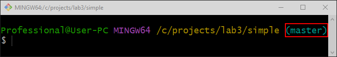

    На самом деле ни сам каталог, ни файл в нём не изменились. В текущем каталоге просто появился ещё один каталог с именем `".git"`.

11. Выполните команду:

    ```bash
    ls  # Показать имена файлов и каталогов присутствующих в текущем каталоге
    ```

    В результате вы увидите, только `"ReadMe.md"`, но `".git"` в списке нет. Это связана с тем, что в *Unix* системах, имена файлов/каталогов начинающиеся на точку считаются скрытыми (в *Windows* за это отвечает отдельный атрибут в свойствах объекта). Чтобы посмотреть всё, что есть в каталоге нужно добавить ключ `--all` или его короткую версию `-a`:

    ```bash
    ls -a
    ```

12. Если вы работаете на *Windows*, то на время этого практического задания установите видимость расширений имён файлов и скрытых элементов:

    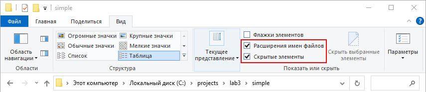

    Если эти опции были отключены, то теперь вы должны увидеть, что каталог `".git"` действительно был создан.

13. Удалите каталог `".git"`:

    ```bash
    rm -r .git
    ```

    Ключ `-r` (*recursive*) нужен при удалении каталога вместе со всем содержимым, даже если он пустой.

    Теперь каталог `"workdir"` перестал быть репозиторием, что можно увидеть по изменению в строке приглашения.

### Кэш

14. В терминале вернитесь в каталог `"lab3"` и выполните команду:

    ```bash
    git init try_cache
    ```

    В результате в каталоге `"lab3"` будет создан каталог `"try_cache"` в котором сразу будет инициализирован пустой репозиторий.

Первое, что мы получаем создавая *git* репозиторий - это возможность пользоваться кэшем (кэш ещё называют `index` или `staging area`). Кэш можно **представить** как каталог спрятанный внутри `".git"`. По желанию, мы можем копировать файлы из рабочего каталога в кэш и, доставать их обратно.


15. В каталоге `"try_cache"` создайте:

    - Файл `"index.html"` содержащий:

      ```html
      <head>
          <link rel='stylesheet' type='text/css' href='styles/my.css'>
      </head>
      <body>
          <h1>Список пользователей</h1>
      </body>
      ```

    - Каталог `"styles"` и в нём файл `"my.css"` содержащий:

      ```css
      h1{
          color: red;
      }
      ```

    Затем дважды щёлкните по файлу `"index.html"`, чтобы он открылся в браузере и убедитесь, что текст красного цвета.

16. Выполните команды (текущим каталогом в терминале должен быть `"try_cache"`):

    ```bash
    ls
    git ls-files  # То же, что и команда: git ls-files --cached
    ```

    Первая покажет список файлов в рабочем каталоге, а вторая в кэше *git*. Как видно, сейчас файлы присутствуют только в рабочем каталоге, а кэш пуст.

17. Выполните команды:

    ```bash
    git add index.html
    git add styles/my.css
    
    git ls-files
    ```

    Здесь, при помощи команды `git add` мы последовательно добавили в кэш оба файла. Вместо явного перечисления файлов по отдельности, можно добавлять группу файлов по маске при помощи [wildcards](https://youtu.be/BxEIYeNRCGE?si=jofAgscWAL9bvrnj) или сразу все файлы (в текущем каталоге и подкаталогах), командой `git add .`.

    Теперь в кэше находится копия обоих файлов из рабочего каталога.

18. Измените содержимое файла `"my.css"` на следующее:

    ```css
    h1{
        color: red;
    }
    
    h1:hover {
        color: green;
    }
    ```

    Затем обновите страницу с `"index.html"` и убедитесь, что при наведении указателя на текст, его цвет меняется на зелёный.

    На текущий момент файл `"my.css"` в рабочем каталоге и в кэше отличаются. Если мы вернёмся к разработке через продолжительный период времени, вряд ли мы вспомним об этом. И уж тем более вряд ли вспомним, как именно они отличаются.

19. Выполните команды (текущим каталогом должен быть `"try_cache"`):

    ```bash
    cat styles/my.css
    git show :styles/my.css
    ```

    Команда `cat` - это стандартная команда *Linux* и отобразит в терминале содержимое файла в рабочем каталоге, а команды `git show` с двоеточием перед именем файла покажет его версию из кэша.

20. При ручном сравнении, можно упустить мелкие отличия в файлах, поэтому полезно поручить поиск отличий *git*.

    Выполните команды:

    ```bash
    git diff index.html
    git diff styles/my.css
    ```

    Утилита `diff` выполнит построчное сравнение содержимого указанного файла в кэше и в рабочем каталоге и покажет результат сравнения. Если перечислить несколько имён, то `diff` будет запущен для каждого. Если имя файла не указать вовсе, то `diff` будет запущен для всех файлов в текущем каталоге и подкаталогах.

    Для первой команды вывода не будет, что означает, что содержимое файла  `"index.html"` в кэше и в рабочем каталоге совпадают. Для второй команды вы увидите текст, в котором символом `+` будут отмечены строки, добавленные в `"my.css"` в рабочем каталоге по сравнению с его версией в кэше. Удалённые строки будут отмечены символом `-`.

21. Вывод утилиты `diff` может быть не очень удобным, особенно, если изменений много или они больше, чем несколько строк. На этот случай можно настроить альтернативный инструмент `git difftool`. Т.к. мы не ограничены только терминалом и работаем в графическом режиме, поэтому настроим *git* на запуск *vscode* (хотя существуют аналогичные по функционалу консольные утилиты).

    Введите команды:

    ```bash
    git config --global diff.tool vscode
    git config --global difftool.vscode.cmd "code --wait --diff \$LOCAL \$REMOTE"
    
    git difftool styles/my.css
    ```

    На вопрос о запуске *vscode* ответьте <kbd>y</kbd>.

    В результате откроется окно *vscode* в двухколоночном виде, с левой стороны файл из кэша, а с правой из рабочего каталога.

    Команда `git difftool` работает по тем же правилам и с теми же ключами, что и `git diff`, просто запускает внешний инструмент для сравнения файлов. Если запустить `git difftool` указав несколько имён, то после закрытия окна *vscode* в терминале будет задан вопрос открывать ли второй файл и т.д. 

22. Выполните команды:

    ```bash
    git add .
    git diff
    ```

    Первой командой мы просим *git* добавить всё, что есть в рабочем каталоге в кэш. При этом старая версия `"my.css"` будет "молча" заменена новой. А у второй команды вывод будет пустой, что означает, полное совпадение всех файлов в кэше и рабочем каталоге.

23. Удалите каталог `"styles"` вместе с файлом `"my.css"` из рабочего каталога командой:

    ```bash
    rm -r styles
    ```

    и убедитесь, что в рабочем каталоге его нет, а в кэше он по прежнему присутствуют:

    ```bash
    ls
    git ls-files
    ```

24. Восстановите `"my.css"` в рабочем каталоге из кэша командой:

    ```bash
    git restore styles/my.css  # То же, что и: git restore --worktree styles/my.css
    ```

    Здесь тоже можно использовать *wildcards* чтобы восстановить группу файлов или точку, чтобы восстановить все (в текущем каталоге и подкаталогах).

    По умолчанию, в качестве источника для восстановления `git restore` использует кэш, а в качестве приёмника рабочий каталог (ключ `--worktree`). При этом, если в рабочем каталоге уже будет восстанавливаемый файл, то он будет "молча" заменён на версию из кэша.

    Заметьте, что для восстановления, был указан полный путь к файлу `"my.css"` вместе с каталогам `"styles"`, т.к. достать файл из кэша можно только по тому же пути по которому он был добавлен.

    На текущий момент файлы в рабочем каталоге и в кэше одинаковые.

25. Переименуйте файл `"index.html"` в `"индекс.html"` и добавьте его в кэш:

    ```bash
    git add индекс.html
    git ls-files
    ```

    Обратите внимание, что файл `"index.html"` по прежнему в кэше, а русские символы в названии `"индекс.html"` были заменены на коды (если вы работаете на *Windows*):

    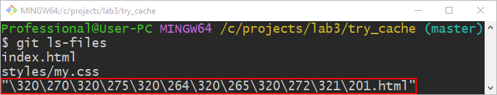

    Чтобы исправить это добавим в локальный конфиг следующей параметр (можно и в глобальный, но вы же не собираетесь называть файлы русскими именами. Ведь не собираетесь, верно?) :

    ``` bash
    git config --local core.quotepath false
    ```

    Теперь имена файлов будут отображаться как есть, даже если в них будут присутствовать необычные (с точки зрения *git*) символы.

26. Выполните команды:

    ```bash
    git add index.html
    git ls-files
    ```

    Как видно, `"индекс.html"` теперь отображается корректно. А команда добавления `"index.html"` в кэш, привела к тому, что он пропал из списка. На самом деле в этом нет ничего странного, т.к. командой `git add` мы не просто копируем файл в кэш, а обновляем его состояние в кэше до актуального состояния в рабочем каталоге.

27. Выполните команды:

    ```bash
    git rm --cached индекс.html
    git rm -f styles/my.css
    
    ls
    git ls-files
    ```

    Ранее мы использовали обычную команду `rm` для удаления файла только из рабочего каталога. Команда `git rm` позволяет удалить файл только из кэша (ключ `--cached`), но оставить в рабочем каталоге или из кэша и из рабочего каталога одновременной (ключ `-f`).

    В результате, в рабочем каталоге остался только файл `"индекс.html"`, а в кэше ничего.

### Постоянное хранение

Кэш даёт нам возможность сохранить файлы но в нём есть только один "слот". Сохраняя обновлённый файл, мы теряем его предыдущую версию. Гит предоставляет функционал долговременного сохранения результатов работы с возможностью вернуться к ним в любое время. Объект, который сохраняет снимок состояния файлов называется *commit* (фиксация). Так же как и кэш, коммит можно **представить** как каталог с файлами спрятанный внутри `".git"`, но к файлам, которые в нём лежат есть доступ только на чтение.

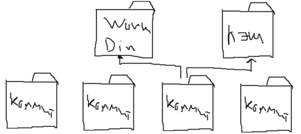

Гит позволяет создавать любое количество коммитов и при необходимости восстанавливать состояние рабочего каталога и/или кэша из любого из них. Коммит невозможно изменить (при любом изменении будет создаваться новый) и не возможно удалить (почти, но об этом позже).

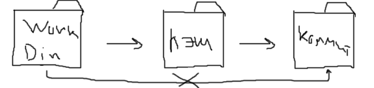

При создании коммита сохраняется снимок файлов НЕ рабочего каталога, а кэша именно поэтому кэш ещё называют *staging area* (промежуточный пункт). Поэтому прежде чем создать коммит необходимо обновить состояние файлов в кэше до желаемого состояния.

28. В терминале вернитесь в каталог `"lab3"` и выполните команду:

    ```bash
    git init try_commit
    ```

    В результате в каталоге `"lab3"` будет создан каталог `"try_commit"` в котором сразу будет инициализирован пустой репозиторий.

29. В каталоге `"try_commit"` создайте файл `"index.html"` содержащий:

    ```html
    <body>
        <ul id="login">
            <li class="button"><a href="https://ya.ru">Войти через Яндекс.ID</a></li>
            <li class="button"><a href="https://github.com">Войти через GitHub</a></li>
            <li class="button"><a href="#">Войти через код</a></li>
        </ul>
    </body>
    ```

    Затем дважды щёлкните по нему, чтобы он открылся в браузере и убедитесь, что на странице отображается маркированный список из трёх ссылок.

30. Добавьте `"index.html"` в кэш и создайте коммит (текущим каталогом должен быть `"try_commit"`):

    ```bash
    git add index.html
    git commit
    ```

    Команда `git commit` запустит текстовый редактор по умолчанию - *vim* или тот который вы указали в конфиге в `core.editor`. Если просто закрыть текстовый редактор, то коммит создан не будет. Гит ожидает, что вы введёте текст (*commit message*), который станет пояснением к коммиту.

    Файл уже содержит некоторое количество текста, но *git* игнорирует все строки начинающиеся с символа `#`, поэтому с точки зрения *git* сейчас в файле ничего нет.

    Напишите в окне редактора:

    ```
    Корневой коммит
    
    Вверху короткое пояснение к коммиту, а здесь более подробное.
    Между коротким и подробным пояснениями должна быть пустая строка.
    ```

    Затем **сохраните** файл и закройте редактор. В результате будет создан первый коммит (*root-commit*) в этом репозитории.

31. Выполните команду:

    ```bash
    git log
    ```

    В результате вы увидите список коммитов в репозитории (сейчас только один).

    По умолчанию отображается хэш коммита, имя и почта автора (те которые были установлены на этапе начального конфигурирования), время создания коммита и пояснение к коммиту.

32. Выполните действия:

    - Создайте каталог `"styles"` и в нём файл `"main.css"` содержащий:

      ```css
      #login {
          display: flex;
          flex-direction:column;
          align-items: center;
      }
      
      a{
          text-decoration: none;
          font-size: 14px;
      }
      ```

    - В начало файла `"index.html"` добавьте строки:

      ```html
      <head>
          <link rel='stylesheet' type='text/css' href='styles/main.css'>
      </head>
      ```

    Обновите страницу в браузере и посмотрите на изменения.

33. Добавьте все изменения в кэш и создайте второй коммит:

    ```bash
    git add .
    git commit -m "Ссылки по центру без подчёркивания"
    ```

    В данном случае при помощи `.` в кэш были добавлены все изменения из рабочего каталога. Команда `git commit` с ключом `-m` позволяет указать *commit message* прямо в командной строке, не открывая текстовый редактор.

34. Добавьте в конец файла `"main.css"` следующий текст:

    ```css
    .button{
        display: inline-flex;
        align-items: center;
        justify-content: center;
        
        height:	36px;
        width: 100%;
        max-width: 300px;
        
        border: 1px solid;
        border-radius: 6px;
        
        margin-top: 8px;
    }
    ```

    Обновите страницу в браузере и посмотрите на изменения.

35. Выполните команду:

    ```bash
    git commit -a -m "Добавлен стиль для кнопки"
    ```

    В данном случае ключ `-a` говорит *git*, что перед коммитом необходимо добавить все изменённые файлы (по сравнению с тем, что есть в кэше) из рабочего каталога в кэш. Обратите внимание, что **новые** файлы в кэш **добавлены не будут**. Команда `git add .` добавляет в кэш как изменённые, так и новые файлы.

36. Внесите изменения в файл `"main.css"` заменив стиль для тега `a` на следующий:

    ```css
    a{
        display: flex;
        text-align: center;
        justify-content: center;
        align-items: center;
        
        width: 100%;
        height:	100%;
        
        text-decoration: none;
        font-size: 14px;
    }
    ```

    Визуально ничего не поменяется, но теперь область ссылки растянута на всю площадь кнопки, а не только на текст, что можно заметить по изменению внешнего вида курсора.

37. Сделайте коммит любым из перечисленных выше способов, указав как *commit message*: *"Ссылка растянута на всю кнопку"*.

38. Выполните действия:

    - В каталоге `"styles"` создайте файл `"color.css"` содержащий:

      ```css
      a{
          color: rgb(34, 36, 38)
      }
      
      .button{
          border-color: rgb(227, 226, 224);
          transition: background-color 1s;
      }
      
      .button:hover{
          background-color: rgb(230, 230, 230);
      }
      ```

    - В файле `"index.html"` замените тег `head` на следующий:

      ```html
      <head>
          <link rel='stylesheet' type='text/css' href='styles/main.css'>
          <link rel='stylesheet' type='text/css' href='styles/color.css'>
      </head>
      ```

    Обновите страницу в браузере и посмотрите на изменения. При наведении мыши на кнопку, цвет фона должен поменяться.

39. Сделайте коммит со следующим комментарием: *"Добавлена цветовая схема"*. При создании коммита учтите, что в рабочем каталоге появился **новый** файл.

    Перед выполнением коммита полезно запускать команду:

    ```bash
    git status
    ```

    Эта команда смотрит на содержимое рабочего каталога, кэша, последнего коммита и выводит сводную информацию по состоянию файлов. Дополнительно `git status` показывает различные команды-подсказки, которые можно применить находясь в текущем состоянии.

40. Выполните команду:

    ```bash
    git log
    ```

    Теперь в списке должно быть пять коммитов отсортированных по дате создания. Если высоты терминала не хватит для вывода всего списка, то вывод можно будет пролистать стрелками вверх/вниз (<kbd>q</kbd> чтобы выйти).

41. Команда `git log` позволяет настроить вывод информации по вашему вкусу при помощи ключа `--pretty=format:"тут ваш формат"`. Также существуют преднастроенные форматы разной степени информативности.

    Выполните команды:

    ```bash
    git log --oneline  # Почти тоже, что и: git log --pretty=oneline
    git log --pretty=format:"%C(green) %h %C(reset)| %s"
    ```

    Заметьте, что у корневого коммита было показано не всё описание, а только его короткая часть.

42. У каждого коммита есть индивидуальное "имя" - 40-ка символьный хэш. На практике, не обязательно использовать полный хэш, достаточно нескольких начальных символов (минимум 4).

    Посмотрите на вывод команды `git log` и используя хэш корневого коммита выполните команду:

    ```bash
    git ls-tree -r --name-only <ХЭШ_КОММИТА>
    ```

    Затем, выполните эту же команду, но для последнего коммита.

    В результате вы получите список файлов попавших в коммит. Ключ `--name-only` нужен, чтобы *git* не выводил дополнительную информацию по файлам, а только их имена. Ключ `-r` говорит *git* запустить эту же команду рекурсивно, для всех каталогов в коммите. Без него в выводе не будут показаны имена файлов, которые лежат в каталогах, а только названия каталогов верхнего уровня.

43. Используя хэш корневого коммита выполните команды:

    ```bash
    cat index.html
    git show :index.html
    git show <ХЭШ_КОММИТА>:index.html
    ```

    Таким образом можно посмотреть все три версии файла: тот, что в текущем каталоге, в кэше и сохранённый в коммите.

44. Используя хэш корневого коммита выполните команды:

    ```bash
    git diff <ХЭШ_КОММИТА> index.html
    git difftool <ХЭШ_КОММИТА> index.html
    ```

    Команды `git diff` и `git difftool` позволят посмотреть, чем файл `"index.html"` в коммите отличается от файла в рабочем каталоге. А ключ `--cached` позволит сравнить файл из коммита с тем, что в кэше.

45. Некоторые коммиты могут обладать особой значимостью, например выпуск новой версии, фикс серьёзного бага и т.д. Чтобы не запоминать хэши коммитов их можно отметить специальным именованным указателем, который называют тег.

    Используя хэш корневого коммита выполните команду:

    ```bash
    git tag v1 <ХЭШ_КОММИТА>
    ```

    Если не указать коммит явно, то тег, по умолчанию, будет привязан к текущему коммиту.

46. Определите хэш четвёртого коммита (нумерация с единицы начиная от корневого) и выполните команды:

    ```bash
    git tag v2 -a -m "Много багов" <ХЭШ_КОММИТА>
    git tag v3 <ХЭШ_КОММИТА> # Тот же хэш, но v3
    ```

    В данном случае мы создали аннотированный тег (ключ `-a`) и так же как и для коммита использовали ключ `-m`, чтобы написать аннотацию прямо в командной строке.

47. Посмотрите историю репозитория:

    ```bash
    git log --oneline
    ```

    Как видно, теперь у первого и четвёртого коммитов отображаются имена тегов.

48. Выполните команду:

    ```bash
    git tag --list -n1
    ```

    В результате вы увидите список всех тегов. Ключ `-n` заставляет отображать в списке не только имя тега, но и аннотацию (если её нет, то текст из сообщения коммита), а цифра показывает сколько строк текста из аннотации нужно показать (в нашем случае только одну).

49. Если вы случайно поставили тег не на тот коммит, его можно пересоздать дополнив команду создания ключом `-f` (длинная версия `--force`). В этом случае тег будет создан, даже если такой уже существует. Или просто удалить при помощи ключа `-d` (длинная версия `--delete`).

    Удалите тег `v3`, а тег `v2` "переставьте" на последний коммит:

    ```bash
    git tag -d v3
    git tag v2 -f -a -m "Много багов"
    ```

    Т.к. коммит последний, то хэш можно не указывать.

50. Посмотрите историю и убедитесь, что теги стоят там где нужно.

51. В каталоге `"try_commit"` создайте файл `"HW.md"` содержащий:

    ```markdown
    # Hello, World
    ```

52. Используя тег корневого коммита (`v1`) выполните команду:

    ```bash
    git restore -s v1 styles
    ```

    В результате, `git restore` восстановит каталог `"styles"` до его состояния в коммите `v1`. Т.к. в корневом коммите `"styles"` не было, то он просто исчезнет.

    Ключ `-s` (` --source=`) указывает какой именно коммит служит источником файлов. 

53. Верните каталог `"styles"` обратно восстановив его из последнего коммита.

54. Выполните команду:

    ```bash
    git restore -s v1 HW.md
    ```

    Вместо ожидаемого удаления файла (т.к. в первом коммите его тоже не было), *git* ругается, что не знает его.

55. Добавьте `"HW.md"` в кэш и повторите команду из предыдущего пункта.

    Теперь файл был молча удалён.

    Таким образом получается, что перед изменением файла, *git* проверяет его наличие в кэше или в источнике (но не в рабочем каталоге). Если его нет ни там ни там, то этот файл *git* не трогает. Это можно объяснить желанием сохранить содержимое файла, т.к. в случае его удаления, восстановить его уже будет не откуда.

    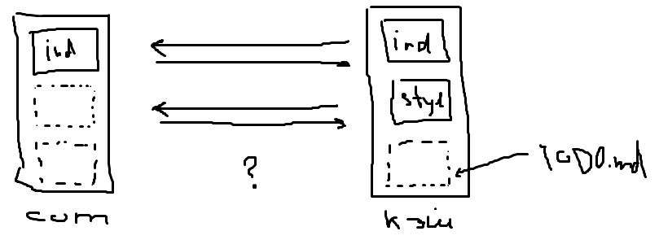

56. Восстановите `"HW.md"` из кэша.

57. Используя тэг корневого коммита выполните команды:

    ```bash
    git restore --staged -s v1 .
    ls           # смотрим, что в рабочем каталоге
    git ls-files # смотрим, что в кэше
    ```

    Здесь ключ `--staged` устанавливает в качестве приёмника данных кэш. В итоге, содержимое кэша будет совпадать с содержимым коммита-источника. Файлы в рабочем каталоге изменены не будут. Если указать оба ключа `--staged --worktree`, то файлы будут изменены и в кэше и в рабочем каталоге. Например, это может пригодится, чтобы откатить все изменения после неудачного эксперимента. Но, как мы видели ранее, новые файлы не добавленные в кэш, останутся в рабочем каталоге. Если перед восстановлением сделать `git add .`, то рабочий каталог полностью вернётся к состоянию из последнего коммита.

### Игнорирование файлов

На практике, вместо поимённого добавления файлов в кэш перед коммитом, используют команду `git add .`, чтобы добавить сразу всё. Но что делать, если в рабочем каталоге есть файлы/папки, которые мы не хотим добавлять в коммит. Например: файлы с секретами, временные файлы и файлы сборок, и т.д.

Гит позволяет решить этот вопрос при помощи файла `".gitignore"` (имени нет, только расширение). Если в репозитории присутствует этот файл, то *git* автоматически использует его в качестве фильтра для команды `git add`. Файлы/каталоги перечисленные в `".gitignore"` не будут добавляться в кэш и как следствие не попадут в коммит.

Если файл попал в кэш до создания `".gitignore"`, то для него `".gitignore"` работать не будет, т.е. `git add` всё равно будет обновлять файл в кэше. В таком случае, можно удалить файл из кэша и тогда `".gitignore"` не допустит его повторного появления в кэше и в будущих коммита, но помните, что в прошлых коммитах файл всё равно остался, поэтому все пароли и токены которые в нём указаны нужно поменять.

58. В терминале вернитесь в каталог `"lab3"` и выполните команду:

    ```bash
    git clone try_commit try_ignore
    ```

    В результате в каталоге `"lab3"` будет создан каталог `"try_ignore"`, в котором будет копия репозитория `"try_commit"`.

    Обратите внимание, что при клонировании копируется только папка `".git"`, а затем выполняется `git restore --staged --worktree`, где в качестве источника используется последний коммит.

59. В каталоге `"try_ignore"` создайте файл `"TODO.md"` содержащий:

    ```markdown
    # План
    
    - [x] Добавить цветовую схему
    - [ ] Изменить цвета
    ```

60. Здесь же создайте файл `".gitignore"` содержащий:

    ```bash
    TODO.md
    ```

    Обратите внимание, что если у вас отключено отображение расширений, то есть шанс создать неправильный файл, например: `".gitignore.txt"` . Такой файл работать не будет.

    Перейдите в терминале в каталог `"try_ignore"` и проверьте, что отображается правильное имя файла:

    ```bash
    ls -a
    ```

61. Выполните команды:

    ```bash
    git ls-files -o
    git ls-files -o --ignored --exclude-standard
    git ls-files -c --ignored --exclude-standard
    ```

    Ключ `-o` (`--others`) покажет файлы из рабочего каталога, которых нет в кэше.

    Вторая команда покажет файлы из рабочего каталога, которых нет в кэше и которые будут проигнорированы (`--ignored`) при добавлении в кэш на основании шаблонов указанных в `".gitignore"` (и в других стандартных файлах). Это может быть полезно, если вы хотите убедиться, что в кэш не попадёт ничего лишнего.

    Третья команда покажет файлы присутствующие в кэше и соответствующие шаблонам игнорирования. Это может быть полезно, если вы хотите проверить, попало ли в кэш что-то, что туда попасть не должно было.

62. Выполните команды:

    ```bash
    git check-ignore -v TODO.md
    git check-ignore -v index.html
    ```

    Команда `git check-ignore` полезна, если вы хотите проверить попадает ли конкретный файл/каталог под какой-то шаблон игнорирования. В нашем случае, для `"index.html"` вывод будет пустой, а для `"TODO.md"` будет указано, что правило находится в первой строке файла `".gitignore"`.

63. Выполните команды:

    ```bash
    git add .
    git ls-files
    ```

    Убедитесь, что файла `"TODO.md"` нет в кэше.

В интернете существует много готовых шаблонов `.gitignore` под разные языки программирования, среды разработки, фреймворки и т.д. Например коллекция на [github](https://github.com/github/gitignore) или [конструктор](https://www.toptal.com/developers/gitignore) позволяющий генерировать `.gitignore` по списку требований (нужен VPN). [Видео](https://youtu.be/oOC3Jd7lOAc?si=AXyizV4thSFL3NWc) подробно объясняющее правила `.gitignore`.

### История проекта

До этого момента мы использовали *git* как средство для создания бэкапов. На самом деле коммиты в *git* не просто отдельные точки сохранения, они связаны друг с другом в односвязный список, в котором каждый следующий коммит знает хэш своего непосредственного предка. Как говорилось ранее коммит нельзя изменить, частично это связано с тем, что хэш коммита вычисляется с учётом информации о предке, поэтому изменение коммита находящегося в середине цепочки, привело бы к необходимости пересоздавать все последующие коммиты (привет блокчейн).

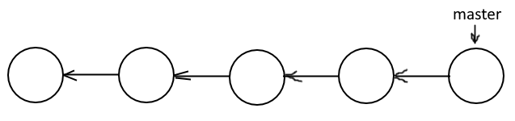

Зная хэш коммита в котором находится файл, мы всегда можем проследить всю его историю вплоть до самого начала. Чтобы *git* и пользователь знали, какой коммит сейчас является последним в списке, он отмечается специальным именованным указателем (по умолчанию `master`). В отличие от тега, который жёстко зафиксирован на коммите, этот указатель автоматически перемещается на новый коммит при его создании и на самом деле является просто текстовым файлом в каталоге `.git/refs/heads` в котором записан хэш текущего коммита.

В дальнейшем мы увидим, что коммиты объединяются в древовидную структуру и отдельную цепочку коммитов в этой структуре называют веткой. Именованный указатель на последний коммит в такой цепочке служит названием всей ветки (в нашем случае все коммиты принадлежат ветке `master`).

Точно также как хэш коммита или тэг, название ветки можно использовать в командах *git* для ссылки на коммит.

64. Перейдите в терминале в каталоге `"lab3"` и выполните команду:

    ```bash
    git clone https://github.com/yhirose/cpp-httplib.git history
    ```

    Ранее мы клонировали локальный репозиторий, здесь же клонируется репозиторий с *github.com* и помещается в каталог `"history"`. Если имя целевого каталога не указать, то по умолчанию оно будет совпадать с именем репозитория (`"cpp-httplib"`).

    При таком клонировании, мы получим весь репозиторий целиком, со всей его историей, что может быть долго и/или занимать много места на диске. Иногда нам достаточно только одного последнего коммита, например, чтобы собрать приложение или библиотеку. В этом случае, можно ограничить глубину клонирования при помощи ключа `--depth=1`. Если нужен не последний коммит, или коммит не из главной ветки, можно дополнительно добавить ключ `--branch=v0.1` (здесь можно указать тег или ветку, но не хэш коммита).

65. Перейдите в терминале в каталог `"history"` и выполните команду:

    ```bash
    git log --oneline
    ```

    Как видно, здесь довольно много коммитов.

66. Выполните команду:

    ```bash
    git blame split.py
    ```

    В результате вы получите построчны вывод файла `"split.py"` в каждой строке будет: хэш последнего коммита в котором была изменена эта строка, имя автора коммита и время его создания, номер строки и текст из файла.

67. Определите автора изменений в *19* строке и выполните команду:

    ```bash
    git log --author="<Имя автора>" --oneline
    ```

    В результате будут показаны только те коммиты, которые были созданы указанным пользователем. 

68. Выполните команду:

    ```bash
    git log --author="<Имя автора>" --oneline split.py
    ```

    В результате вы получите список коммитов в которых изменялся файл `"split.py"` и автором которых был указанный пользователь. Если имя автора не указать, то будут показаны все коммиты в которых изменялся файл `"split.py"`.

69. Выполните команду:

    ```bash
    git log --diff-filter=A --oneline split.py
    ```

    Ключ `--diff-filter` позволяет точнее определить значение слова "изменялся", например здесь мы просим найти коммит в котором файл был создан. Некоторые другие значения принимаемые этим ключом:

    - `A`: added (добавлено) - показывать только те коммиты, в которых файлы были добавлены в репозиторий.
    - `M`: modified (изменено) - показывает коммиты, в которых файлы были изменены.
    - `D`: deleted (удалено) - показывает коммиты, в которых файлы были удалены.

    и другие. Кроме того, можно указывать несколько значений подряд.

70. Выполните команду:

    ```bash
    git log --author="<Имя автора>" --oneline --after=2.years --before=1.year 
    ```

    Здесь мы отфильтровали коммиты указанного автора созданные позже, чем текущая дата и время *-2* года, но не позже, чем текущая дата и время *-1* год.

    Гит позволяет работать с датой во множестве разных форматов, а том числе и с указанием конкретной даты-времени вплоть до секунды. Подробнее можно посмотреть в этом [видео](https://youtu.be/QgT06OZYads?si=ej_8qM4U8QgyVnn4).

71. Выполните команду:

    ```bash
    git log --oneline --grep="fix" --after=6.month
    ```

    Здесь мы просим *git* найти все коммиты за последние пол года в сообщении которых присутствует слово *fix*. На самом деле это почти так, т.к. ключ `--grep` принимает не строку, а регулярное выражение, поэтому можно составлять и более сложные запросы.

    Обратите внимание, что в выводе команды `git log` не везде есть слово "fix". Это потому-что `--oneline` отображает только короткую часть комментария к коммиту.

72. Выполните команду:

    ```bash
    git log --oneline -S "do_split = True" split.py
    ```

    При помощи ключа `-S` можно искать указанный текст не в названии, а в самом содержимом коммита, т.е. в файлах. Здесь мы просим *git* найти все коммиты содержащие файлы в которых указанный текст был **изменён (добавлен или удалён)**. Ключ `-S` принимает в качестве значения именно текст, но если необходимо искать по регулярному выражению то используйте `-G`.

73. Выполните команду:

    ```bash
    git log -L 33,33:split.py -p
    ```

    Если мы хотим проследить изменения в определённом диапазоне строк файла `"split.py"`, то можно воспользоваться ключом `-L`. В нашем случае мы просим *git* показать коммиты в которых были **изменены** строки начиная с 33 и заканчивая 33 (т.е. только в этой строке). Ключ `-p` добавит к выводу *diff*.

    *diff* показывает разницу не только в указанных строках, а как бы в блоке который пересекается с указанным диапазоном (т.к. *diff* не знает *Python* он будет показывать блоки больших размеров, чем нужно).

74. Выполните команду:

    ```bash
    git log -L "/^inline std::string random_string/","/^}/":httplib.h
    ```

    Отслеживать изменения в строках, обычно мало полезно, гораздо чаще нужно проследить изменения в определённом блоке, например в функции. В этом случае, ключу `-L` вместо цифр можно передать два регулярных выражения: одно для начала диапазона, второе для конца.

    В нашем случае начало диапазона это текст `inline std::string random_string` (продолжение строки может быть любым). Символ `^` означает, что текст должен быть прямо в начале строки, без отступов. Конец диапазона, это `}`, который тоже должен быть без отступов перед ним. То есть что-то типо такого:

    ```c++
    inline std::string random_string(size_t length) { // <- начало
        if (true){
            // ...
        }                                             // <- НЕ конец, т.к. есть отступ
    }                                                 // <- конец
    ```

    Обратите внимание, что в предпоследнем коммите функция была переименована, и *git* продолжил отслеживать её, назад по истории с предыдущим именем, тем самым учитывая факт переименования.


75. При помощи `git log` определите коммит в которым файл `"split.py"` был создан и последний коммит, в котором он был изменён и воспользуйтесь командой `git difftool`, чтобы посмотреть на сколько он изменился:

    ```bash
    git difftool <КОММИТ_СОЗДАНИЯ> <ПОСЛЕДНИЙ_КОММИТ> split.py
    ```

Т.к. коммиты связаны в цепочку к ним можно обращаться в относительном формате, т.е. предыдущий коммит или пять коммитов назад от указанного, например:

```bash
master    # последний коммит в ветке master
master~1  # предпоследний коммит в ветке master
master~   # то же самое
master~3  # master минус три коммита
master~~~ # то же самое
v1~10     # 10 коммитов назад от тега v1
412ba~1   # коммит перед коммитом с хэшем 412ba
```

Диапазоны коммитов для `git log`:

```bash
master   # показать все коммиты от master до корневого (root)
412ba    # показать все коммиты от коммита с хэшем 412ba до корневого
412ba master  # показать все коммиты от master до корневого и от 412ba до корневого
^412ba master # показать все коммиты от master до корневого исключая общие с 412ba
412ba..master # точно то же самое, что и выше
master..412ba # показать все коммиты от 412ba до корневого исключая общие с master
```

### Альтернативная история

До этого момента история проекта была строго линейная, но *git* позволяет держать в репозитории несколько параллельных историй одновременно. Каждая такая последовательность коммитов называется - веткой (*branch*). С каждой веткой ассоциирован отдельный именованный указатель, который автоматически смещается на последний коммит при его создании.

Гит позволяет свободно переключаться между ветками.

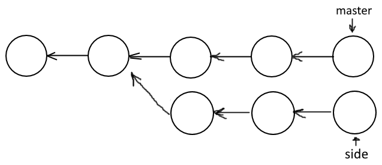

76. В терминале вернитесь в каталог `"lab3"` и выполните команду:

    ```bash
    git init try_branch
    ```

77. Зайдите в каталог `"try_branch"` и создайте файл `"TODO.md"` содержащий:

    ```markdown
    - Task 1
    - Task 2
    - Task 3
    - Task 4
    - Task 5
    - Task 6
    ```

78. Создайте коммит с комментарием *"init"*.

79. Создайте файл `"DONE.md"` содержащий:

    ```markdown
    - Task 1
    ```

80. Создайте коммит с комментарием *"1"*.

81. Модифицируйте файл `"DONE.md"`:

    ```markdown
    - Task 1
    - Task 2
    ```

82. Создайте коммит с комментарием *"2"*.

83. Выполните команду:

    ```bash
    git branch
    ```

    В результате вы увидите список веток в репозитории. Oдна (и пока единственная)  будет отмечена звёздочкой - это текущая ветка.

84. Выполните команду:

    ```bash
    git log --oneline
    ```

    Как видно, возле последнего коммита указано название ветки.

85. Выполните команды:

    ```bash
    git branch new  # git branch new HEAD
    git branch
    git log --oneline
    ```

    Первая команда создала новую ветку с именем *new* и в качестве точки откуда ветка будет начинаться был выбран текущий коммит (т.к. мы его не указали явно). Как видно, ветка *new* указывает на тот же коммит, что и *master*.

86. Измените содержимое файла `"DONE.md"` добавив туда ещё два пункта:

    ```markdown
    - Task 3
    - Task 6
    ```

    и сделайте коммит с комментарием *"3 6"*.

87. Выполните командy:

    ```bash
    git log --oneline
    ```

    Как видно, *master* переместился на следующий коммит, а *new* так и остался на *3-м*.

88. С точки зрения внутреннего устройства *git*, ветки - это просто текстовые файлы лежащие в каталоге `"git/refs/heads"`, в которых указан хэш коммита на который они ссылаются.

    Выполните команды:

    ```bash
    ls .git/refs/heads
    cat .git/refs/heads/master
    cat .git/refs/heads/new
    ```

89. Как видно, по выводу `git log` кроме веток есть ещё одна ссылка - `HEAD`. Эта ссылка указывает на коммит на который в данный момент "смотрит" пользователь.  С точки зрения внутреннего устройства *git*, `HEAD` это тоже текстовый файл лежащие в каталоге `".git"`, но у него может быть 2 типа содержимого: ссылка на на ветку (основное состояние) и ссылка на коммит (отсоединённое состояние).

    Выполните команду:

    ```bash
    cat .git/HEAD
    ```

    Как видно, на текущий момент, `HEAD`, присоединён к ветке *master* и автоматически перемещается вместе с ней.

90. Выполните команду:

    ```bash
    git switch new
    cat DONE.md
    git log --oneline
    ```

    При помощи команды `git switch` мы переключились на ветку *new* (о чём свидетельствует изменение строки приглашения, т.к. теперь там в скобочках написано *new*). При этом из файла `"DONE.md"` пропали 2 последних пункта, т.к. теперь мы видим его состояние на момент *3-го* коммита. А из вывода команды `git log` пропала ветка *master*, т.к. по умолчанию `git log` показывает коммиты начиная от `HEAD` и далее назад по истории.

91. Измените содержимое файла `"DONE.md"` добавив туда пункт:

    ```markdown
    - Task 4
    ```

    и сделайте коммит с комментарием *"4"*.

92. Выполните команду:

    ```bash
    git log --oneline
    ```

93. Выполните команды:

    ```bash
    git switch master
    cat DONE.md
    git log --oneline
    ```

    Как видно, состояние файла `"DONE.md"` снова содержит пункты 3 и 6, но не содержит пункта 4. Т.е. каждая ветка содержит свою отдельную копию файла со своей собственной историей изменений.

94. В прошлом пункте команда `git log` показывала только историю ветки *master*. Чтобы посмотреть историю другой ветки, нужно указать её название или коммит. Если нам нужно посмотреть коммиты из нескольких веток одновременно, нужно перечислить их через пробел. Если мы хотим посмотреть коммиты из всех веток, поможет ключ `--all`.

    Выполните команду:

    ```bash
    git log --oneline --graph --all
    ```

    Здесь ключ `--graph` отображает связи между коммитами при помощи линий, а звёздочками сами коммиты.

95. Выполните действия:

    - Создайте новую ветку *other*, которая будет начинаться на *3-м* коммите:

      ```bash
      git branch other master~1
      ```

      Здесь мы ссылаемся на третий коммит через *master*.

    - Переключитесь на ветку *other*.

    - Измените содержимое файла `"DONE.md"` добавив туда пункт:

      ```markdown
      - Task 5
      ```

      и сделайте коммит с комментарием *"5"*.

    - Посомтрите историю:

      ```bash
      git log --oneline --graph --all
      ```

    Как видно, теперь у нас три ветки. Все они начинаются с *3-го* коммита и в каждой по одному собственному коммиту.

96. По умолчанию, с каждой веткой и с `HEAD` (т.е. с каждой ссылкой) связан лог файл, который фиксирует все перемещение ссылки. Такой лог называют *reflog* (*reference log*).

    Выполните команды:
    ```bash
    ls .git/logs/
    ls .git/logs/refs/heads/
    ```

    Как видно, для каждой ветки и `HEAD` существует свой файл.

97. Выполните команы:

    ```bash
    git reflog master
    git reflog new
    git reflog  # Аналогично: git reflog HEAD
    ```

    Как видно, комментарием указано действие которое привело к перемещению, а в первом столбце указан коммит на который было соверешено перемещение.

98. Выполните команду:

    ```bash
    git branch -d new  # Аналог: git branch --delete new
    git branch -D new  # Аналог: git branch --delete -f new
    git branch
    ```

    Первая команда откажется выполнять удаление ветки и сообщит, что в случае удаления могут быть потеряны коммиты. Вторая команда приведёт к удалению ветки.

    Обратите внимание, что удаление ветки, это удаление **указателя** на коммит и *reflog-a*, но НЕ самих коммитов.

99. Предположим, что прошло некоторое время и мы полняли, что ветку удалили зря. Т.к. *git* пока не удалил коммиты, мы можем восстановить ветку, но для этого нам нужно знать его хэш. Чтобы получить информацию о хэше можно обратиться к *reflog* `HEAD`, т.к. мы переходили на эту ветку.

    Выполните команду:

    ```bash
    git reflog
    ```

    и найдите строку перед *"checkout: moving from new to master"*. Там был создан коммит *4*. Это последний раз, когда мы взаимодействовали с *new*. Посмотрите хэш коммита и создайте ветку:

    ```bash
    git branch renew <ХЭШ_КОММИТА>
    git log --oneline --graph --all
    ```

    По умолчанию *git* хранит записи в логах *90 дней* (для недостижимых коммитов *30 дней*), те, что старше удаляются.

100. Выполните команды:

     ```bash
     git branch -m renew new
     git log --oneline --graph --all
     ```

     При помощи ключа `-m` ветка *renew* была переименована в *new*.

101. Переключитесь на ветку *master* и добавьте в файл `"TODO.md"` ещё две строки:

     ```markdown
     - Task 7
     - Task 8
     ```

     И создайте коммит с комментарием *"add 7 8"*.

102. Переключатель на ветку *new* и добавьте в файл `"TODO.md"` ещё две другие строки:

     ```markdown
     - Task 9
     - Task 10
     ```

     Сохраните файл, но коммитить пока не нужно.

103. Выполните команду:

     ```bash
     git switch master
     ```

     В результате *git* откажется переходить на ветку *master*, т.к. наши локальные изменения в файле `"TODO.md"` будут потеряны. Гит предлагает сначала закоммитить изменения, а потом менять ветку.

     Такое поведение не всегда подходит, т.к. коммитить незаконченные изменения считается дурным тоном (т.к. проект переходит в поломанное состояние). Поместить изменения в кэш мы тоже не можем, т.к. кэш тоже заменяется при смене ветки. На такой случай есть вариант спрятать изменения в отдельное хранилище `git stash`.

104. Выполните команду:

     ```bash
     git stash
     ```

     В результате вы получите сообщение, что рабочий каталог и кэш были сохранены. Теперь состояние вашего рабочего каталога и кэша соответствует состоянию сразу после последнего коммита и никаких изменений в файле `"TODO.md"` нет.

105. Выполните команды:

     ```bash
     cat TODO.md
     git switch master
     git switch -     # Переключиться на предыдущую ветку
     git stash pop
     cat TODO.md
     ```

     Как видно, теперь переключение ветки туда и обратно произошло без вопросов. После того, как мы переключились обратно на *new* мы вернули все спрятанные изменения при помощи команды `git stash pop`.

     Стэш позволяет прятать множество изменений и доставать их не обязательно по порядку, но и по номеру.

106. Создайте файл `"index.html"` и выполните команды:

     ```bash
     git add .
     git stash -m "index.html"
     git stash list
     ```

     Как видно, теперь у нас припятано одно изменение с индекосм 0 и комментарием `index.html`. Из рабочего каталога файл `"index.html"` разумеется испарился.

107. Типичный случай, когда вы начали работу, изменили несколько файлов и тут поняли, что не перешли на нужную ветку. Можно припрятать изменения в стэш, перейти на правильную ветку и достать из там, но можно и создать из сэш отдельную ветку:

     ```bash
     git stash branch index
     git branch
     ```

     Здесь вы создали ветку *index* и достали в неё припутанные в сэше изменения.

     Создайте коммит с любым комментарием.

108. При работе над большим проектом типичная ситуация, когда вам постоянно нужно вносить изменения, то в одну ветку, то в другую и чтобы не гонять туда сюда стэш, *git* позволяет вынести ветку (или несколько) в отдельный каталог и тогда можно будет одновременно работать в двух каталогах в каждом со своей веткой.

     Выполните команду:

     ```bash
     git switch master
     git worktree add ../branch_index index
     git worktree list
     git branch
     ```

     Здесь мы сначала ушли с ветки *index* и затем вынесли её в отдельный каталог `"../branch_index"`, который появился в каталоге `"lab3"`. В списке веток возле *index* указан `+`, что говорит о то, что на неё нельзя переключиться, т.к. эта ветка уже активна в другом каталоге.

     Команда `git worktree list` показывает список рабочих каталогов связанных с текущим репозиторием и пути к ним.

109. Выполните команду:

     ```bash
     cd ../branch_index
     git branch
     git switch new
     git branch
     ```

     Как видно, команда `git worktree add` не просто вынесла ветку в отдельный каталог, но и создала полноценный рабочий каталог в котором можно работать точно также как и в основном. Теперь нет необходимости стэшить изменения, а достаточно зайти в другой рабочий каталог и спокойно работать со второй веткой.

110. Выполните команды:

     ```bash
     cd ../try_branch
     git worktree remove ../branch_index
     git worktree list
     ```

     Теперь второй рабочий каталог был удален.

### Переписывание истории

111. В терминале вернитесь в каталог `"lab3"` и выполните команду:

     ```bash
     git init rehistory
     ```

112. Зайдите в каталог `"rehistory"`, создайте файл `"task1.txt"` c текстом *"1"* и создайте коммит с комментарием *"1"*.

113. Таким же образом добавляя по одному файлы `"task2.txt"` и так далее создайте ещё 4 коммита. Не забывайте добавлять в файл текст соответствующий номеру файла. 

114. Посмотрите историю получившегося репозитория и определите хэш *3-го* коммита (или вместо хэша можно будет использовать `master~2`).

#### Отмена нескольких последних коммитов

115. Выполните команды:

     ```bash
     git reset --soft <ХЭШ_КОММИТА>
     git log --oneline
     ```

     Как видно, сейчас *master* указывает на *3-й* коммит, а *4-й* и *5-й* отсутствую. Таким образом, можно сказать, что мы удалили последние два коммита из истории репозитория.

     На самом деле, команда `reset` просто переставила указатель *master* (т.к. мы сейчас в этой ветке) c последнего коммита на указанный. Родителем следующего коммита теперь будет *3-й*.

     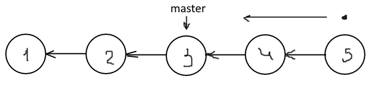
     
116. Выполните команды:

     ```bash
     ls
     git ls-files
     git ls-tree master --name-only
     ```

     Как видно, файлы в рабочем каталоге и в кэше точно такие же как были на момент последнего *5-го* коммита, а в текущем коммите их всего три. Т.е.  `reset` с флагом `--soft` **просто передвинул указатель** *master* на *3-й* коммит, но содержимое рабочего каталога и кэша осталось без изменения.

117. Выполните команды:

     ```bash
     git commit -m "4"
     git log --oneline
     ```

     Таким образом наш новый *4-й* коммит содержит все изменения которые были в старых *4-м* и *5-м* коммитах. Т.е. с точки зрения истории разработки мы как бы схлопнули два коммита в один.

118. Как говорилось ранее, коммиты не изменяются и не удаляются, а значит старые *4-й* и *5-й* коммиты всё ещё в репозитории.

     Выполните команду:

     ```bash
     git log --oneline --reflog --graph
     ```

     Ключ `--graph` пытается нарисовать историю репозитория в виде дерева, добавляя соединительные линии между коммитами. Ключ `--reflog` позволяет показать все коммиты, которые мы когда либо посещали.

     Как видно, от основной ветки вправо отходит ветка с двумя коммитами. Не сложно догадаться, что это и есть наши старые коммиты. Т.к. на них не указывает ни один из именованных указателей (тег или ветка), то *git* считает эти коммиты недостижимыми (мусорными) и через некоторое время (по умолчанию *2 недели*) самостоятельно удалит.

119. Определите хэш старого *5-го* коммита и выполните команды:

     ```bash
     git tag start <ХЭШ_КОММИТА>
     git reset --soft start
     git log --oneline --reflog --graph
     ```

     Как видно, мы вернулись в начальное состояние, которое было до того как мы сделали первый `reset`. Т.е. как бы мы не экспериментировали с историей, всегда можно вернуться назад.

120. Выполните команды:

     ```bash
     git reflog expire --expire=now --all
     git log --oneline --reflog --graph
     ```

     Первой командой мы просим удалить старые логи из всех файлов, при этом при помощи ключа `--expire` указываем дату-время логов, которые мы считаем старыми. Т.е. будут удалены все логи, т.к. `now` (сейчас) в любом случае позже чем все существующие логи.

     Как видно, теперь `git log` не показывает второй *4-й* коммит. 

121. Выполните команду:

     ```bash
     git fsck --unreachable --no-reflogs
     ```

     Команда `git fsck` (*file system check*) проверят "файловую систему" *git*. Ключ `--unreachable` говорит показывать только недостижимые объекты, а `--no-reflogs` говорит игнорировать *reflog* (иначе будут показаны только те недостижимые объекты, которых нет в рефлоге).

     В результате вы увидите один недостижимый коммит и его хэш.

122. Выполните команды:

     ```bash
     git tag alter <ХЭШ_КОММИТА>
     git fsck --unreachable --no-reflogs
     git log --oneline --graph --all
     ```

     Первой командой мы установили коммиту тег `alter` тем самым он перестал быть недостижимым, что и подтверждает вторая команда.

     Ключ `--all` заставляет `git log` показывать все коммиты, достижимые по любой из именованных ссылок.

123. На текущий момент мы находимся в состоянии как перед первым `reset`.

     Используя хэш третьего коммита (или `master~2` или `start~2`) выполните команды:

     ```bash
     git reset --hard <ХЭШ_КОММИТА>
     git log --oneline
     ```

124. Выполните команды:

     ```bash
     ls
     git ls-files
     git ls-tree master --name-only
     ```

     Как видно, вывод всех трёх команд одинаковый, т.е. `reset` с флагом `--hard` передвинул указатель *master* на *3-й* коммит и дополнительно изменил содержимое рабочего каталога и кэша на то, что находится в этом коммите. Это эквивалентно:

     ```bash
     git reset --soft <ХЭШ_КОММИТА>            # Двигаем master
     git restore --staged -s <ХЭШ_КОММИТА> .   # Заменяем файлы в кэше
     git restore --worktree -s <ХЭШ_КОММИТА> . # Заменяем файлы в рабочем каталоге
     ```

125. Выполните команду:

     ```bash
     git reset --hard start
     ls
     git ls-files
     ```

     Как видно, состояние рабочего каталога и хэша тоже вернулось обратно.

126. Используя хэш третьего коммита выполните команды:

     ```bash
     git reset --mixed <ХЭШ_КОММИТА> # Аналогично: git reset <ХЭШ_КОММИТА>
     ls
     git ls-files
     ```

     Как видно, файлы в рабочем каталоге соответствует файлам из 5-го коммита (т.е. НЕ были изменены в результате `reset`), а файлы в кэше соответствует файлам из 3-го коммита  (т.е. кэш был изменён в результате `reset`).

     Таким образом `reset` с флагом `--mixed` передвинул указатель *master* на *3-й* коммит и дополнительно изменил содержимое кэша, но не рабочего каталога. Это эквивалентно:

     ```bash
     git reset --soft <ХЭШ_КОММИТА>            # Двигаем master
     git restore --staged -s <ХЭШ_КОММИТА> .   # Заменяем файлы в кэше
     ```

Все варианты `reset` рассмотренные выше так же как и `restore` игнорируют новые файлы которых нет в кэше и целевом коммите. Если файл присутствует либо там либо там, то он будет **молча** изменён, т.е. существует риск потери данных. У `reset` есть и другие ключи, но их отличия в основном заключаются в добавлении проверок перед выполнением `reset` и отказу выполнять команду, если существует риск потери незакоммиченных изменений. 

127. Выполните *hard reset* обратно на тег *start*;

#### Изменение последнего коммита

Довольно часто приходится переписывать историю последнего коммита. Это можно сделать так:

```bash
git reset --soft master~  # Откатываем один коммит
# Изменяем файлы
git add .
git commit -m "..." --author="..." --date="..."
```

Но данный способ, помимо того, что требует ввода 3-х команд ещё и требует ввода полной информации о коммите, иначе данные будут текущие. Есть способ проще - использовать ключ `--amend`.

128. Переименуйте файл `"task5.txt"` в `"task10.txt"` и выполните команды:

     ```bash
     git add .
     git commit --amend --no-edit
     ```

     Ключ `--amend` говорит, что нужно внести изменения в последний коммит, а не создавать новый. Ключ `--no-edit` говорит, что информацию о коммите нужно взять из заменяемого коммита.

129. Выполните команду:

     ```bash
     git show --pretty=fuller master
     ```

     Команда `git show` во многом аналогична `git log` но специализируется на работе с отдельными коммитами, а не с историей. Опция `--pretty=fuller` - преднастроенный формат вывода, который показывает расширенную информацию по коммиту.

     Обратите внимание, что комментарий к коммиту, *Author* и *AuthorDate* явно взяты из заменённого коммита (особенно это видно по дате-времени), но кроме этого, есть ещё два поля *Commit* и *CommitDate* которые равны текущим параметрам.

     Дело в том, что с коммитом ассоциируется два человека: автор и коммитер. Когда вы создаёте коммит, то эта информация совпадает, но когда коммит "модифицируется" информация о коммитере и дате его "изменения" заменяется на текущую.

     Изменить ифнормацию о коммитетре через ключи нельзя, но можно воспользоваться переменнымим оккужения. Например:

     ```bash
     GIT_COMMITTER_NAME="`git log -1 --pretty=format:%cn`" \
     GIT_COMMITTER_EMAIL="`git log -1 --pretty=format:%ce`" \
     GIT_COMMITTER_DATE="`git log -1 --pretty=format:%cd`" \
     git commit --amend --no-edit
     ```

     Это всё одна строка, просто разделённая для удобства символом переноса `\`. Значения в кавычках - это команды, которые после выполнения превратятся в конкретные данные. Для выполнения команд в кавычках используется синтаксис обратных апострофов.

     Точно также, при помощи `--amend` можно заменить только комментарий к коммиту, не трогая содержимое (например, если обнаружили опечатку в тексте сообщения или закоммитили не с того аккаунта):

     ```bash
     git commit --amend -m "..." --author="..." --date="..."
     ```

130. Как говорилось ранее, коммиты не удалялются и в случае `--amend` естественно тоже. В результате просто были созданны новые коммиты, поэтому мы всегда можем вернуться обратно.

     Выполните команды:

     ```bash
     git log --reflog --graph --oneline
     git reset --hard start
     ```

#### Перенос последних коммитов (перебазирование)

Далее мы ещё затронем операцию перебазирования, но сейчас мы воспользуемся ей для удаления части коммитов которые находятся в середине истории - *2-го* и *3-го*. Для этого, просто переставим *4-й* и *5-й* коммиты на первый.

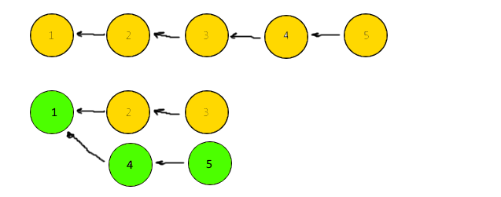

131. Определите хэш *1-го* и *3-го* коммитов и выполните команды:

     ```bash
     git rebase --onto=<ХЭШ_КОММИТА_1> <ХЭШ_КОММИТА_3> start
     git log --oneline
     ls
     ```
     
     Здесь мы берём коммиты от тега *start* и до корневого и исключаем из них коммиты общие с диапазоном от *<ХЭШ\_КОММИТА\_3>* и до корневого. Все коммиты которые останутся будут применены поверх коммита *<ХЭШ\_КОММИТА\_1>*. Каким образом в новой истории коммиты 2 и 3 отсутствуют и все изменения, которые были выполнены в них соответственно тоже.

#### Интерактивное перебазирование

Самой многоцелевой операцией по изменению истории является интерактивное перебазирование. Она позволяет сделать практически любую операцию, которую можно пожелать.

132. Выполните *hard reset* обратно на тег *start*;

133. **Удаление коммитов:**

     - Выполните команду:

       ```bash
       git rebase -i <ХЭШ_КОММИТА_1>
       ```

     - В открывшемся редакторе замените *pick* на *drop* у коммита с комментарием *2* и *3*;

     - Сохраните файл и закройте текстовый редактор;

     - Посмотрите историю.  
       Как видно, второй и третий коммиты отсутствуют;

     - Выполните *hard reset* обратно на тег *start*.

134. **Склеивание коммитов (сквош):**

     - Выполните команду:

       ```bash
       git rebase -i <ХЭШ_КОММИТА_1>
       ```

     - В открывшемся редакторе замените *pick* на *squash* у коммитов с комментарием *3*, *4* и *5*. У второго коммита нельзя указать *squash*, т.к. коммиты склеиваются с предыдущим;

     - Сохраните файл и закройте текстовый редактор.  
       В результате откроется новое окно текстового редактора в котором нужно будет написать *commit message* для получившегося склеенного коммита. Здесь будут собраны комментарии ко всем коммитам участвующим в склеивании;
       
     - Удалите весь текст и напишите *"2-5"*. Сохраните файл и закройте текстовый редактор;

     - Посмотрите историю.  
       Как видно, осталось только 2 коммита первый и второй, содержаний все изменения из *4-х* прежних коммитов;
       
     - Выполните *hard reset* обратно на тег *start*.

135. **Склеивание исправлений:**
     
     Аналог обычного склеивания, но предполагается, что следующие несколько коммитов после целевого - не несут исторической ценности и являются мелкими исправлениями.

     - Выполните команду:

       ```bash
       git rebase -i <ХЭШ_КОММИТА_1>
       ```

     - В открывшемся редакторе замените *pick* на *fixup* у коммитов с комментарием *3*, *4* и *5*. У второго коммита нельзя указать *fixup*, т.к. коммиты склеиваются с предыдущим;

     - Сохраните файл и закройте текстовый редактор.  
       В результате сразу будет выполнен коммит без лишних вопросов. В качестве комментария к нему будет взят комментарий к коммиту *2*, т.к. все следующие коммиты мы отметили как исправления, а значит их комментарии не несут информационной ценности;

     - Посмотрите историю;
       
     - Выполните *hard reset* обратно на тег *start*.
     
136. **Изменение порядка коммитов:**

     - Выполните команду:

       ```bash
       git rebase -i <ХЭШ_КОММИТА_1>
       ```

     - В открывшемся редакторе поменяйте местами строки с комментарием *5* и *2*;

     - Сохраните файл и закройте текстовый редактор;

     - Посмотрите историю.  
       Как видно, порядок коммитов теперь изменился. Пятый идет после первого, а второй в самом конце;
       
     - Выполните *hard reset* обратно на тег *start*.
     
137. **Изменения комментария к коммиту:**

     - Выполните команду:

       ```bash
       git rebase -i <ХЭШ_КОММИТА_1>
       ```

     - В открывшемся редакторе замените *pick* на *reword* у коммитов с комментариями *2* и *4*;

     - Сохраните файл и закройте текстовый редактор.  
       В результате откроется текстовый редактор, в котором нужно написать новое сообщение к коммиту *2*. 
       
     - Напишите: *"new 2"*. Сохраните файл и закройте текстовый редактор.  
       Следом откроется текстовый редактор, в котором нужно написать новое сообщение к коммиту *4*. 

     - Напишите: *"new 4"*. Сохраните файл и закройте текстовый редактор;

     - Посмотрите историю;

     - Выполните *hard reset* обратно на тег *start*.

138. **Изменение/разделение/добавление коммита:**

     - Выполните команду:

       ```bash
       git rebase -i <ХЭШ_КОММИТА_1>
       ```

     - В открывшемся редакторе замените *pick* на *edit* у коммита с комментарием *4*;

     - Сохраните файл и закройте текстовый редактор.  
       В результате процесс перебазирования остановится после применения *4-го* коммита о чём свидетельствует сообщение в строке ввода, которое говорит, что мы находимся на *3-м* шаге перебазирования из *4-х*. Теперь мы может использовать `--amend`, чтобы внести в него изменения.
       
       Если вы хотите, то можете создать несколько дополнительных коммитов. Например, если в коммит попали несколько файлов, а вы хотели закоммитить их по отдельности, то можно убрать лишний из кэша сделать коммит, а затем закоммитиить второй файл.
       
     - Выполните команды:
     
       ```bash
       touch new.txt
       git add .
       git commit -m "Добавлен new.txt"
       ```
     
     - Продолжите перебазирование командой:
     
       ```bash
       git rebase --continue
       ```
     
     - Посмотрите историю.
       Как видно, между *4-м* и *5-м* коммитами появился ещё один;
       
     - Выполните *hard reset* обратно на тег *start*;

Не всегда перебазирование происходит так гладко, довольно часть можно попасть в состояние конфликта. В этом случае перебазирование можно прервать и вернуться к начальному состоянию командой `git rebase --abort`.

### Отмена изменений

При совместной работе любое переписывание истории чревато проблемами. Поэтому существует способ отменить изменение в коммите или нескольких без переписывания истории, а создавая новый коммит, который отменяет внесённые изменения.

139. Выполните команду:

     ```bash
     git switch master
     ls
     git revert --no-commit master~1 master~3
     ls
     git ls-files
     ```

     В результате, рабочий каталог и кэш придут в состояние как будто бы коммиты *4-й* (`master~1`) и *2-й* (`master~3`) не создавались. Ключ `--no-commit` предотвращает автоматический запуск команды `git commit`, поэтому сейчас мы находимся в промежуточном состоянии, что видно по сообщению в строке приглашения.

140. Выполните команду:

     ```bash
     git status
     ```

     В результате вы увидите текущее состояние файлов в репозитории относительно последнего коммита и кэша. И несколько подсказок по команде `revert` и по работе с кэшем.

     Например *git* говорит, что можно прервать `revert` командой `git revert --abort` или продолжить командой `git revert --continue`.

141. Выполните команду:

     ```bash
     git revert --continue
     ```

     В открывшемся окне введите комментарий для нового коммита отмены: `"Отмена 2 и 4"`. Сохраните файл и закройте текстовый редактор.

     После создания коммита вы выйдите из промежуточного состояния.

142. Посмотрите историю.  
     Как видно, в истории появился новый коммит, а старые остались на месте. Именно поэтому важно делать [атомарные коммиты](https://en.wikipedia.org/wiki/Atomic_commit), т.е. не смешивать в одном коммите несвязанные по смыслу изменения. В этом случае `revert`-ом будет пользоваться просто.

### Слияние изменений из разных веток

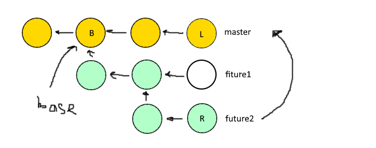

Ранее мы рассмотрели работу с ветками. В больших проектах ветки, как правило, создают для реализации отдельной фичи и затем функционал из ветки добавляется (вливается) в основную или *dev* ветку.

Процесс слияния может по началу показаться не совсем понятным, но главное понять, что ветка это не папка, а слияние это не объединения файлов из двух папок.

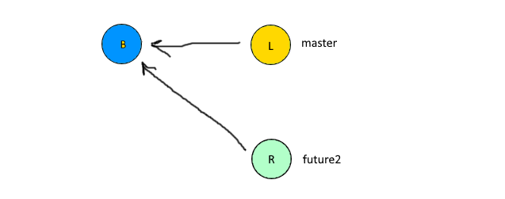

Гит производит, так называемое, трёхстороннее слияние, т.е. в процессе слияния учувствуют три коммита: последний коммит из текущей ветки, последний коммит из вливаемой ветки и база - общий коммит на котором история двух веток разошлась (слияние одновременно больше чем двух веток мы рассматривать не будем, хотя это возможно).

В результате слияния создаётся коммит содержащий все изменения из обоих веток. В отличие от обычных коммитов у коммита-слияния два (и более) родителя: первый родитель это коммит из текущей ветки, второй - из вливаемой.

143. Выполните команды:

     ```bash
     git reset --hard start
     git branch ff
     git switch ff
     ```

     В результате будет создана ветка с названием *ff* и она станет активной.

144. Выполните команды:

     ```bash
     echo "Изменения из ветки ff" > task5.txt
     touch taskff.txt
     git commit -a -m 6
     ```

     Здесь создаётся новый файл `"taskff.txt"` и перезаписывается содержимое `"task5.txt"`. После чего создаётся коммит.

145. Перейдите в ветку *master* и выполните команды:

     ```bash
     git merge ff
     git log --oneline
     ```

     В результате вы получите сообщение, что *git* выполнил *Fast-forward* (перемотка), т.е. просто перенёс ветку *master* на то же коммит, что и *ff*.

     Это самый просто случай слияния, т.к. изменения были внесены только в одну ветку.

     Если относительно базового коммита изменения в файле выполнялись только в одной ветке, то в коммит-слияния попадёт версия из этой ветки. Дата-время коммитов не учитывается, только факт отличия от базового коммита.

146. Отменим слияние вернув указатель *master* обратно на коммита с тегом *start*:

     ```bash
     git reset --hard master~
     ```

     Коммит-слияния находится только в ветке **в которую** вливают изменения (т.е. в нашем случае в *master*). Поэтому переместив указатель на один коммит назад, мы как бы отменяем слияние.

147. Выполните команды:

     ```bash
     echo "Изменения из ветки master" > task3.txt
     git commit -a -m 7
     git merge ff
     ```

     Откроется текстовый редактор предлагающий ввести *commit message*. Просто закройте, стандартный нас устраивает.

     Здесь мы изменяем файл `"task3.txt"`, создаём коммит и сливаем в текущую ветку изменения из *ff*.

     Теперь стратегию перемотки применить не получится, т.к. присутствуют изменения в обеих ветках и если выполните перемотку, то пропадут изменения из ветки *master*, поэтому *git* выполняет автоматическое слияние и создаёт коммит-слияния.

148. Выполните команды:

     ```bash
     cat task3.txt
     cat task5.txt
     git log --oneline --graph
     ```

     Как видно, текущий коммит включает изменения из обеих веток. Гит действует по правилу описанному ранее. Т.е. файл `"task3.txt"` изменялся только в ветке *master*, поэтому в коммит попала версия из *master*, а `"task5.txt"` изменялся только в ветке *ff*, поэтому в коммит попала версия из *ff*. Остальные файл не отличаются от базового коммита, поэтому *git* мог взять их из любого из трёх коммитов.

149. Отмените слияние вернув указатель *master* обратно на коммит с тегом *start*.

150. Создайте ветку *conf* и перейдите в неё.

151. Переименуйте файл `"task1.txt"` в `"task_conf.txt"` и закоммитьте изменения с комментарием *"6"*.

152. Перейдите в ветку *master* и переименуйте файл `"task1.txt"` в `"task_master.txt"` и тоже закоммитьте изменения с комментарием *"7"*.

153. Выполните слияние *master* с *conf*.

     Может показаться, что всё должно быть успешно и в коммит должны попасть оба файла, но как говорилось ранее, слияние веток - это не объединение содержимого двух каталогов, это объединения изменений в коммитах относительно базового.

     Как видно *git* действительно создал в рабочем каталоге оба файла, но при этом и сообщил о конфликте. Конфликт заключается в том, что обе ветки переименовали один и тот же файл из базового коммита и имена получившихся файлов не совпадают.

     Выполните команду:

     ```bash
     git status
     ```

     Как видно, *git* показывает, что в репозитории присутствует новый файл, а также необъединённый изменения и предлагает либо разрешить конфликт и сделать коммит или отменить слияние командой `git merge --abort`.

154. Предположим, что мы решаем оставить оба файла, тогда выполните команды:

     ```bash
     git add .
     git status
     git commit -m "Оставляем оба файла"
     git log --oneline --graph
     ```

     Как видно, после добавления файлов в кэш, `git status` сообщил, что все конфликты разрешены, но слияние ещё в процессе (*All conflicts fixed but you are still merging*), а после коммита, в строке приглашения, сообщение о прерванном слиянии сменилось просто на имя ветки.

     Аналогичный конфликт будет, если в одной из веток файл удалить. А если удалить в обоих или переименовать в одно и тоже имя, то конфликта не будет.

155. Отменим слияние вернув указатель *master* обратно на коммит с тегом *start*.

156. Создайте ветку *same* и прейдите в неё.

157. Допишите в файл `"task2.txt"` текст: *"Изменения из ветки same"* после двойки **на новой строке**. И создайте коммит с комментарием *"6"*.

158. Переключитесь обратно на ветку *master* и допишите в файл `"task2.txt"` текст: *"Изменения из ветки master"* после двойки **на новой строке**. И создайте коммит с комментарием *"7"*.

     Таким образом в файле `"task2.txt"` произведены разные изменения во второй строке в обеих ветках.

159. Выполните слияние *master* с *same*.

     Ожидаемо произошёл конфликт при слиянии файла  `"task2.txt"`. Гит не знает версию из какой ветки брать. Но *git* всё равно попытался выполнить слияние и оставил соответствующие пометки там, где у него это не получилось.

160. Выведите содержимое файла `"task2.txt"` в терминал:

     ```bash
     cat task2.txt
     ```

     Как видно, первая строка в обеих ветках совпадает с базой, поэтому с ней проблем нет, а вот при слиянии второй строки есть два варианта, поэтому *git* показал их разделив соответствующими маркерами. Это вариант второй строки их текущей ветки:

     ```
     <<<<<<< HEAD
     Изменения из ветки master
     =======
     ```

      А это из вливаемой ветки:

     ```
     =======
     Изменения из ветки same
     >>>>>>> same
     ```

     Далее *git* ждёт, что мы примем какое-нибудь решение относительно таких вот блоков во всех файлах в которых есть конфликты. В принципе *git* без разницы, что мы сделаем. Как вариант можно, не разбираясь, закоммитить всё как есть и *git* успешно завершит слияние. Но вряд ли нам нужны всякие стрелочки, особенно, если текст - это код программы.

     В общем, чтобы завершить слияние главное добавить конфликтные файлы в кэш и сделать коммит.

161. Выполните команды:

     ```bash
     git ls-files -u
     
     git show :1:task2.txt
     git show :2:task2.txt
     git show :3:task2.txt
     ```

     Ключ `-u` (`--unmerged`) показывает файлы в кэш которые находятся в конфликтном состоянии. Как видно сейчас их там целых *3*. Команда `git show` позволяет посмотреть каждую из версий файла. Как видно это версии из базового коммита, ветки *master* и ветки *same*.

162. Откройте файл `"task2.txt"` и замените блок:

     ```
     <<<<<<< HEAD
     Изменения из ветки master
     =======
     Изменения из ветки same
     >>>>>>> same
     ```

     на

     ```
     Изменения из ветки same
     Изменения из ветки master
     ```

     Т.е. мы решаем оставить оба изменения, но в другом порядке.

163. Обновите файл в кэше и создайте коммит с комментарием *"merge"*.

     После коммита мы вышли из состояния прерванного слияния.

164. Посмотрите историю репозитория:

     ```bash
     git log --oneline --graph
     ```

165. Не всегда удобно ориентироваться по таким вот разделителям которые оставил *git*. Чтобы они были нагляднее настроим внешний инструмент слияния, так же ка мы это делали для *difftool*.

     Введите команды:

     ```bash
     git config --global merge.tool vscode
     git config --global mergetool.vscode.cmd 'code --wait --merge $REMOTE $LOCAL $BASE $MERGED'
     git config --global mergetool.keepBackup false
     ```

     Здесь мы назначаем в качестве внешнего инструмента слияния - *vscode*. Последняя строка нужна, чтобы не создавались бэкапы конфликтных файлов (обычно они создаются, при использовании внешнего инструмента слияния) и их потом приходится вручную удалять.

166. Выполнте команды:

     ```bash
     git reset --hard master~  # отменяем слияние (откат на один коммит назад)
     git merge same
     git mergetool
     ```

     В результате мы откатимся назад, отменив коммит слияния, и снова выполним слияние с веткой *same* и разумеется опять попадём в конфликт. Только теперь мы будем разрешать его не руками, а при помощи *vscode*.

     В результате запуска внешнего инструмента, в рабочем каталоге будут создано 4 временных файла, которые будут удалены после слияния.

167. В открывшемся окне установите галочку *Show Base Center*, таким образом у вас получится три окна вверху и одно снизу по центру.

     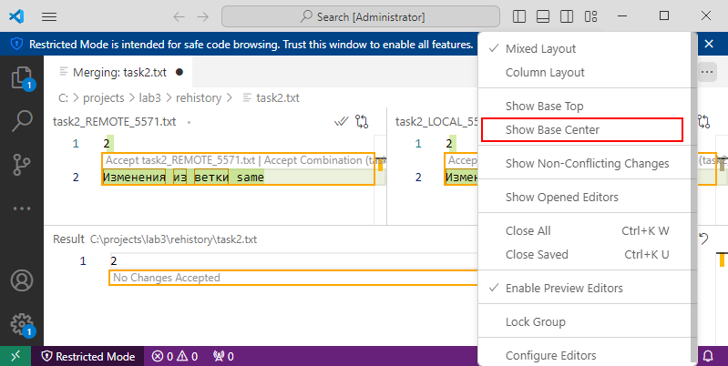

     Сверху будут показаны: файл из вливаемой ветки, затем файл из базы и затем из текущей ветки. Снизу показан результирующий файл, который войдёт в коммит.

     Таким образом мы наглядно видим, что строка *1* в обоих документах одинаковая и совпадает с базой. Строка *2* отличается, а в базе её вообще не было.

     При помощи мыши нажмите на копку *Accept* в левом окне, а затем в правом. При необходимости можно откатить изменения или поправить результат в нижнем окне.

168. Сохраните изменения и закройте окно, затем выполните команду:

     ```bash
     git status
     ```

     Как видно, файл `"task2.txt"` теперь отмечен как готовый к коммиту.

169. Для разнообразия завершите слияние командой:

     ```bash
     git merge --continue
     ```

Не всегда изменение в одной и той же строке приводят к конфликту слияния. Гит старается автоматически объединить файлы если это возможно. Для этого *git* делит файл на блоки и если изменения произведены  в одном блоке, то это конфликт, если в разных, то в итоговый файл попадут оба изменения без конфликта.

170. Отменим слияние вернув указатель *master* обратно на коммит с тегом *start*.

171. Создайте файл `"index.html"` содержащий:

     ```html
     <tag>
     border
     </tag>
     ```

     И создайте коммит с комментарием *"base"*.

172. Создайте ветку *html* и прейдите в неё. Затем измените содержимое файла `"index.html"` на следующее:

     ```html
     <tag>
     <b>Ветка html</b>
     border
     </tag>
     ```

     И создайте коммит с комментарием *"html"*.

173. Вернитесь в ветку *master* и измените содержимое файла `"index.html"` на следующее:

     ```html
     <tag>
     border
     <b>Ветка master</b>
     </tag>
     ```

     И создайте коммит с комментарием *"master"*.

174. Выполните слияние *master* с веткой *html*.

     В результате вам сразу предложат ввести сообщение для коммита. И никакого конфликта не будет.

175. Посмотрите содержимое файла `"index.html"` после слияния:

     ```bash
     cat index.html
     ```

     Как видно, изменения из обоих веток на своих местах.

     Такое произошло, т.к. *git* использовал неизменяемые, относительно базы, строки `<tag>` и *border* как границы первого блока и *border* и `</tag>` как границы второго. Таким образом с точки зрения *git* изменения в ветке *html* касались только первого блока, а в ветке *master* только второго, поэтому *git* легко смог их объединить.

#### Объединение веток через перебазирование

Слияние сохраняет полную историю репозитория, но при большом количестве веток и и постоянном их слиянии история может стать слишком запутанной, поэтому часто перенос функционала из одной ветки в другую выполняется при помощи перебазирования и последующего слияния. После перебазирования, слияние будет выполняться простой перемоткой.

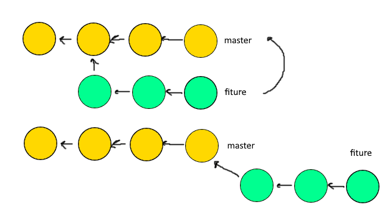

Таким образом история становится менее запутанной, хотя при этом и теряется информация о последовательности разработки.

176. Отменим слияние вернув указатель *master* обратно на коммит с тегом *start*.

177. Выполните перебазирование ветки *html* на *master* командой:

     ```bash
     git log --oneline --graph master html
     git switch html   # Перешли на ветку html
     git rebase master # Перебазируем текущую ветку на master
     ```

     Как видно во время `rebase` *git* сообщил, что текущая ветка не нуждается в перебазировании. Оно и понятно, т.к. *html* была создан от коммита `start` и после этого в *master* никаких изменений не было, т.к. мы их все откатили назад.

178. Вернитесь на *master* и завершите слияние. 

179. Отменим слияние вернув указатель *master* обратно на коммит с тегом *start*.

180. Находясь в ветке *master* измените файл `"task1.txt"` дописав в конец несколько любых символов и создайте коммит с комментарием *"6"*.

     Теперь в ветке *master* относительно общего коммита с *html* есть изменения, а значит простой перемоткой не обойтись.

181. Выполните команды:

     ```bash
     git log --oneline --graph master html
     git switch html   # Перешли на ветку html
     git rebase master # Перебазируем текущую ветку на master
     git log --oneline --graph master html
     git switch master # Возвращаемся на master
     git merge html    # Вливаем html в master
     git log --oneline --graph master html
     ```

     Как видно, после слияния и *master* и *html* указывают на один коммит, при этом история осталась линейной и никакого специального коммита-слияния нет.

182. Отменим слияние вернув указатель *master* обратно на коммит с тегом *start*.

183. Допишите в файл `"task2.txt"` текст: *"Изменения из ветки master"* после двойки **на новой строке**. И создайте коммит с комментарием "7".

     Далее будем выполнять перебазирование ветки *same* на *master*. В ветке *same* присутствуют другие изменения во второй строке файла `"task2.txt"`.

184. Выполните команды:

     ```bash
     git log --oneline --graph  master same
     git switch same   # Перешли на ветку same
     git rebase master # Перебазируем текущую ветку на master
     cat task2.txt
     ```

     После команды `rebase` ожидаемо произошёл конфликт и процесс перебазирования остановился до момента отмены или разрешения конфликта.

185. Выполните команду:

     ```bash
     git mergetool
     ```

     И разрешите конфликт оставив изменения из обоих файлов. Сохраните изменения и закройте текстовый редактор. Затем проверьте, что изменения в файле `"task2.txt"` правильные.

186. Проверьте статус репозитория и продолжите перебазирование командой:

     ```bash
     git rebase --continue
     ```

     В результате будет открыт текстовый редактор чтобы вы указали *commit message*. Используйте *"rebase 6"*, затем сохраните файл и закройте редактор.

     В результате будет создан коммит, а перебазирование будет завершено.

187. Выполните команды:

     ```bash
     git log --oneline --graph master same
     git switch master # Возвращаемся на master
     git merge same    # Вливаем same в master
     git log --oneline --graph master same
     ```

Как видно, во многом перебазировании и слияние похожи по процессу. В обоих случаях может быть автоматическое слияние и конфликты. Но в процессе обычного слияния вы получаете как бы один суммарный конфликт или можете не получить вовсе, если итоговое состояние файлов в последнем коммите не конфликтует со сливаемой веткой. В процессе перебазирования все коммиты применяются по порядку, поэтому конфликтов может быть больше.

Ещё стоит сказать, что обычное слияние не сдвигает указатель вливаемой ветки, т.е. вливаемая ветка остаётся без изменения. В случае слияния через перебазирование, вам нужно сначала выполнить перебазирование, которое переместит указатель ветки на новый, перебазированный коммит. Т.е. вливаемая ветка изменяется. Если вы работаете над веткой в одиночку, то проблем нет, но если с веткой работают несколько человек, то такие изменения нужно будет согласовывать, иначе вы будете коммитить уже в перебазированную ветку, а ваши коллеги в старую.

<br>

## Работа с удалённым git репозиторием. GitHub


<br>

## Источники и ссылки

- Pro Git 2nd Edition: https://git-scm.com/book/ru/v2

  *Официальная книга по git (перевод на русский)*

- Git: курс: https://youtube.com/playlist?list=PLDyvV36pndZFHXjXuwA_NywNrVQO0aQqb&si=mvt79WcKR_UlEGTP

  *Хороший, слегка "продвинутый" видеокурс по Git*

- Удачная модель ветвления для Git: https://habr.com/ru/articles/106912/

  *Про модель ветвления gitflow*

- a simple git branching model: https://gist.github.com/shvechikov/7876564

- GitHub Flow: https://habr.com/ru/articles/346066/

- Стратегия ветвления ThreeFlow: https://habr.com/ru/companies/infopulse/articles/345826/

- Trunk Based Development — кто такой и зачем нужен: https://habr.com/ru/companies/avito/articles/680522/

- https://github.com/cyberspacedk/Git-commands

